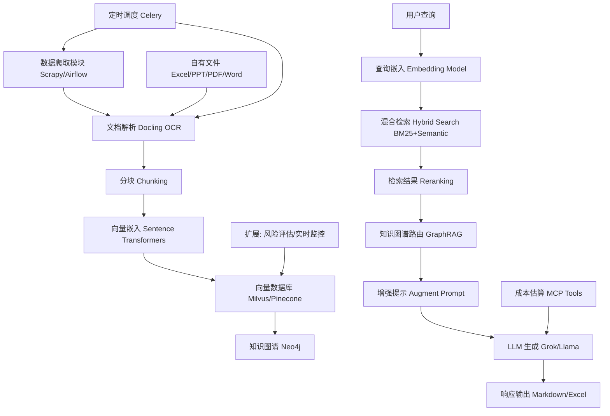

# Cost-RAG: 工程造价咨询智能RAG系统

一个基于成本优化的检索增强生成(RAG)系统，专为工程造价咨询行业设计，通过智能优化策略在保持高质量响应的同时最小化运营成本。

## 🚀 核心特性

### 主要功能
- **文档处理**: 支持PDF、TXT、Markdown、HTML文件
- **智能分块**: 基于内容类型和token限制的自适应文本分割
- **混合搜索**: 语义搜索和关键词搜索策略结合
- **多LLM支持**: 集成OpenAI、Anthropic和本地模型
- **成本优化**: 实时成本跟踪和预算管理

### 成本优化特性
- **智能缓存**: 多级缓存（内存、Redis、文件）用于嵌入和响应
- **自适应模型选择**: 基于查询复杂度的动态模型路由
- **Token管理**: 上下文窗口优化和提示压缩
- **预算控制**: 可配置预算限制和警报
- **成本分析**: 详细成本分解和优化建议

## 📋 系统要求

- Python 3.9+
- PostgreSQL 12+
- Redis 6+
- 向量数据库 (Weaviate 或 Qdrant)
- LLM Provider API keys (OpenAI/Anthropic)

## 2. 功能需求
### 2.1 核心功能
1. **数据爬取模块**：
   - 定期（每日/每周）爬取行业数据：新技术、新工艺、定额版本、人工费/材料价格变动。
   - 来源：住建部官网、中国造价网、公开API。
   - 调度：CronJob或Airflow；数据清洗后向量化存储。

2. **文件处理与RAG知识库**：
   - 支持文件类型：Excel、PPT、PDF、Word。
   - OCR解析：集成Docling（开源方案，支持结构化提取文本/表格/图像）。
   - 定时检查文件夹变化（新增/修改），增量更新向量数据库（如Milvus/Pinecone）。
   - 知识图谱：使用Neo4j生成实体（分部分项如钢筋、混凝土）和关系（含量-单价-综合单价）。
   - 问答流程：查询 → 混合检索（BM25+Semantic） → 图谱路由 → LLM生成答案。

3. **成本估算模块**：
   - 输入：项目类型（写字楼、商场、住宅）、参数。
   - 输出：建安成本表格（Markdown/Excel），精确到分部分项（含量、单价、组成、价格差异）。
   - 工具：LLM或Multi-Chain Prompting (MCP)；集成公开数据查询。

### 2.2 扩展功能（基于行业趋势）
- **风险评估**：分析材料短缺、政策风险，生成审计报告。
- **实时监控**：接入API预测价格波动，设置警报（>5%变动通知）。
- **多模态支持**：处理工程图纸（Docling扩展到图像识别），自动算量。
- **协作与反馈**：多用户编辑、版本控制、答案评分优化RAG。
- **可持续性估算**：整合碳排放成本、绿色建材数据。
- **RAG评估**：内置RAGAS框架监控指标（忠实度、召回率）。

## 3. 技术架构
### 3.1 应用框架
- **后端框架**：FastAPI（Python-based），支持异步API、高性能；或Flask/Django作为备选。
- **前端框架**：Streamlit（快速原型）或React.js（生产级UI），提供文件上传、查询界面、表格输出。
- **数据库**：
  - 向量数据库：Milvus/Pinecone（支持Hybrid Search）。
  - 图谱数据库：Neo4j（实体关系存储）。
  - 关系型：PostgreSQL（用户数据、日志）。
- **调度与任务**：Airflow/Celery（定时爬取/文件检查）。
- **部署**：Docker容器化，Kubernetes orchestration；云平台如AWS/Azure。
- **安全**：OAuth2认证、数据加密。

### 3.2 RAG系统集成方案
- **框架选择**：LangChain或Haystack（开源、灵活），构建端到端Pipeline。
- **集成流程**：
  1. **文档解析**：使用Docling作为核心解析器：
     - 输入：文件路径。
     - 处理：OCR/结构提取（文本、表格、布局），转换为JSON/Markdown。
     - 输出：分块（Chunking）后Embedding（Sentence Transformers模型）。
  2. **向量存储**：增量更新机制；结合知识图谱路由（GraphRAG）。
  3. **检索优化**：Hybrid Search + Reranking（避免幻觉）。
  4. **生成**：LLM接入（如Grok/Llama via API）；MCP工具链用于成本预测。
  5. **评估与迭代**：集成RAGAS，定期fine-tune Embedding模型。
- **性能考虑**：批处理文件（<100MB/文件）；本地/云混合部署。

### 3.3 详细架构图
以下是应用的详细架构图，展示了RAG系统的整体流程，包括索引、检索和生成阶段，适用于工程造价咨询的自定义实现（例如整合知识图谱和行业数据爬取）。图中突出用户查询从嵌入到LLM生成的端到端路径，可扩展到扩展功能如风险评估。


为进一步说明，以下是基于该图的自定义描述（使用Mermaid语法，可在支持的Markdown查看器中渲染）：



此图扩展了标准RAG，融入行业特定元素如定时爬取和图谱集成。

## 4. 接口设计
### 4.1 核心接口（RESTful API/GraphQL）
- **文件上传/处理**：POST /upload – 上传文件，触发Docling解析并更新知识库。
- **查询问答**：GET /query?question=... – 返回RAG答案，支持知识图谱过滤。
- **成本估算**：POST /estimate – 输入JSON项目参数，返回Markdown表格。
- **数据爬取**：GET /crawl/status – 手动触发/查看爬取状态。
- **导出报告**：GET /export?format=md/excel – 输出估算/审计报告。

### 4.2 预留应用接口（基于行业发展需求）
考虑到2025年趋势（如BIM集成、ESG标准、AI协作），预留以下接口以便未来扩展：
- **Webhook接口**：POST /webhook – 外部数据源推送（e.g., 价格API更新通知），适应实时市场监控。
- **BIM集成接口**：GET /bim/import?model_id=... – 从Revit/Autodesk导入模型数据，扩展多模态算量。
- **第三方API对接**：OAuth-protected endpoints，如 /api/integrate/green – 查询绿色建材数据库（e.g., 国家统计局API）。
- **移动端接口**：GraphQL /mobile/query – 支持APP访问，预留语音模式（Grok声控）。
- **扩展模块接口**：POST /plugins/risk – 插件式添加风险评估，方便未来ML模型集成。
- **监控接口**：GET /metrics – 返回RAG性能指标（召回率等），支持运维工具如Prometheus。

## 5. 非功能需求
- **性能**：支持并发用户>50；响应<3s。
- **可用性**：99% uptime；日志监控。
- **可扩展性**：模块化设计，便于添加新功能。
- **测试**：单元测试（Pytest）、集成测试（RAG准确性）；使用合成数据模拟工程场景。
- **文档**：API Swagger、用户手册。

## 6. 开发计划与风险
### 6.1 里程碑
- Phase 1 (1月)：原型开发（核心RAG + Docling）。
- Phase 2 (2月)：扩展功能 + 接口测试。
- Phase 3 (1月)：部署 + 优化。

### 6.2 风险与缓解
- 数据质量：添加清洗脚本。
- 计算资源：云弹性扩展。
- 合规：内置隐私检查。

## 7. 多项目对比成本估算系统

### 7.1 多项目对比表格结构

#### Excel表格布局
多项目对比数据采用标准化Excel格式，每3列代表一个完整项目：

```
        | B列      | C列      | D列      | E列      | F列      | G列      | H列      | I列      | J列      |
--------|----------|----------|----------|----------|----------|----------|----------|----------|----------|
第1行   | 项目名称  | 项目名称  | 项目名称  | 项目名称  | 项目名称  | 项目名称  | 项目名称  | 项目名称  | 项目名称  |
第2行   | 面积信息  | 面积信息  | 面积信息  | 面积信息  | 面积信息  | 面积信息  | 面积信息  | 面积信息  | 面积信息  |
第3行   | 层数信息  | 层数信息  | 层数信息  | 层数信息  | 层数信息  | 层数信息  | 层数信息  | 层数信息  | 层数信息  |
第4行   | 时间信息  | 时间信息  | 时间信息  | 时间信息  | 时间信息  | 时间信息  | 时间信息  | 时间信息  | 时间信息  |
第5行+  | 分部分项数据| 分部分项数据| 分部分项数据| 分部分项数据| 分部分项数据| 分部分项数据| 分部分项数据| 分部分项数据| 分部分项数据|
        |          金地商业广场          |          芷阳广场            |         西安凯德广场             |
        |          B,C,D列              |          E,F,G列             |         H,I,J列             |
```

#### 数据库表结构设计

```sql
CREATE TABLE multi_project_cost_comparison (
    id INTEGER PRIMARY KEY AUTOINCREMENT,
    row_number INTEGER NOT NULL,                    -- Excel行号，保持原始顺序
    item_type VARCHAR(50) NOT NULL,                 -- 数据类型分类
    item_code VARCHAR(20),                          -- 分部分项代码（如2.1, 2.2）
    item_name VARCHAR(200),                         -- 分部分项名称

    -- 金地商业广场数据（第2-4列）
    project_1_value TEXT,                           -- 数值
    project_1_unit VARCHAR(20),                     -- 单位（如"元/平米", "平米"）
    project_1_notes TEXT,                           -- 备注说明

    -- 芷阳广场数据（第5-7列）
    project_2_value TEXT,
    project_2_unit VARCHAR(20),
    project_2_notes TEXT,

    -- 西安凯德广场数据（第8-10列）
    project_3_value TEXT,
    project_3_unit VARCHAR(20),
    project_3_notes TEXT,

    -- 可继续扩展更多项目列...

    created_at TIMESTAMP DEFAULT CURRENT_TIMESTAMP,
    updated_at TIMESTAMP DEFAULT CURRENT_TIMESTAMP
);

-- 性能优化索引
CREATE INDEX idx_row_number ON multi_project_cost_comparison(row_number);
CREATE INDEX idx_item_type ON multi_project_cost_comparison(item_type);
CREATE INDEX idx_item_code ON multi_project_cost_comparison(item_code);
```

#### 数据类型分类说明
- **project_name**: 项目基本信息（第1行）
- **area**: 建筑面积信息（第2行）
- **floors**: 层数信息（第3行）
- **dates**: 开竣工时间（第4行）
- **cost_section**: 分部分项成本数据（第5行及以后）

### 7.2 核心估算算法逻辑

#### 7.2.1 14级分部分项层级结构

系统采用标准的14级分部分项结构，其中：
- **1-13级**: 具体分部分项（土石方工程、桩基工程、主体结构等）
- **14级**: 项目总开发成本（前13级之和）

#### 7.2.2 层级递归计算算法

**核心原则**: 从最底层开始逐级计算，严禁跳级或简单分配

```python
def calculate_project_cost(project_area, template_data):
    """
    层级递归计算项目成本
    严格按照：二级分部 → 一级分部 → 项目总造价 的顺序
    """

    # Step 1: 计算所有二级分部质量调整后单方造价
    secondary_unit_prices = {}
    for secondary_section in all_secondary_sections:
        base_price = get_base_price_from_template(secondary_section.code, template_data)
        quality_multiplier = get_quality_adjustment_factor(project_params.quality_level)
        adjusted_price = base_price * quality_multiplier
        secondary_unit_prices[secondary_section.code] = adjusted_price

    # Step 2: 计算一级分部单方造价（其下所有二级分部求和）
    primary_unit_prices = {}
    for primary_section in range(1, 14):  # 1-13一级分部
        secondary_sections_under_primary = get_secondary_sections_by_primary(primary_section)
        primary_unit_price = sum(
            secondary_unit_prices[sec.code]
            for sec in secondary_sections_under_primary
        )
        primary_unit_prices[f"{primary_section}.0"] = primary_unit_price

    # Step 3: 计算项目总单方造价（第14项 = 前13项一级分部求和）
    total_unit_price = sum(
        primary_unit_prices[f"{i}.0"] for i in range(1, 14)
    )

    # Step 4: 计算各层级合价（单方造价 × 建筑面积）
    secondary_total_costs = {
        code: price * project_area
        for code, price in secondary_unit_prices.items()
    }
    primary_total_costs = {
        code: price * project_area
        for code, price in primary_unit_prices.items()
    }
    total_project_cost = total_unit_price * project_area  # 第14项合价

    return {
        'secondary_unit_prices': secondary_unit_prices,
        'primary_unit_prices': primary_unit_prices,
        'total_unit_price': total_unit_price,
        'total_project_cost': total_project_cost,
        'secondary_total_costs': secondary_total_costs,
        'primary_total_costs': primary_total_costs
    }
```

#### 7.2.3 反向验证机制

**验证目的**: 确保计算结果的数学关系正确性

```python
def reverse_validation_calculation(calculation_result, project_area, tolerance=0.01):
    """
    反向验证：确保各层级数学关系正确
    """

    # 验证1: 二级分部求和 = 一级分部
    for primary_section in range(1, 14):
        expected_primary_price = 0
        secondary_sections = get_secondary_sections_by_primary(primary_section)

        for sec in secondary_sections:
            if sec.code in calculation_result['secondary_unit_prices']:
                expected_primary_price += calculation_result['secondary_unit_prices'][sec.code]

        actual_primary_price = calculation_result['primary_unit_prices'].get(f"{primary_section}.0", 0)

        if abs(expected_primary_price - actual_primary_price) > tolerance:
            raise ValueError(
                f"一级分部{primary_section}验证失败: "
                f"期望{expected_primary_price:.2f}, 实际{actual_primary_price:.2f}"
            )

    # 验证2: 一级分部求和 = 项目总单方造价（第14项）
    expected_total_unit_price = sum(
        calculation_result['primary_unit_prices'][f"{i}.0"]
        for i in range(1, 14)
    )
    actual_total_unit_price = calculation_result['total_unit_price']

    if abs(expected_total_unit_price - actual_total_unit_price) > tolerance:
        raise ValueError(
            f"项目总单方造价验证失败: "
            f"期望{expected_total_unit_price:.2f}, 实际{actual_total_unit_price:.2f}"
        )

    # 验证3: 总造价计算验证
    expected_total_cost = calculation_result['total_unit_price'] * project_area
    actual_total_cost = calculation_result['total_project_cost']

    if abs(expected_total_cost - actual_total_cost) > tolerance:
        raise ValueError(
            f"项目总造价验证失败: "
            f"期望{expected_total_cost:.2f}, 实际{actual_total_cost:.2f}"
        )

    print("✅ 所有反向验证通过")
    return True
```

#### 7.2.4 常见算法错误与正确做法对比

**❌ 错误做法：简单分配法**
```python
# 绝对禁止的算法
def wrong_calculation(project_area, total_unit_price):
    total_cost = total_unit_price * project_area
    # 按历史比例分配到各分部 - 这完全破坏了层级结构！
    # 这样做会导致数学关系不成立，估算结果不准确
```

**✅ 正确做法：层级递归法**
```python
# 正确的估算流程
def estimate_new_project(project_params, comparison_template):
    # 1. 选择最相似的基准项目
    reference_project = select_most_similar_project(project_params, comparison_template)

    # 2. 基于基准项目二级分部单价进行逐项调整
    estimated_secondary_prices = {}
    for secondary_section in all_secondary_sections:
        base_price = reference_project['secondary_unit_prices'][secondary_section.code]
        adjustment_factor = calculate_section_adjustment_factor(
            secondary_section, project_params, reference_project
        )
        adjusted_price = base_price * adjustment_factor
        estimated_secondary_prices[secondary_section.code] = adjusted_price

    # 3. 层级递归计算（不是简单乘以总面积）
    result = calculate_project_cost(project_params.area, estimated_secondary_prices)

    # 4. 反向验证（关键步骤）
    validation_passed = reverse_validation_calculation(result, project_params.area)

    if not validation_passed:
        raise ValueError("估算结果验证失败，请检查算法逻辑")

    return result
```

### 7.3 关键算法原则总结

1. **层级递归原则**: 从二级分部开始，逐级向上计算，绝不能跳级
2. **禁止简单分配**: 不能用总造价按比例分配到各分部
3. **数学关系严格**: 二级求和=一级，一级求和=总计，必须严格成立
4. **反向验证必须**: 每次计算后都要验证数学关系
5. **估算基于模板**: 从多项目对比表选择基准，逐项调整而非整体调整

### 7.4 数据验证标准

#### 7.4.1 数据完整性检查
```sql
-- 检查第14项是否等于前13项之和
SELECT
    project_name,
    SUM(CASE WHEN item_code IN ('1.0', '2.0', ..., '13.0')
        THEN CAST(project_1_value AS DECIMAL) ELSE 0 END) as sum_primary,
    CAST((SELECT project_1_value FROM multi_project_cost_comparison
          WHERE item_code = '14.0' AND project_name = t.project_name) AS DECIMAL) as total_cost
FROM multi_project_cost_comparison t
WHERE project_name = '金地商业广场'
GROUP BY project_name;
```

#### 7.4.2 层级关系验证
```sql
-- 检查二级分部是否正确求和到一级分部
-- 示例：验证2.1 + 2.2 + 2.3 + 2.4 = 2.0
SELECT
    '2.0' as primary_section,
    SUM(CASE WHEN item_code IN ('2.1', '2.2', '2.3', '2.4')
        THEN CAST(project_1_value AS DECIMAL) ELSE 0 END) as secondary_sum,
    CAST((SELECT project_1_value FROM multi_project_cost_comparison
          WHERE item_code = '2.0' AND project_name = t.project_name) AS DECIMAL) as primary_value
FROM multi_project_cost_comparison t
WHERE project_name = '金地商业广场';
```

.## 8. 多项目Excel解析器实现详解

### 8.1 解析器核心架构

#### 8.1.1 解析器类结构
```python
class MultiProjectExcelParser:
    """多项目对比Excel文件解析器"""

    def __init__(self, db_path: str = "cost_rag.db"):
        self.db_path = db_path
        self.engine = create_engine(f"sqlite:///{db_path}")
        self.SessionLocal = sessionmaker(bind=self.engine)

        # 项目面积存储 - 用于计算单价
        self.project_areas = {}  # 格式: {'金地商业项目': 89727, '芷阳广场': 28000, ...}

        # 项目列配置 - 每个项目占用3列（合价、单方造价 、备注项）
        self.project_columns = {
            1: {'name_col': 1, 'value_col': 2, 'unit_col': 3},    # B,C,D列
            2: {'name_col': 4, 'value_col': 5, 'unit_col': 6},    # E,F,G列
            3: {'name_col': 7, 'value_col': 8, 'unit_col': 9},    # H,I,J列
            4: {'name_col': 10, 'value_col': 11, 'unit_col': 12}, # K,L,M列
            5: {'name_col': 13, 'value_col': 14, 'unit_col': 15}, # N,O,P列
            6: {'name_col': 16, 'value_col': 17, 'unit_col': 18}, # Q,R,S列
            7: {'name_col': 19, 'value_col': 20, 'unit_col': 21}, # T,U,V列
        }
```

#### 8.1.2 数据库表结构
```sql
-- 项目基本信息表
CREATE TABLE projects (
    id INTEGER PRIMARY KEY AUTOINCREMENT,
    name TEXT NOT NULL,                          -- 项目名称
    area REAL DEFAULT 0.0,                      -- 建筑面积
    total_cost REAL DEFAULT 0.0,                -- 总造价
    unit_cost REAL DEFAULT 0.0,                 -- 单方造价
    quality_level TEXT DEFAULT '中',            -- 质量等级
    project_status TEXT DEFAULT '草稿',         -- 项目状态
    template_id INTEGER,                        -- 关联模板ID
    source_file TEXT,                           -- 源文件路径
    created_at TIMESTAMP DEFAULT CURRENT_TIMESTAMP,
    updated_at TIMESTAMP DEFAULT CURRENT_TIMESTAMP
);

-- 多项目对比表
CREATE TABLE multi_project_cost_comparison (
    id INTEGER PRIMARY KEY AUTOINCREMENT,
    row_number INTEGER NOT NULL,                -- Excel行号
    item_type VARCHAR(50) NOT NULL,             -- 数据类型分类
    item_code VARCHAR(20),                     -- 分部分项代码
    item_name VARCHAR(200),                    -- 分部分项名称

    -- 各项目数据列
    jindi_value TEXT, jindi_unit TEXT, jindi_notes TEXT,      -- 金地商业项目
    zhiyang_value TEXT, zhiyang_unit TEXT, zhiyang_notes TEXT,  -- 芷阳广场
    wanxiang_value TEXT, wanxiang_unit TEXT, wanxiang_notes TEXT, -- 西安凯德广场
    project_4_value TEXT, project_4_unit TEXT, project_4_notes TEXT,
    project_5_value TEXT, project_5_unit TEXT, project_5_notes TEXT,
    project_6_value TEXT, project_6_unit TEXT, project_6_notes TEXT,
    project_7_value TEXT, project_7_unit TEXT, project_7_notes TEXT,

    created_at TIMESTAMP DEFAULT CURRENT_TIMESTAMP
);
```

### 8.2 核心解析算法

#### 8.2.1 文件结构识别算法
```python
def identify_excel_structure(self, df: pd.DataFrame):
    """
    识别Excel文件结构并确定项目配置
    """
    print(f"Excel文件维度: {df.shape[0]}行 x {df.shape[1]}列")

    # 1. 识别项目名称（第1行）
    row1 = df.iloc[0]
    project_names = {}

    for project_id, config in self.project_columns.items():
        name_col = config['name_col']
        if name_col < len(row1) and pd.notna(row1.iloc[name_col]):
            project_name = str(row1.iloc[name_col]).strip()
            if project_name:
                project_names[project_id] = project_name
                print(f"识别到项目{project_id}: {project_name}")

    # 2. 识别面积信息（第2行）
    row2 = df.iloc[1] if len(df) > 1 else pd.Series()
    areas = {}

    for project_id, project_name in project_names.items():
        config = self.project_columns[project_id]
        value_col = config['value_col']

        if value_col < len(row2) and pd.notna(row2.iloc[value_col]):
            try:
                area = float(row2.iloc[value_col])
                areas[project_name] = area
                self.project_areas[project_name] = area
                print(f"项目{project_name}面积: {area} m²")
            except (ValueError, TypeError):
                areas[project_name] = 0.0

    return project_names, areas
```

#### 8.2.2 项目信息提取算法
```python
def extract_project_info(self, df: pd.DataFrame, project_names: dict, areas: dict):
    """
    提取项目基本信息并保存到数据库
    """
    projects = {}

    for project_id, project_name in project_names.items():
        area = areas.get(project_name, 0.0)

        project_data = {
            'name': project_name,
            'area': area,
            'total_cost': 0.0,  # 将在成本数据解析后更新
            'unit_cost': 0.0,
            'quality_level': '中',
            'project_status': '草稿',
            'template_id': 1,
            'source_file': self.current_file_path
        }

        projects[project_name] = project_data

    return projects
```

#### 8.2.3 成本数据解析算法
```python
def parse_cost_section(self, df: pd.DataFrame, project_names: dict):
    """
    解析成本数据部分（第5行及以后）
    """
    cost_data = []

    # 从第5行开始处理成本数据
    for row_idx in range(4, len(df)):  # 第5行开始（索引4）
        row = df.iloc[row_idx]

        # 提取分部分项信息（A列）
        item_code = str(row.iloc[0]) if pd.notna(row.iloc[0]) else ""
        item_name = str(row.iloc[0]) if pd.notna(row.iloc[0]) else ""

        # 解析代码和名称
        if '.' in item_code:
            parts = item_code.split('.', 1)
            item_code = parts[0]
            item_name = parts[1] if len(parts) > 1 else item_name

        # 跳过空行
        if not item_code.strip():
            continue

        # 确定数据类型
        if item_code == 'area':
            item_type = 'area'
        elif item_code.isdigit() and int(item_code) <= 14:
            item_type = 'cost_section'
        else:
            item_type = 'cost_item'

        # 提取各项目数据
        cost_item = {
            'row_number': row_idx + 1,
            'item_type': item_type,
            'item_code': item_code,
            'item_name': item_name
        }

        # 为每个项目提取数值、单位和备注
        for project_id, project_name in project_names.items():
            config = self.project_columns[project_id]

            # 根据项目名称确定数据库列名
            column_mapping = {
                '金地商业项目': 'jindi',
                '芷阳广场': 'zhiyang',
                '西安凯德广场': 'wanxiang',
                '成都凯德商用·天府项目商业': 'project_4',
                '成都凯德商用·天府项目办公楼': 'project_5',
                '西安林隐天下办公楼': 'project_6',
                '赛高城市广场办公楼': 'project_7'
            }

            column_prefix = column_mapping.get(project_name, f'project_{project_id}')

            value_col = config['value_col']
            unit_col = config['unit_col']

            # 提取数值
            value = None
            if value_col < len(row) and pd.notna(row.iloc[value_col]):
                try:
                    value = float(row.iloc[value_col])
                except (ValueError, TypeError):
                    value = str(row.iloc[value_col])

            # 提取单位
            unit = ""
            if unit_col < len(row) and pd.notna(row.iloc[unit_col]):
                unit = str(row.iloc[unit_col]).strip()

            # 存储到数据结构中
            cost_item[f'{column_prefix}_value'] = value
            cost_item[f'{column_prefix}_unit'] = unit
            cost_item[f'{column_prefix}_notes'] = ""

        cost_data.append(cost_item)

    return cost_data
```

### 8.3 数据处理与计算逻辑

#### 8.3.1 数据类型识别与分类
```python
def classify_data_rows(self, cost_data):
    """
    对解析的数据进行分类处理
    """
    classified_data = {
        'project_info': [],    # 项目基本信息
        'areas': [],          # 面积信息
        'cost_sections': [],  # 成本分部分项
        'cost_items': []      # 具体成本项目
    }

    for item in cost_data:
        item_type = item['item_type']
        item_code = item['item_code']

        if item_type == 'area':
            classified_data['areas'].append(item)
        elif item_type == 'cost_section':
            if item_code.isdigit() and int(item_code) <= 14:
                classified_data['cost_sections'].append(item)
        else:
            classified_data['cost_items'].append(item)

    return classified_data
```

#### 8.3.2 数值标准化处理
```python
def standardize_numeric_values(self, cost_data):
    """
    标准化数值数据，处理不同的数值格式
    """
    for item in cost_data:
        # 标准化各项目的数值
        for project_id in range(1, 8):  # 支持7个项目
            column_prefix = self.get_column_prefix(project_id)

            value_key = f'{column_prefix}_value'
            if value_key in item and item[value_key] is not None:
                # 尝试转换为数值
                try:
                    if isinstance(item[value_key], str):
                        # 清理字符串中的非数字字符
                        cleaned_value = re.sub(r'[^\d.-]', '', str(item[value_key]))
                        if cleaned_value:
                            item[value_key] = float(cleaned_value)
                        else:
                            item[value_key] = 0.0
                    else:
                        item[value_key] = float(item[value_key])
                except (ValueError, TypeError):
                    item[value_key] = 0.0

    return cost_data
```

#### 8.3.3 项目面积计算逻辑
```python
def calculate_project_areas(self, cost_data):
    """
    从成本数据中提取和计算项目面积
    """
    area_data = {}

    for item in cost_data:
        if item['item_type'] == 'area':
            for project_id in range(1, 8):
                column_prefix = self.get_column_prefix(project_id)
                value_key = f'{column_prefix}_value'

                if value_key in item and item[value_key] is not None:
                    try:
                        area = float(item[value_key])
                        if area > 0:
                            project_name = self.get_project_name_by_id(project_id)
                            if project_name:
                                area_data[project_name] = area
                                self.project_areas[project_name] = area
                    except (ValueError, TypeError):
                        pass

    return area_data
```

### 8.4 数据验证与质量保证

#### 8.4.1 数据完整性验证
```python
def validate_parsed_data(self, projects, cost_data):
    """
    验证解析数据的完整性和一致性
    """
    validation_results = {
        'is_valid': True,
        'errors': [],
        'warnings': []
    }

    # 1. 验证项目数量
    if len(projects) == 0:
        validation_results['is_valid'] = False
        validation_results['errors'].append("未找到有效的项目数据")

    # 2. 验证项目面积
    for project_name, project_info in projects.items():
        if project_info['area'] <= 0:
            validation_results['warnings'].append(f"项目{project_name}面积无效: {project_info['area']}")

    # 3. 验证成本数据结构
    cost_sections = [item for item in cost_data if item['item_type'] == 'cost_section']
    expected_sections = [str(i) for i in range(1, 15)]  # 1-14级分部

    found_sections = [item['item_code'] for item in cost_sections]
    missing_sections = set(expected_sections) - set(found_sections)

    if missing_sections:
        validation_results['warnings'].append(f"缺少成本分部: {missing_sections}")

    # 4. 验证数值数据
    numeric_errors = 0
    for item in cost_data:
        for project_id in range(1, 8):
            column_prefix = self.get_column_prefix(project_id)
            value_key = f'{column_prefix}_value'

            if value_key in item and item[value_key] is not None:
                try:
                    float(item[value_key])
                except (ValueError, TypeError):
                    numeric_errors += 1

    if numeric_errors > 0:
        validation_results['warnings'].append(f"发现{numeric_errors}个无效的数值数据")

    return validation_results
```

#### 8.4.2 数学关系验证
```python
def validate_mathematical_relationships(self, cost_data):
    """
    验证成本数据的数学关系
    """
    validation_results = {
        'is_valid': True,
        'errors': [],
        'warnings': []
    }

    # 为每个项目验证数学关系
    for project_id in range(1, 8):
        column_prefix = self.get_column_prefix(project_id)
        value_key = f'{column_prefix}_value'

        # 收集各级分部数据
        primary_sections = {}
        secondary_sections = {}

        for item in cost_data:
            if value_key in item and item[value_key] is not None:
                try:
                    value = float(item[value_key])
                    item_code = item['item_code']

                    if item_code.isdigit():
                        section_num = int(item_code)
                        if section_num <= 13:  # 1-13级分部
                            primary_sections[section_num] = value
                    elif '.' in item_code:
                        # 二级分部（如2.1, 2.2等）
                        primary_code = item_code.split('.')[0]
                        if primary_code.isdigit():
                            primary_num = int(primary_code)
                            if primary_num <= 13:
                                if primary_num not in secondary_sections:
                                    secondary_sections[primary_num] = []
                                secondary_sections[primary_num].append(value)
                except (ValueError, TypeError):
                    pass

        # 验证第14项是否等于前13项之和
        total_primary = sum(primary_sections.values())
        section_14_value = None

        for item in cost_data:
            if item['item_code'] == '14' and value_key in item and item[value_key] is not None:
                try:
                    section_14_value = float(item[value_key])
                    break
                except (ValueError, TypeError):
                    pass

        if section_14_value is not None:
            difference = abs(total_primary - section_14_value)
            tolerance = section_14_value * 0.01  # 1%容差

            if difference > tolerance:
                validation_results['errors'].append(
                    f"项目{project_id}第14项验证失败: 前13项之和={total_primary:.2f}, "
                    f"第14项={section_14_value:.2f}, 差异={difference:.2f}"
                )
                validation_results['is_valid'] = False

    return validation_results
```

### 8.5 错误处理与容错机制

#### 8.5.1 列索引自适应
```python
def get_adaptive_column_config(self, df):
    """
    根据Excel实际列数自适应调整配置
    """
    max_columns = len(df.columns)
    adaptive_config = {}

    for project_id, config in self.project_columns.items():
        if config['name_col'] < max_columns:
            adaptive_config[project_id] = config
        else:
            print(f"跳过项目{project_id}: 列索引超出范围")

    return adaptive_config
```

#### 8.5.2 数据类型容错处理
```python
def safe_float_conversion(self, value, default=0.0):
    """
    安全的浮点数转换，处理各种异常情况
    """
    if value is None or pd.isna(value):
        return default

    if isinstance(value, (int, float)):
        return float(value)

    if isinstance(value, str):
        # 清理字符串
        cleaned = re.sub(r'[^\d.-]', '', value.strip())
        if cleaned:
            try:
                return float(cleaned)
            except ValueError:
                return default
        else:
            return default

    return default
```

### 8.6 性能优化策略

#### 8.6.1 批量数据处理
```python
def batch_insert_cost_data(self, cost_data):
    """
    批量插入成本数据以提高性能
    """
    try:
        # 准备批量数据
        batch_data = []
        for item in cost_data:
            batch_data.append({
                'row_number': item['row_number'],
                'item_type': item['item_type'],
                'item_code': item['item_code'],
                'item_name': item['item_name'],
                # ... 其他字段
            })

        # 批量插入
        self.db.execute(insert(multi_project_cost_comparison), batch_data)
        self.db.commit()

        print(f"成功批量插入{len(batch_data)}条成本数据")

    except Exception as e:
        print(f"批量插入失败: {e}")
        # 降级到逐条插入
        self.fallback_insert_cost_data(cost_data)
```

#### 8.6.2 内存使用优化
```python
def process_large_excel(self, file_path, chunk_size=1000):
    """
    分块处理大型Excel文件
    """
    try:
        # 分块读取Excel文件
        for chunk in pd.read_excel(file_path, chunksize=chunk_size):
            process_chunk(chunk)

            # 手动触发垃圾回收
            gc.collect()

    except Exception as e:
        print(f"分块处理失败: {e}")
        # 降级到一次性读取
        fallback_process_excel(file_path)
```

### 8.7 解析器使用示例

#### 8.7.1 基本使用
```python
# 创建解析器实例
parser = MultiProjectExcelParser("cost_rag.db")

# 解析并保存Excel文件
excel_file = "path/to/your/cost_comparison.xlsx"
success = parser.parse_and_save(excel_file)

if success:
    print("Excel文件解析成功!")
else:
    print("Excel文件解析失败!")
```

#### 8.7.2 高级配置
```python
# 自定义数据库路径
parser = MultiProjectExcelParser("/custom/path/database.db")

# 设置解析选项
parser.set_options({
    'validate_math_relationships': True,
    'batch_size': 500,
    'error_tolerance': 0.05
})

# 解析多个文件
excel_files = [
    "file1.xlsx",
    "file2.xlsx",
    "file3.xlsx"
]

for excel_file in excel_files:
    if parser.parse_and_save(excel_file):
        print(f"{excel_file} 解析成功")
    else:
        print(f"{excel_file} 解析失败")
```

### 8.8 总结

多项目Excel解析器实现了以下核心功能：

1. **智能文件结构识别**: 自动识别项目名称、面积信息和成本数据布局
2. **多层次数据解析**: 支持14级分部分项结构的完整解析
3. **数据验证机制**: 确保数学关系的正确性和数据的完整性
4. **容错处理**: 处理各种数据格式异常和文件结构变化
5. **性能优化**: 支持批量处理和大型文件的分块处理
6. **数据标准化**: 统一数值格式和单位表示

该解析器为多项目成本对比估算提供了可靠的数据基础，确保了估算结果的准确性和可追溯性。

### 9.0端口运行要求
- 前端只在3000端口运行，如果有端口占用关闭再启动。
- 后端只在8000端口运行，如果有端口占用关闭再启动。
### 10.0项目部署环境
- 项目部署环境为云服务器docker环境，设计框架及前后端代码是需要考虑部署生产环境的适配。

