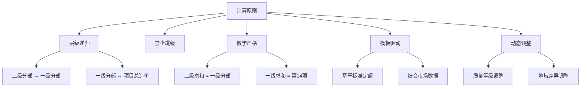
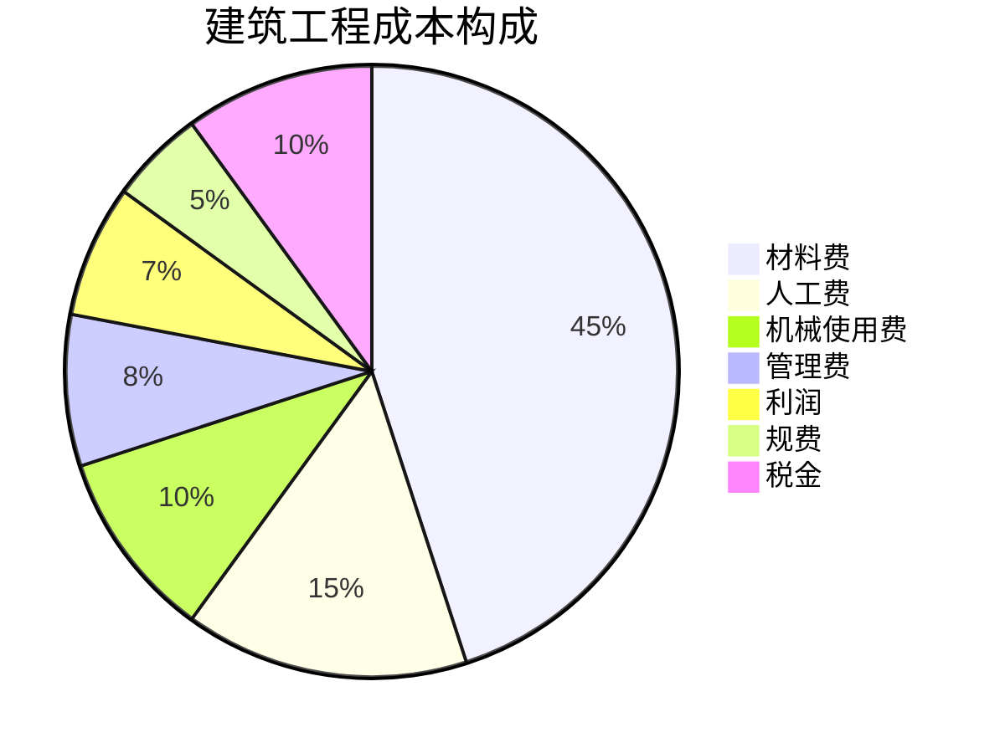
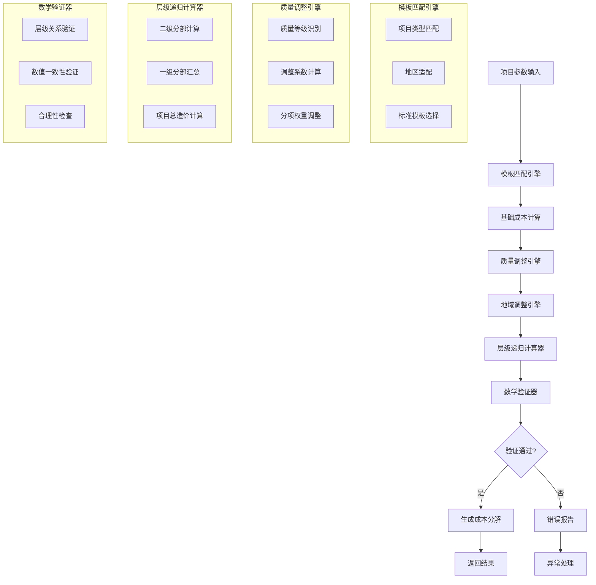
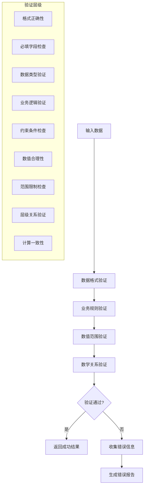

# 14级分部分项成本计算算法详解

## 📋 目录

- [算法概述](#算法概述)
- [理论基础](#理论基础)
- [算法架构](#算法架构)
- [核心算法实现](#核心算法实现)
- [数据验证机制](#数据验证机制)
- [性能优化策略](#性能优化策略)
- [算法测试与验证](#算法测试与验证)
- [实际应用案例](#实际应用案例)

## 🎯 算法概述

Cost-RAG系统采用14级分部分项层级递归计算算法，这是工程造价估算领域的核心算法。该算法严格按照国家建设工程工程量清单计价规范(GB 50500-2013)的要求，实现从二级分部开始，逐级向上计算，最终形成项目总造价的完整成本分解。

### 算法特点

1. **层级递归**: 严格按照14级层级结构进行计算
2. **数学验证**: 确保各层级数学关系的正确性
3. **模板驱动**: 基于成本模板进行标准成本计算
4. **动态调整**: 支持质量等级和地域差异的动态调整
5. **验证机制**: 多层次的数据验证和错误检测

### 计算原则



## 📚 理论基础

### 14级分部分项体系

根据《建设工程工程量清单计价规范》(GB 50500-2013)，建设工程项目分为以下14个分部：

| 级别 | 分部代码 | 分部名称 | 说明 |
|------|----------|----------|------|
| 1 | 1.0 | 土石方工程 | 场地平整、挖填、运输等 |
| 2 | 2.0 | 桩与基坑工程 | 桩基、支护、降水等 |
| 3 | 3.0 | 地基处理与边坡支护工程 | 地基加固、边坡支护等 |
| 4 | 4.0 | 混凝土及钢筋混凝土工程 | 混凝土、钢筋、模板等 |
| 5 | 5.0 | 木结构工程 | 木屋架、木梁、木柱等 |
| 6 | 6.0 | 金属结构工程 | 钢结构、铝合金结构等 |
| 7 | 7.0 | 屋面及防水工程 | 屋面、防水、保温等 |
| 8 | 8.0 | 保温、隔热、防腐工程 | 保温、防腐、防火等 |
| 9 | 9.0 | 脚手架工程 | 脚手架搭拆、安全防护等 |
| 10 | 10.0 | 已完工程及设备保护 | 保护措施、拆除清理等 |
| 11 | 11.0 | 施工排水、降水工程 | 排水、降水、集水井等 |
| 12 | 12.0 | 安全文明施工措施费 | 安全措施、文明施工等 |
| 13 | 13.0 | 其他项目 | 室外工程、夜间施工等 |
| 14 | 14.0 | 项目总价 | 前13项分部造价之和 |

### 成本构成理论



## 🏗️ 算法架构

### 整体架构图



### 核心组件

#### 1. 模板匹配引擎
```python
class TemplateMatchingEngine:
    def __init__(self):
        self.template_repository = TemplateRepository()
        self.region_adapter = RegionAdapter()

    def match_template(self, project: Project) -> CostTemplate:
        # 1. 项目类型匹配
        type_matches = self._match_by_type(project.type)

        # 2. 地区适配
        region_matches = self._match_by_region(project.location)

        # 3. 综合评分
        best_template = self._calculate_similarity_score(
            type_matches, region_matches
        )

        return best_template
```

#### 2. 质量调整引擎
```python
class QualityAdjustmentEngine:
    def __init__(self):
        self.adjustment_rules = AdjustmentRuleRepository()

    def calculate_adjustment(self,
                           base_costs: Dict[str, float],
                           quality_level: QualityLevel) -> Dict[str, float]:
        adjustments = {}

        for section_code, base_cost in base_costs.items():
            # 获取调整规则
            rule = self.adjustment_rules.get_rule(
                section_code,
                quality_level
            )

            if rule:
                adjustment = rule.calculate_adjustment(base_cost)
                adjustments[section_code] = adjustment

        return adjustments
```

#### 3. 地域调整引擎
```python
class RegionAdjustmentEngine:
    def __init__(self):
        self.region_repository = RegionRepository()
        self.market_analyzer = MarketAnalyzer()

    def calculate_adjustment(self,
                          costs: Dict[str, float],
                          location: str) -> Dict[str, float]:
        # 1. 地区识别
        region = self.region_repository.get_region(location)

        # 2. 获取地区调整系数
        adjustments = {}
        for section_code, base_cost in costs.items():
            region_factor = self._get_region_factor(
                section_code,
                region
            )

            adjustments[section_code] = base_cost * region_factor

        return adjustments
```

## 🔧 核心算法实现

### 1. 主计算算法

```python
class HierarchicalCostCalculator:
    def __init__(self):
        self.template_engine = TemplateMatchingEngine()
        self.quality_adjuster = QualityAdjustmentEngine()
        self.region_adjuster = RegionAdjustmentEngine()
        self.validator = MathRelationValidator()

    def calculate(self,
                  project: Project,
                  quality_level: QualityLevel) -> CostBreakdown:
        """主计算方法"""

        # 1. 匹配成本模板
        template = self.template_engine.match_template(project)

        # 2. 获取基础成本数据
        base_costs = self._get_base_costs(template)

        # 3. 应用质量调整
        quality_adjusted_costs = self.quality_adjuster.calculate_adjustment(
            base_costs, quality_level
        )

        # 4. 应用地域调整
        region_adjusted_costs = self.region_adjuster.calculate_adjustment(
            quality_adjusted_costs, project.location
        )

        # 5. 层级递归计算
        breakdown = self._hierarchical_calculation(
            project.area,
            region_adjusted_costs,
            template
        )

        # 6. 数学关系验证
        validation_result = self.validator.validate(breakdown)
        if not validation_result.is_valid:
            raise ValidationError(validation_result.errors)

        return breakdown
```

### 2. 层级递归计算

```python
def _hierarchical_calculation(self,
                             area: Area,
                             adjusted_costs: Dict[str, float],
                             template: CostTemplate) -> CostBreakdown:
    """层级递归计算核心算法"""

    # 步骤1: 计算所有二级分部调整后单方造价
    secondary_costs = {}
    secondary_sections = template.get_secondary_sections()

    for section in secondary_sections:
        if section.code in adjusted_costs:
            secondary_costs[section.code] = adjusted_costs[section.code]
        else:
            secondary_costs[section.code] = section.base_unit_price

    # 步骤2: 计算一级分部单方造价（二级分部求和）
    primary_costs = {}
    primary_sections = template.get_primary_sections()

    for primary_section in primary_sections:
        secondary_under_primary = template.get_secondary_by_primary(
            primary_section.code
        )

        primary_cost = sum(
            secondary_costs.get(sec.code, 0)
            for sec in secondary_under_primary
        )

        primary_costs[primary_section.code] = primary_cost

    # 步骤3: 计算项目总单方造价（第14项 = 前13项求和）
    total_unit_cost = sum(
        primary_costs[sec_code]
        for sec_code in primary_costs.keys()
        if sec_code.startswith("1.") or sec_code.startswith("2.") or
           sec_code.startswith("3.") or sec_code.startswith("4.") or
           sec_code.startswith("5.") or sec_code.startswith("6.") or
           sec_code.startswith("7.") or sec_code.startswith("8.") or
           sec_code.startswith("9.") or sec_code.startswith("10.") or
           sec_code.startswith("11.") or sec_code.startswith("12.") or
           sec_code.startswith("13.")
    )

    # 步骤4: 创建成本分解对象
    return CostBreakdown(
        area=area,
        total_unit_cost=Money(total_unit_cost),
        primary_sections=self._create_primary_sections(
            primary_costs, area
        ),
        secondary_sections=self._create_secondary_sections(
            secondary_costs, area
        )
    )
```

### 3. 数学关系验证

```python
class MathRelationValidator:
    def __init__(self):
        self.tolerance = 0.01  # 1% 容差
        self.max_attempts = 3

    def validate(self, breakdown: CostBreakdown) -> ValidationResult:
        """验证成本分解的数学关系"""

        errors = []
        warnings = []

        # 验证1: 二级分部求和 = 一级分部
        primary_validation = self._validate_primary_secondary_relationship(
            breakdown
        )
        errors.extend(primary_validation.errors)
        warnings.extend(primary_validation.warnings)

        # 验证2: 一级分部求和 = 项目总单方造价
        total_validation = self._validate_total_relationship(breakdown)
        errors.extend(total_validation.errors)
        warnings.extend(total_validation.warnings)

        # 验证3: 单方造价 × 建筑面积 = 合价
        area_validation = self._validate_area_cost_relationship(breakdown)
        errors.extend(area_validation.errors)
        warnings.extend(area_validation.warnings)

        return ValidationResult(
            is_valid=len(errors) == 0,
            errors=errors,
            warnings=warnings,
            validation_details={
                "primary_secondary": primary_validation,
                "total": total_validation,
                "area": area_validation
            }
        )

    def _validate_primary_secondary_relationship(
        self, breakdown: CostBreakdown
    ) -> ValidationDetail:
        """验证一级分部与二级分部的关系"""
        errors = []

        for primary_section in breakdown.primary_sections:
            expected_sum = 0.0
            secondary_sections = [
                sec for sec in breakdown.secondary_sections
                if sec.primary_section_code == primary_section.code
            ]

            calculated_sum = sum(sec.unit_cost.amount for sec in secondary_sections)
            expected_sum = primary_section.unit_cost.amount

            difference = abs(calculated_sum - expected_sum)
            tolerance = expected_sum * self.tolerance

            if difference > tolerance:
                errors.append(
                    f"一级分部{primary_section.code}验证失败: "
                    f"计算值{calculated_sum:.2f} != 期望值{expected_sum:.2f}, "
                    f"差异{difference:.2f}"
                )

        return ValidationDetail(errors=errors, warnings=[])

    def _validate_total_relationship(self, breakdown: CostBreakdown) -> ValidationDetail:
        """验证总分部与项目总价的关系"""
        errors = []

        calculated_total = sum(
            sec.unit_cost.amount for sec in breakdown.primary_sections
        )
        expected_total = breakdown.total_unit_cost.amount

        difference = abs(calculated_total - expected_total)
        tolerance = expected_total * self.tolerance

        if difference > tolerance:
            errors.append(
                f"项目总单方造价验证失败: "
                f"计算值{calculated_total:.2f} != 期望值{expected_total:.2f}, "
                f"差异{difference:.2f}"
            )

        return ValidationDetail(errors=errors, warnings=[])
```

### 4. 成本模板匹配算法

```python
class TemplateSimilarityCalculator:
    def __init__(self):
        self.weights = {
            'project_type': 0.4,
            'region': 0.3,
            'quality_level': 0.2,
            'scale': 0.1
        }

    def calculate_similarity(self,
                           project: Project,
                           template: CostTemplate) -> float:
        """计算项目与模板的相似度"""

        scores = {}

        # 项目类型相似度
        type_score = self._calculate_type_similarity(project.type, template.project_type)
        scores['project_type'] = type_score

        # 地区相似度
        region_score = self._calculate_region_similarity(project.location, template.region)
        scores['region'] = region_score

        # 质量等级相似度
        quality_score = self._calculate_quality_similarity(
            project.quality_level, template.quality_level
        )
        scores['quality_level'] = quality_score

        # 规模相似度
        scale_score = self._calculate_scale_similarity(project.area, template.typical_area)
        scores['scale'] = scale_score

        # 计算加权平均
        similarity = sum(
            scores[factor] * self.weights[factor]
            for factor in scores.keys()
        )

        return similarity

    def _calculate_type_similarity(self,
                                 project_type: ProjectType,
                                 template_type: ProjectType) -> float:
        """计算项目类型相似度"""
        if project_type == template_type:
            return 1.0
        elif self._is_related_type(project_type, template_type):
            return 0.8
        else:
            return 0.3

    def _calculate_region_similarity(self,
                                  location: str,
                                  template_region: str) -> float:
        """计算地区相似度"""
        if not location or not template_region:
            return 0.5

        # 地区匹配度计算
        if template_region in location:
            return 1.0
        elif self._is_nearby_region(location, template_region):
            return 0.8
        elif self._is_same_province(location, template_region):
            return 0.6
        else:
            return 0.3
```

## 📊 数据验证机制

### 验证流程图



### 验证规则定义

```python
class ValidationRules:
    # 数据格式验证规则
    DATA_FORMAT_RULES = {
        'area': {
            'type': 'float',
            'min_value': 1.0,
            'max_value': 1000000.0,
            'precision': 2
        },
        'floors': {
            'type': 'integer',
            'min_value': 1,
            'max_value': 200
        },
        'cost_value': {
            'type': 'float',
            'min_value': 0.0,
            'max_value': 100000000.0,
            'precision': 2
        }
    }

    # 业务逻辑验证规则
    BUSINESS_RULES = {
        'project_type_validation': {
            'allowed_types': ['office', 'residential', 'commercial', 'mixed'],
            'required_fields': ['name', 'type', 'area']
        },
        'section_hierarchy_validation': {
            'primary_sections': list(range(1, 14)),
            'max_secondary_per_primary': 10,
            'required_secondary_codes': True
        }
    }

    # 数学关系验证规则
    MATH_RULES = {
        'hierarchy_relationship': {
            'tolerance': 0.01,  # 1%
            'required_sections': [str(i) + '.0' for i in range(1, 14)]
        },
        'area_cost_relationship': {
            'tolerance': 0.001,  # 0.1%
            'calculation_method': 'multiplication'
        },
        'total_calculation': {
            'tolerance': 0.001,
            'validation_method': 'summation'
        }
    }
```

### 错误处理机制

```python
class ValidationErrorHandler:
    def __init__(self):
        self.error_categories = {
            'data_format': DataFormatError,
            'business_logic': BusinessLogicError,
            'math_relation': MathRelationError,
            'system_error': SystemError
        }

    def handle_validation_error(self, error: ValidationError) -> ErrorResponse:
        """处理验证错误"""

        # 分类错误
        error_type = self._classify_error(error)

        # 生成错误响应
        error_response = ErrorResponse(
            code=error_type.code,
            message=error.message,
            details=error.details,
            suggestions=error.suggestions
        )

        # 记录错误日志
        logger.error(f"验证错误: {error}")

        return error_response

    def _classify_error(self, error: ValidationError) -> ErrorType:
        """分类错误类型"""

        if error.field in ['area', 'floors', 'cost_value']:
            return self.error_categories['data_format']
        elif error.message.startswith('业务规则'):
            return self.error_categories['business_logic']
        elif error.message.startswith('数学关系'):
            return self.error_categories['math_relation']
        else:
            return self.error_categories['system_error']
```

## ⚡ 性能优化策略

### 1. 计算优化

#### 批量计算优化
```python
class BatchCostCalculator:
    def __init__(self):
        self.calculator = HierarchicalCostCalculator()
        self.batch_size = 10

    async def calculate_batch(
        self,
        projects: List[Project],
        quality_level: QualityLevel
    ) -> List[CostBreakdown]:
        """批量计算成本估算"""

        results = []

        # 分批处理
        for i in range(0, len(projects), self.batch_size):
            batch = projects[i:i + self.batch_size]
            batch_results = await asyncio.gather([
                self.calculator.calculate(project, quality_level)
                for project in batch
            ])
            results.extend(batch_results)

        return results
```

#### 缓存优化
```python
class CachedCostCalculator:
    def __init__(self):
        self.calculator = HierarchicalCostCalculator()
        self.cache = TTLCache(maxsize=100, ttl=3600)  # 1小时
        self.template_cache = TTLCache(maxsize=50, ttl=86400)  # 24小时

    async def calculate(self, project: Project, quality_level: QualityLevel) -> CostBreakdown:
        # 生成缓存键
        cache_key = self._generate_cache_key(project, quality_level)

        # 检查缓存
        cached_result = self.cache.get(cache_key)
        if cached_result:
            return cached_result

        # 执行计算
        result = await self.calculator.calculate(project, quality_level)

        # 缓存结果
        self.cache.set(cache_key, result)

        return result

    def _generate_cache_key(self, project: Project, quality_level: QualityLevel) -> str:
        """生成缓存键"""
        return f"estimate:{project.type}:{project.area:.0f}:{quality_level.value}"
```

### 2. 内存优化

#### 流式计算
```python
class StreamingCalculator:
    def __init__(self):
        self.chunk_size = 100

    def calculate_large_project(self,
                              project: Project,
                              template: CostTemplate) -> CostBreakdown:
        """大项目流式计算"""

        # 流式处理二级分部
        secondary_stream = self._stream_secondary_sections(
            template.secondary_sections
        )

        # 累积计算一级分部
        primary_costs = {}
        for chunk in secondary_stream:
            chunk_primary = self._aggregate_primary_section(chunk)
            for section_code, cost in chunk_primary.items():
                if section_code in primary_costs:
                    primary_costs[section_code] += cost
                else:
                    primary_costs[section_code] = cost

        # 计算总价
        total_cost = sum(primary_costs.values())

        return CostBreakdown(
            area=project.area,
            total_unit_cost=Money(total_cost),
            primary_sections=self._create_primary_sections(
                primary_costs, project.area
            )
        )
```

### 3. 数据库优化

#### 索引优化
```sql
-- 项目表索引
CREATE INDEX idx_projects_type_area ON projects(project_type, area);
CREATE INDEX idx_projects_location ON projects USING GIN(to_tsvector('chinese'));

-- 成本估算表索引
CREATE INDEX idx_estimates_project ON cost_estimates(project_id);
CREATE INDEX idx_estimates_status ON cost_estimates(status);
CREATE INDEX idx_estimates_created ON cost_estimates(created_at);

-- 成本分解表索引
CREATE INDEX idx_breakdowns_estimate ON cost_breakdowns(estimate_id);
CREATE INDEX idx_breakdowns_section_code ON cost_breakdowns(section_code);
CREATE INDEX idx_breakdowns_section_type ON cost_breakdowns(section_level);
```

#### 查询优化
```sql
-- 优化的成本分解查询
WITH RECURSIVE cost_hierarchy AS (
    SELECT
        section_code,
        parent_section_code,
        unit_cost,
        section_level,
        total_cost
    FROM cost_breakdowns
    WHERE estimate_id = :estimate_id
),
aggregated_costs AS (
    SELECT
        parent_section_code,
        SUM(unit_cost) as aggregated_cost
    FROM cost_hierarchy
    WHERE section_level = 2
    GROUP BY parent_section_code
)
SELECT
    ch.section_code,
    ch.unit_cost,
    ch.total_cost,
    ac.aggregated_cost as parent_cost
FROM cost_hierarchy ch
LEFT JOIN aggregated_costs ac ON ch.parent_section_code = ac.parent_section_code
WHERE ch.section_level = 1
ORDER BY ch.section_code;
```

## 🧪 算法测试与验证

### 1. 单元测试

```python
class TestHierarchicalCostCalculator:
    def test_calculate_simple_project(self):
        """测试简单项目计算"""
        project = Project.create(
            name="测试项目",
            type=ProjectType.COMMERCIAL,
            area=Area(1000.0),
            quality_level=QualityLevel.MEDIUM,
            location="北京市"
        )

        calculator = HierarchicalCostCalculator()
        result = calculator.calculate(project, QualityLevel.MEDIUM)

        # 验证结果
        assert result.total_unit_cost.amount > 0
        assert len(result.primary_sections) == 13
        assert len(result.secondary_sections) > 0

        # 验证数学关系
        expected_total = sum(
            sec.unit_cost.amount for sec in result.secondary_sections
        )
        calculated_total = sum(
            sec.unit_cost.amount for sec in result.primary_sections
        )
        assert abs(calculated_total - expected_total) < 0.01

    def test_quality_adjustment(self):
        """测试质量调整功能"""
        base_costs = {
            "1.1": 100.0,
            "2.1": 200.0,
            "3.1": 300.0
        }

        quality_adjuster = QualityAdjustmentEngine()

        # 测试低质量调整
        low_adjusted = quality_adjuster.calculate_adjustment(
            base_costs, QualityLevel.LOW
        )

        # 验证调整比例
        for section_code, adjusted_cost in low_adjusted.items():
            expected = base_costs[section_code] * 0.85
            assert abs(adjusted_cost - expected) < 0.01

    def test_math_validation(self):
        """测试数学关系验证"""
        breakdown = CostBreakdown(
            area=Area(1000.0),
            total_unit_cost=Money(1000.0),
            primary_sections=[
                PrimarySection("1.0", Money(100.0), Area(1000.0)),
                PrimarySection("2.0", Money(200.0), Area(1000.0))
            ],
            secondary_sections=[
                SecondarySection("1.1", Money(60.0), "1.0"),
                SecondarySection("1.2", Money(40.0), "1.0"),
                SecondarySection("2.1", Money(120.0), "2.0"),
                SecondarySection("2.2", Money(80.0), "2.0")
            ]
        )

        validator = MathRelationValidator()
        result = validator.validate(breakdown)

        assert result.is_valid, f"验证失败: {result.errors}"
        assert len(result.warnings) == 0
```

### 2. 集成测试

```python
class TestCostCalculationWorkflow:
    def test_complete_workflow(self):
        """测试完整计算工作流"""

        # 1. 准备测试数据
        project = self._create_test_project()
        template = self._create_test_template()

        # 2. 执行计算
        calculator = HierarchicalCostCalculator()
        breakdown = calculator.calculate(project, QualityLevel.HIGH)

        # 3. 验证结果
        self._assert_breakdown_validity(breakdown)
        self._assert_business_rules_compliance(breakdown)

        # 4. 测试导出功能
        export_service = CostExportService()
        excel_data = export_service.export_to_excel(breakdown)

        assert len(excel_data) > 0
        assert "总造价" in str(excel_data[0])

    def test_error_handling(self):
        """测试错误处理"""

        # 测试无效输入
        invalid_project = Project(
            name="",  # 空名称
            type=ProjectType.COMMERCIAL,
            area=Area(-1.0),  # 负面积
            quality_level=QualityLevel.MEDIUM,
            location=""
        )

        calculator = HierarchicalCostCalculator()

        with pytest.raises(ValidationError):
            calculator.calculate(invalid_project)

        # 测试模板不匹配
        project = self._create_test_project()

        calculator = HierarchicalCalculator()

        with pytest.raises(TemplateNotFoundError):
            calculator.calculate(
                project,
                QualityLevel.MEDIUM,
                template_id="invalid_template_id"
            )
```

### 3. 性能测试

```python
class TestCalculationPerformance:
    def test_calculation_speed(self):
        """测试计算性能"""

        projects = [
            self._create_test_project(area=1000.0),
            self._create_test_project(area=5000.0),
            self._create_test_project(area=10000.0),
            self._create_test_project(area=50000.0)
        ]

        calculator = HierarchicalCalculator()

        # 测试单个计算性能
        start_time = time.time()
        for project in projects:
            calculator.calculate(project, QualityLevel.MEDIUM)
        single_calc_time = time.time() - start_time

        # 测试批量计算性能
        start_time = time.time()
        results = calculator.calculate_batch(projects, QualityLevel.MEDIUM)
        batch_calc_time = time.time() - start_time

        # 性能断言
        assert single_calc_time < 1.0, f"单个计算时间过长: {single_calc_time}s"
        assert batch_calc_time < len(projects) * 0.5, f"批量计算时间过长: {batch_calc_time}s"

    def test_memory_usage(self):
        """测试内存使用"""
        import psutil
        import os

        # 获取初始内存使用
        process = psutil.Process(os.getpid())
        initial_memory = process.memory_info().rss

        # 执行大量计算
        projects = [
            self._create_test_project(area=10000.0)
            for _ in range(100)
        ]

        calculator = HierarchicalCostCalculator()
        results = calculator.calculate_batch(projects, QualityLevel.MEDIUM)

        # 检查内存使用
        final_memory = process.memory_info().rss
        memory_increase = final_memory - initial_memory

        # 内存断言
        assert memory_increase < 100 * 1024 * 1024, f"内存使用过高: {memory_increase / 1024 / 1024}MB"
```

## 📈 实际应用案例

### 案例1: 商业综合体项目估算

```python
def commercial_complex_estimation_example():
    """商业综合体项目估算示例"""

    # 项目参数
    project = Project(
        name="中关村商业综合体",
        type=ProjectType.COMMERCIAL,
        area=Area(50000.0),
        floors=35,
        quality_level=QualityLevel.HIGH,
        location="北京市海淀区"
    )

    # 执行计算
    calculator = HierarchicalCostCalculator()
    breakdown = calculator.calculate(project, QualityLevel.HIGH)

    # 计算结果分析
    print(f"项目: {project.name}")
    print(f"面积: {project.area.square_meters}平方米")
    print(f"总造价: ¥{breakdown.total_cost.amount:,.0f}")
    print(f"单方造价: ¥{breakdown.total_unit_cost.amount:,.0f}/平方米")

    # 分部分项分析
    print("\n主要分部分项:")
    for section in breakdown.primary_sections[:5]:
        print(f"{section.code} {section.name}: ¥{section.total_cost.amount:,.0f}")
        print(f"  单方造价: ¥{section.unit_cost.amount:,.0f}/平方米")
        print(f"  占比: {section.cost_ratio:.1%}")
```

### 案例2: 多项目对比分析

```python
def multi_project_comparison_example():
    """多项目对比分析示例"""

    # 对比项目数据
    projects_data = [
        {
            "name": "项目A",
            "area": 30000.0,
            "type": "commercial",
            "total_cost": 150000000.0
        },
        {
            "name": "项目B",
            "area": 45000.0,
            "type": "commercial",
            "total_cost": 270000000.0
        },
        {
            "name": "项目C",
            "area": 25000.0,
            "type": "residential",
            "total_cost": 125000000.0
        }
    ]

    # 计算单方造价
    for project in projects_data:
        project['unit_cost'] = project['total_cost'] / project['area']

    # 分析成本差异
    avg_unit_cost = sum(p['unit_cost'] for p in projects_data) / len(projects_data)

    print("多项目对比分析:")
    print(f"平均单方造价: ¥{avg_unit_cost:.2f}/平方米")

    for project in projects_data:
        variance = (project['unit_cost'] - avg_unit_cost) / avg_unit_cost
        print(f"{project['name']}: ¥{project['unit_cost']:.2f}/m² ({variance:+.1%})")
```

---

## 📞 技术支持

- **算法文档**: [多项目对比算法](./multi-project-analysis.md)
- **验证规则**: [数据验证规则](./data-validation-rules.md)
- **性能报告**: [算法性能报告](./performance-report.md)
- **技术支持**: support@cost-rag.com
- **算法咨询**: algorithms@cost-rag.com