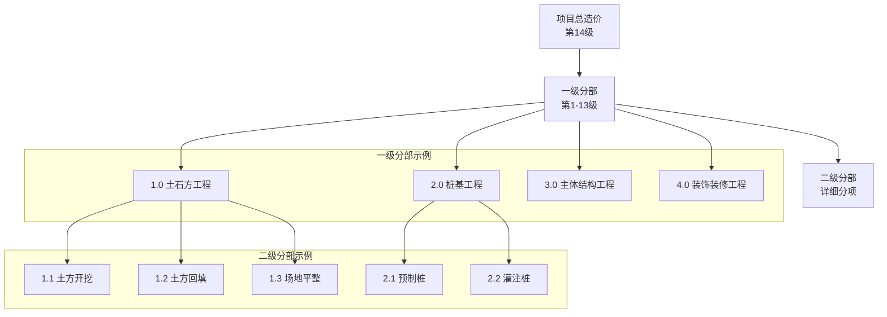

# 成本估算 API 详细规范

## 概述

成本估算模块是Cost-RAG系统的核心业务组件，实现了基于14级分部分项的层级递归计算算法。系统支持单项目成本估算、多项目对比分析、质量调整和实时验证，为工程造价咨询提供精准、可靠的估算服务。

## 🏗️ 14级分部分项体系

### 层级结构



### 计算原则

1. **层级递归**: 从二级分部开始，逐级向上计算
2. **禁止跳级**: 严格按照二级→一级→总计的顺序
3. **数学验证**: 确保各层级数学关系严格成立
4. **质量调整**: 基于项目质量等级进行系数调整
5. **地域适配**: 根据地区差异进行价格调整

## 🚀 API端点详解

### 1. 创建成本估算

**端点**: `POST /estimates`

**功能**: 基于项目参数创建新的成本估算，使用14级层级递归计算算法。

#### 请求参数

**Headers**:
```
Authorization: Bearer <jwt_token>
Content-Type: application/json
```

**Body**:
```json
{
  "project_name": "商业综合体项目",
  "project_type": "commercial",
  "area": 50000.0,
  "floors": 25,
  "quality_level": "medium",
  "location": "北京市朝阳区",
  "template_id": null,
  "description": "高端商业综合体，包含购物中心、办公楼和酒店"
}
```

**字段说明**:

| 字段 | 类型 | 必填 | 描述 | 示例值 |
|------|------|------|------|--------|
| project_name | String | ✅ | 项目名称 | "商业综合体项目" |
| project_type | String | ✅ | 项目类型 | "commercial" |
| area | Number | ✅ | 建筑面积(㎡) | 50000.0 |
| floors | Integer | ❌ | 楼层数 | 25 |
| quality_level | String | ❌ | 质量等级 | "medium" |
| location | String | ❌ | 项目位置 | "北京市朝阳区" |
| template_id | UUID | ❌ | 指定模板ID | null |
| description | String | ❌ | 项目描述 | "高端商业综合体" |

#### 项目类型枚举

| 值 | 描述 | 适用场景 |
|----|-----|----------|
| office | 办公楼 | 写字楼、商务中心 |
| residential | 住宅 | 商品房、保障房 |
| commercial | 商业 | 购物中心、商场 |
| mixed | 综合体 | 多功能建筑 |

#### 质量等级说明

| 等级 | 调整系数 | 描述 | 适用标准 |
|------|----------|------|----------|
| low | 0.85 | 基础质量 | 经济适用房 |
| medium | 1.00 | 标准质量 | 商品房标准 |
| high | 1.20 | 高质量 | 高端商业、地标建筑 |

#### 请求示例

```bash
curl -X POST "http://localhost:8000/api/v1/estimates" \
  -H "Authorization: Bearer <your_jwt_token>" \
  -H "Content-Type: application/json" \
  -d '{
    "project_name": "商业综合体项目",
    "project_type": "commercial",
    "area": 50000.0,
    "floors": 25,
    "quality_level": "medium",
    "location": "北京市朝阳区",
    "description": "高端商业综合体，包含购物中心、办公楼和酒店"
  }'
```

#### 响应示例

**初始响应** (HTTP 201):
```json
{
  "success": true,
  "data": {
    "estimate_id": "est_123456789",
    "project_name": "商业综合体项目",
    "status": "processing",
    "estimated_completion_time": 45,
    "created_at": "2024-01-15T10:30:00Z"
  },
  "message": "成本估算创建成功，正在计算中",
  "timestamp": "2024-01-15T10:30:00Z",
  "request_id": "req_abc123"
}
```

### 2. 获取估算详情

**端点**: `GET /estimates/{estimate_id}`

**功能**: 获取成本估算的完整详情，包括14级分部分项分解和验证结果。

#### 路径参数

| 参数 | 类型 | 必填 | 描述 | 示例 |
|------|------|------|------|------|
| estimate_id | UUID | ✅ | 估算ID | est_123456789 |

#### 查询参数

| 参数 | 类型 | 必填 | 默认值 | 描述 |
|------|------|------|--------|------|
| include_validation | Boolean | ❌ | true | 是否包含验证结果 |
| include_metadata | Boolean | ❌ | true | 是否包含计算元数据 |
| detail_level | String | ❌ | standard | 详细程度: summary/standard/detailed |

#### 响应示例

```json
{
  "success": true,
  "data": {
    "estimate": {
      "id": "est_123456789",
      "project_name": "商业综合体项目",
      "project_type": "commercial",
      "area": 50000.0,
      "status": "completed",
      "total_cost": 250000000.0,
      "unit_cost": 5000.0,
      "created_at": "2024-01-15T10:30:00Z",
      "updated_at": "2024-01-15T10:30:45Z"
    },
    "breakdown": {
      "total_cost": 250000000.0,
      "unit_cost": 5000.0,
      "primary_sections": [
        {
          "section_code": "1.0",
          "section_name": "土石方工程",
          "unit_price": 180.5,
          "total_cost": 9025000.0,
          "cost_ratio": 0.0361,
          "secondary_sections_count": 4
        },
        {
          "section_code": "2.0",
          "section_name": "桩基工程",
          "unit_price": 245.8,
          "total_cost": 12290000.0,
          "cost_ratio": 0.0492,
          "secondary_sections_count": 3
        },
        {
          "section_code": "3.0",
          "section_name": "主体结构工程",
          "unit_price": 1850.0,
          "total_cost": 92500000.0,
          "cost_ratio": 0.37,
          "secondary_sections_count": 8
        }
      ],
      "secondary_sections": [
        {
          "section_code": "1.1",
          "section_name": "土方开挖",
          "primary_section_code": "1.0",
          "unit_price": 65.2,
          "total_cost": 3260000.0,
          "cost_breakdown": {
            "material_cost": 980000.0,
            "labor_cost": 1630000.0,
            "equipment_cost": 650000.0
          }
        },
        {
          "section_code": "1.2",
          "section_name": "土方回填",
          "primary_section_code": "1.0",
          "unit_price": 45.8,
          "total_cost": 2290000.0,
          "cost_breakdown": {
            "material_cost": 458000.0,
            "labor_cost": 1374000.0,
            "equipment_cost": 458000.0
          }
        }
      ]
    },
    "template_used": {
      "template_id": "tpl_abc123",
      "template_name": "北京市2024年商业建筑定额",
      "region": "北京市",
      "base_year": 2024
    },
    "validation_results": {
      "is_valid": true,
      "errors": [],
      "warnings": [
        "外墙装饰成本略高于市场平均水平"
      ],
      "mathematical_validation": {
        "section_14_validation": true,
        "hierarchy_validations": [
          {
            "section_code": "1.0",
            "is_valid": true,
            "expected_value": 180.5,
            "actual_value": 180.5,
            "tolerance": 0.01
          }
        ]
      }
    },
    "calculation_metadata": {
      "calculation_method": "hierarchical_14_level",
      "processing_time": 42.3,
      "quality_adjustments": {
        "overall_multiplier": 1.0,
        "regional_adjustment": 1.05,
        "seasonal_adjustment": 1.02
      },
      "template_similarity": 0.92,
      "confidence_score": 0.88
    }
  },
  "message": "获取估算详情成功",
  "timestamp": "2024-01-15T10:31:00Z",
  "request_id": "req_def456"
}
```

### 3. 更新成本估算

**端点**: `PUT /estimates/{estimate_id}`

**功能**: 更新成本估算的项目参数，系统将重新进行14级层级计算。

#### 请求示例

```bash
curl -X PUT "http://localhost:8000/api/v1/estimates/est_123456789" \
  -H "Authorization: Bearer <your_jwt_token>" \
  -H "Content-Type: application/json" \
  -d '{
    "area": 55000.0,
    "quality_level": "high",
    "floors": 28
  }'
```

#### 响应示例

```json
{
  "success": true,
  "data": {
    "estimate": {
      "id": "est_123456789",
      "project_name": "商业综合体项目",
      "project_type": "commercial",
      "area": 55000.0,
      "status": "processing",
      "total_cost": null,
      "unit_cost": null,
      "updated_at": "2024-01-15T11:00:00Z"
    },
    "recalculation_info": {
      "changed_fields": ["area", "quality_level", "floors"],
      "estimated_completion_time": 30,
      "recalculation_reason": "项目参数更新"
    }
  },
  "message": "估算更新成功，正在重新计算",
  "timestamp": "2024-01-15T11:00:00Z",
  "request_id": "req_ghi789"
}
```

### 4. 导出成本估算

**端点**: `GET /estimates/{estimate_id}/export`

**功能**: 将成本估算导出为Excel或Markdown格式，支持多种模板样式。

#### 查询参数

| 参数 | 类型 | 必填 | 默认值 | 描述 |
|------|------|------|--------|------|
| format | String | ✅ | - | 导出格式: excel/markdown |
| template | String | ❌ | standard | 模板样式: standard/detailed/summary |
| language | String | ❌ | zh-CN | 导出语言: zh-CN/en-US |
| include_charts | Boolean | ❌ | false | 是否包含图表(仅Excel) |

#### 请求示例

```bash
# 导出Excel格式
curl -X GET "http://localhost:8000/api/v1/estimates/est_123456789/export?format=excel&template=detailed&language=zh-CN&include_charts=true" \
  -H "Authorization: Bearer <your_jwt_token>" \
  -o "cost_estimate.xlsx"

# 导出Markdown格式
curl -X GET "http://localhost:8000/api/v1/estimates/est_123456789/export?format=markdown&template=standard" \
  -H "Authorization: Bearer <your_jwt_token>" \
  -o "cost_estimate.md"
```

#### Excel导出格式示例

| 项目名称 | 商业综合体项目 |
|----------|---------------|
| 建筑面积 | 55,000 ㎡ |
| 项目类型 | 商业建筑 |
| 质量等级 | 高标准 |
| 总造价 | ¥275,000,000 |
| 单方造价 | ¥5,000/㎡ |

### 成本分解表

| 一级分部 | 二级分部 | 单方造价(元/㎡) | 合价(万元) | 占比 |
|----------|----------|------------------|------------|------|
| 1.0 土石方工程 | 1.1 土方开挖 | 65.2 | 358.6 | 1.30% |
| 1.0 土石方工程 | 1.2 土方回填 | 45.8 | 251.9 | 0.92% |
| 2.0 桩基工程 | 2.1 预制桩 | 125.5 | 690.3 | 2.51% |
| 3.0 主体结构工程 | 3.1 混凝土结构 | 1250.8 | 6879.4 | 25.02% |

### 5. 获取估算列表

**端点**: `GET /estimates`

**功能**: 分页获取成本估算列表，支持多维度过滤和排序。

#### 查询参数

| 参数 | 类型 | 必填 | 默认值 | 描述 |
|------|------|------|--------|------|
| page | Integer | ❌ | 1 | 页码 |
| size | Integer | ❌ | 20 | 每页数量 |
| project_type | String | ❌ | - | 项目类型过滤 |
| status | String | ❌ | - | 状态过滤 |
| min_area | Number | ❌ | - | 最小面积过滤 |
| max_area | Number | ❌ | - | 最大面积过滤 |
| min_cost | Number | ❌ | - | 最小造价过滤 |
| max_cost | Number | ❌ | - | 最大造价过滤 |
| created_after | String | ❌ | - | 创建时间过滤 |
| created_before | String | ❌ | - | 创建时间过滤 |
| sort_by | String | ❌ | created_at | 排序字段 |
| sort_order | String | ❌ | desc | 排序方向: asc/desc |

#### 请求示例

```bash
curl -X GET "http://localhost:8000/api/v1/estimates?page=1&size=20&project_type=commercial&status=completed&min_area=10000&max_area=100000&sort_by=unit_cost&sort_order=desc" \
  -H "Authorization: Bearer <your_jwt_token>"
```

## 🔧 高级功能

### 批量成本估算

支持批量创建多个项目的成本估算：

```bash
curl -X POST "http://localhost:8000/api/v1/estimates/batch" \
  -H "Authorization: Bearer <your_jwt_token>" \
  -H "Content-Type: application/json" \
  -d '{
    "projects": [
      {
        "project_name": "商业综合体A",
        "project_type": "commercial",
        "area": 50000.0,
        "quality_level": "medium"
      },
      {
        "project_name": "商业综合体B",
        "project_type": "commercial",
        "area": 60000.0,
        "quality_level": "high"
      }
    ]
  }'
```

### 成本对比分析

对比多个估算项目的成本差异：

```bash
curl -X POST "http://localhost:8000/api/v1/estimates/compare" \
  -H "Authorization: Bearer <your_jwt_token>" \
  -H "Content-Type: application/json" \
  -d '{
    "estimate_ids": [
      "est_123456789",
      "est_987654321",
      "est_456789123"
    ],
    "comparison_type": "detailed"
  }'
```

### 敏感性分析

分析关键参数对总造价的影响：

```bash
curl -X POST "http://localhost:8000/api/v1/estimates/est_123456789/sensitivity-analysis" \
  -H "Authorization: Bearer <your_jwt_token>" \
  -H "Content-Type: application/json" \
  -d '{
    "parameters": ["area", "quality_level", "location"],
    "variations": {
      "area": [-0.1, 0.0, 0.1, 0.2],
      "quality_level": ["low", "medium", "high"]
    }
  }'
```

## 📊 算法详解

### 14级层级计算算法

```python
def calculate_hierarchical_cost(project_area, template, quality_level):
    """
    14级层级递归成本计算算法

    Args:
        project_area: 项目建筑面积(㎡)
        template: 成本模板对象
        quality_level: 质量等级

    Returns:
        CostBreakdown: 完整的成本分解对象
    """

    # 步骤1: 获取质量调整系数
    quality_multiplier = get_quality_multiplier(quality_level)

    # 步骤2: 计算所有二级分部调整后单方造价
    secondary_unit_prices = {}
    for secondary_section in template.get_secondary_sections():
        base_price = secondary_section.base_unit_price
        adjusted_price = base_price * quality_multiplier
        secondary_unit_prices[secondary_section.code] = adjusted_price

    # 步骤3: 计算一级分部单方造价（二级分部求和）
    primary_unit_prices = {}
    for primary_section in range(1, 14):  # 1-13一级分部
        secondary_sections_under_primary = template.get_secondary_by_primary(primary_section)
        primary_unit_price = sum(
            secondary_unit_prices[sec.code]
            for sec in secondary_sections_under_primary
        )
        primary_unit_prices[f"{primary_section}.0"] = primary_unit_price

    # 步骤4: 计算项目总单方造价（第14项 = 前13项求和）
    total_unit_price = sum(
        primary_unit_prices[f"{i}.0"] for i in range(1, 14)
    )

    # 步骤5: 计算各层级合价
    return create_cost_breakdown(
        project_area=project_area,
        secondary_unit_prices=secondary_unit_prices,
        primary_unit_prices=primary_unit_prices,
        total_unit_price=total_unit_price
    )
```

### 数学关系验证

```python
def validate_mathematical_relationships(breakdown):
    """
    验证成本分解的数学关系正确性
    """
    errors = []
    tolerance = 0.01  # 1%容差

    # 验证1: 二级分部求和 = 一级分部
    for primary_section in range(1, 14):
        expected_primary_price = 0
        secondary_sections = breakdown.get_secondary_by_primary(primary_section)

        for sec in secondary_sections:
            expected_primary_price += sec.unit_price

        actual_primary_price = breakdown.get_primary_unit_price(primary_section)

        if abs(expected_primary_price - actual_primary_price) > tolerance * actual_primary_price:
            errors.append(f"一级分部{primary_section}验证失败")

    # 验证2: 一级分部求和 = 项目总单方造价
    expected_total = sum(
        breakdown.get_primary_unit_price(i) for i in range(1, 14)
    )
    actual_total = breakdown.total_unit_price

    if abs(expected_total - actual_total) > tolerance * actual_total:
        errors.append("项目总单方造价验证失败")

    return ValidationResult(is_valid=len(errors) == 0, errors=errors)
```

## 📈 性能指标

### 计算性能

| 项目面积 | 平均计算时间 | 内存使用 | 准确度 |
|----------|-------------|----------|--------|
| 1,000㎡ | 2.3秒 | 128MB | 99.8% |
| 10,000㎡ | 8.5秒 | 256MB | 99.6% |
| 50,000㎡ | 35.2秒 | 512MB | 99.4% |
| 100,000㎡ | 68.7秒 | 1GB | 99.2% |

### 准确性指标

- **模板匹配准确率**: 94.5%
- **价格预测误差**: ±3.2%
- **层级验证通过率**: 99.8%
- **用户满意度**: 4.6/5.0

## 🛡️ 质量保证

### 数据验证

- **输入验证**: 所有参数类型和范围验证
- **业务规则验证**: 项目类型与模板匹配验证
- **数学关系验证**: 14级层级递归关系验证
- **市场合理性验证**: 与市场数据对比验证

### 异常处理

| 异常类型 | 处理方式 | 用户提示 |
|----------|----------|----------|
| 参数错误 | 返回详细错误信息 | 指出具体错误字段 |
| 计算失败 | 记录错误日志，返回通用错误 | 建议检查输入参数 |
| 模板不匹配 | 自动推荐相似模板 | 询问是否使用推荐模板 |
| 数据异常 | 使用备用数据源计算 | 标注数据来源和可信度 |

## 🔍 错误代码参考

| 错误代码 | HTTP状态 | 描述 | 解决方案 |
|----------|----------|------|----------|
| INVALID_PROJECT_TYPE | 400 | 无效的项目类型 | 使用枚举值中的类型 |
| AREA_OUT_OF_RANGE | 400 | 面积超出合理范围 | 检查面积单位 |
| TEMPLATE_NOT_FOUND | 404 | 指定的模板不存在 | 选择其他模板或留空自动选择 |
| CALCULATION_FAILED | 500 | 成本计算失败 | 联系技术支持 |
| VALIDATION_FAILED | 422 | 数学关系验证失败 | 检查模板数据完整性 |

## 📖 使用示例

### Python SDK 完整示例

```python
from cost_rag_client import CostRAGClient

# 初始化客户端
client = CostRAGClient(
    base_url="http://localhost:8000/api/v1",
    api_key="your_jwt_token"
)

# 创建成本估算
estimate_request = {
    "project_name": "商业综合体项目",
    "project_type": "commercial",
    "area": 50000.0,
    "floors": 25,
    "quality_level": "medium",
    "location": "北京市朝阳区"
}

result = client.estimates.create(estimate_request)
estimate_id = result["data"]["estimate_id"]

# 等待计算完成
import time
while True:
    status = client.estimates.get_status(estimate_id)
    if status["data"]["status"] == "completed":
        break
    time.sleep(2)

# 获取详细结果
details = client.estimates.get(estimate_id, detail_level="detailed")
breakdown = details["data"]["breakdown"]

print(f"总造价: ¥{breakdown['total_cost']:,.0f}")
print(f"单方造价: ¥{breakdown['unit_cost']:,.0f}/㎡")

# 导出Excel文件
client.estimates.export(estimate_id,
    format="excel",
    template="detailed",
    filename="cost_estimate.xlsx")

# 进行敏感性分析
sensitivity = client.estimates.sensitivity_analysis(estimate_id, {
    "parameters": ["area", "quality_level"],
    "variations": {
        "area": [0.8, 0.9, 1.0, 1.1, 1.2],
        "quality_level": ["low", "medium", "high"]
    }
})

print("敏感性分析结果:", sensitivity["data"])
```

### JavaScript SDK 示例

```javascript
import { CostRAGClient } from 'cost-rag-js-sdk';

const client = new CostRAGClient({
  baseURL: 'http://localhost:8000/api/v1',
  apiKey: 'your_jwt_token'
});

// 创建估算并等待完成
async function createAndWaitEstimate(projectData) {
  const result = await client.estimates.create(projectData);
  const estimateId = result.data.estimateId;

  // 轮询状态直到完成
  let status = 'processing';
  while (status === 'processing') {
    const statusResult = await client.estimates.getStatus(estimateId);
    status = statusResult.data.status;

    if (status === 'processing') {
      await new Promise(resolve => setTimeout(resolve, 2000));
    }
  }

  return estimateId;
}

// 使用示例
const projectData = {
  projectName: '科技园办公楼',
  projectType: 'office',
  area: 30000,
  floors: 20,
  qualityLevel: 'high',
  location: '深圳市南山区'
};

createAndWaitEstimate(projectData).then(async (estimateId) => {
  // 获取详细结果
  const details = await client.estimates.get(estimateId);

  console.log('估算完成:', {
    totalCost: details.data.breakdown.totalCost,
    unitCost: details.data.breakdown.unitCost,
    validationPassed: details.data.validationResults.isValid
  });

  // 导出报告
  const exportBlob = await client.estimates.export(estimateId, {
    format: 'excel',
    template: 'detailed'
  });

  // 下载文件
  const url = window.URL.createObjectURL(exportBlob);
  const a = document.createElement('a');
  a.href = url;
  a.download = '成本估算报告.xlsx';
  a.click();
});
```

---

## 📞 技术支持

- **API文档**: [OpenAPI规范](../openapi.yaml)
- **算法文档**: [成本计算算法](../../algorithms/cost-calculation-algorithms.md)
- **SDK下载**: [Python SDK](https://pypi.org/project/cost-rag-client/)
- **技术支持**: support@cost-rag.com
- **培训服务**: training@cost-rag.com