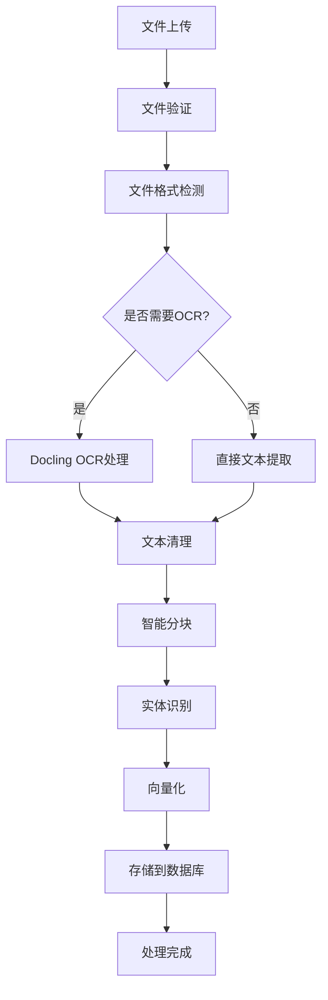

# 文档处理 API 详细规范

## 概述

文档处理模块是Cost-RAG系统的核心组件，负责处理各种格式的工程文档，包括PDF、Excel、Word、PPT等。系统使用Docling OCR技术进行文档解析，智能提取文本内容，并进行分块处理和向量化存储，为RAG智能检索提供数据基础。

## 📁 支持的文件格式

| 格式 | 扩展名 | OCR支持 | 结构化提取 | 最大文件大小 |
|------|--------|---------|------------|--------------|
| PDF | `.pdf` | ✅ | ✅ | 100MB |
| Excel | `.xlsx`, `.xls` | ❌ | ✅ | 50MB |
| Word | `.docx`, `.doc` | ❌ | ✅ | 50MB |
| PowerPoint | `.pptx`, `.ppt` | ❌ | ✅ | 100MB |
| 文本 | `.txt`, `.md` | ❌ | ✅ | 10MB |
| HTML | `.html`, `.htm` | ❌ | ✅ | 20MB |

## 🚀 API端点详解

### 1. 上传文档

**端点**: `POST /documents/upload`

**功能**: 上传并处理文档文件，自动进行OCR识别、文本提取、分块处理和向量化存储。

#### 请求参数

**Headers**:
```
Authorization: Bearer <jwt_token>
Content-Type: multipart/form-data
```

**Body** (multipart/form-data):
| 字段 | 类型 | 必填 | 描述 | 示例 |
|------|------|------|------|------|
| file | File | ✅ | 上传的文档文件 | cost_template.pdf |
| document_type | String | ❌ | 文档类型分类 | cost_template |
| project_id | UUID | ❌ | 关联的项目ID | 123e4567-e89b-12d3-a456-426614174000 |
| description | String | ❌ | 文档描述 | 2024年北京市工程造价定额 |

#### 请求示例

```bash
curl -X POST "http://localhost:8000/api/v1/documents/upload" \
  -H "Authorization: Bearer <your_jwt_token>" \
  -F "file=@cost_template.pdf" \
  -F "document_type=cost_template" \
  -F "project_id=123e4567-e89b-12d3-a456-426614174000" \
  -F "description=北京市2024年工程造价定额"
```

#### 响应示例

```json
{
  "success": true,
  "data": {
    "document_id": "doc_123456789",
    "filename": "cost_template.pdf",
    "file_size": 2048576,
    "document_type": "cost_template",
    "processing_status": "processing",
    "upload_time": "2024-01-15T10:30:00Z",
    "estimated_processing_time": 120,
    "file_metadata": {
      "original_format": "PDF",
      "page_count": 45,
      "creation_date": "2024-01-01T00:00:00Z",
      "author": "北京市住建委"
    }
  },
  "message": "文档上传成功，正在处理中",
  "timestamp": "2024-01-15T10:30:00Z",
  "request_id": "req_abc123"
}
```

#### 错误响应

```json
{
  "success": false,
  "error": {
    "code": "FILE_TOO_LARGE",
    "message": "文件大小超出限制",
    "details": [
      {
        "field": "file",
        "message": "文件大小不能超过100MB"
      }
    ]
  },
  "timestamp": "2024-01-15T10:30:00Z",
  "request_id": "req_abc123"
}
```

#### 处理流程



### 2. 获取文档列表

**端点**: `GET /documents`

**功能**: 分页获取用户文档列表，支持搜索和过滤功能。

#### 查询参数

| 参数 | 类型 | 必填 | 默认值 | 描述 | 示例 |
|------|------|------|--------|------|------|
| page | Integer | ❌ | 1 | 页码，从1开始 | 1 |
| size | Integer | ❌ | 20 | 每页数量(1-100) | 20 |
| search | String | ❌ | - | 搜索关键词 | 混凝土 |
| document_type | String | ❌ | - | 文档类型过滤 | cost_template |
| project_id | UUID | ❌ | - | 项目ID过滤 | 123e4567-e89b-12d3-a456-426614174000 |
| status | String | ❌ | - | 处理状态过滤 | completed |
| created_after | String | ❌ | - | 创建时间过滤(ISO 8601) | 2024-01-01T00:00:00Z |
| created_before | String | ❌ | - | 创建时间过滤(ISO 8601) | 2024-12-31T23:59:59Z |

#### 请求示例

```bash
curl -X GET "http://localhost:8000/api/v1/documents?page=1&size=20&search=混凝土&document_type=cost_template&status=completed" \
  -H "Authorization: Bearer <your_jwt_token>"
```

#### 响应示例

```json
{
  "success": true,
  "data": {
    "documents": [
      {
        "id": "doc_123456789",
        "filename": "北京市工程造价定额2024.pdf",
        "file_type": "PDF",
        "document_type": "cost_template",
        "file_size": 2048576,
        "processing_status": "completed",
        "created_at": "2024-01-15T10:30:00Z",
        "updated_at": "2024-01-15T10:32:00Z",
        "project_name": "商业综合体项目",
        "processing_metadata": {
          "pages_processed": 45,
          "chunks_created": 234,
          "entities_extracted": 156,
          "processing_time": 118.5
        }
      }
    ],
    "pagination": {
      "page": 1,
      "size": 20,
      "total": 1,
      "pages": 1,
      "has_next": false,
      "has_prev": false
    }
  },
  "message": "获取文档列表成功",
  "timestamp": "2024-01-15T10:35:00Z",
  "request_id": "req_def456"
}
```

### 3. 获取文档详情

**端点**: `GET /documents/{document_id}`

**功能**: 获取指定文档的详细信息，包括处理状态、提取的文本内容和识别的实体。

#### 路径参数

| 参数 | 类型 | 必填 | 描述 | 示例 |
|------|------|------|------|------|
| document_id | UUID | ✅ | 文档ID | doc_123456789 |

#### 查询参数

| 参数 | 类型 | 必填 | 默认值 | 描述 |
|------|------|------|--------|------|
| include_text | Boolean | ❌ | false | 是否包含完整提取文本 |
| include_chunks | Boolean | ❌ | false | 是否包含分块信息 |
| chunk_limit | Integer | ❌ | 50 | 返回分块数量限制 |

#### 请求示例

```bash
curl -X GET "http://localhost:8000/api/v1/documents/doc_123456789?include_text=true&include_chunks=true&chunk_limit=10" \
  -H "Authorization: Bearer <your_jwt_token>"
```

#### 响应示例

```json
{
  "success": true,
  "data": {
    "document": {
      "id": "doc_123456789",
      "filename": "北京市工程造价定额2024.pdf",
      "file_type": "PDF",
      "document_type": "cost_template",
      "file_size": 2048576,
      "processing_status": "completed",
      "created_at": "2024-01-15T10:30:00Z",
      "updated_at": "2024-01-15T10:32:00Z",
      "project_name": "商业综合体项目"
    },
    "extracted_text": "第一章 总则\n1.1 本定额适用于北京市行政区域内的新建、扩建、改建工程...\n",
    "text_metadata": {
      "total_characters": 125432,
      "total_words": 18765,
      "language_detected": "zh-CN",
      "ocr_confidence": 0.96
    },
    "chunk_count": 234,
    "entities_extracted": [
      {
        "entity_type": "material",
        "entity_name": "混凝土C30",
        "confidence": 0.95,
        "position": {
          "start": 1250,
          "end": 1258
        },
        "context": "混凝土C30配合比：水泥400kg，砂650kg，石子1200kg",
        "standard_code": "GB/T 50081-2019"
      },
      {
        "entity_type": "quota",
        "entity_name": "A1-1",
        "confidence": 0.88,
        "position": {
          "start": 2456,
          "end": 2460
        },
        "context": "定额编号A1-1：人工挖土方",
        "unit_price": 45.67
      }
    ],
    "processing_details": {
      "ocr_confidence": 0.96,
      "parsing_method": "docling_ocr_v2",
      "language_detected": "zh-CN",
      "processing_time": 118.5,
      "chunk_strategy": "semantic_split",
      "vector_model": "sentence-transformers/paraphrase-multilingual-MiniLM-L12-v2"
    },
    "chunks_preview": [
      {
        "chunk_id": "chunk_001",
        "chunk_index": 0,
        "content": "第一章 总则\n1.1 本定额适用于北京市行政区域内的新建、扩建、改建工程...",
        "token_count": 512,
        "embedding_vector_id": "vec_abc123"
      }
    ]
  },
  "message": "获取文档详情成功",
  "timestamp": "2024-01-15T10:35:00Z",
  "request_id": "req_ghi789"
}
```

### 4. 删除文档

**端点**: `DELETE /documents/{document_id}`

**功能**: 删除指定文档及其相关的所有数据，包括分块数据、向量数据和知识图谱实体。

#### 路径参数

| 参数 | 类型 | 必填 | 描述 | 示例 |
|------|------|------|------|------|
| document_id | UUID | ✅ | 文档ID | doc_123456789 |

#### 请求示例

```bash
curl -X DELETE "http://localhost:8000/api/v1/documents/doc_123456789" \
  -H "Authorization: Bearer <your_jwt_token>"
```

#### 响应示例

**成功响应** (HTTP 204):
```
No Content
```

**错误响应** (HTTP 404):
```json
{
  "success": false,
  "error": {
    "code": "DOCUMENT_NOT_FOUND",
    "message": "指定的文档不存在",
    "details": []
  },
  "timestamp": "2024-01-15T10:40:00Z",
  "request_id": "req_jkl012"
}
```

## 🔧 高级功能

### 文档处理状态跟踪

系统提供实时处理状态跟踪：

| 状态 | 描述 | 预估处理时间 |
|------|------|-------------|
| uploaded | 文件已上传，等待处理 | 0秒 |
| processing | 正在进行OCR和文本提取 | 30-120秒 |
 chunking | 正在进行智能分块 | 10-30秒 |
| embedding | 正在生成向量嵌入 | 20-60秒 |
| completed | 处理完成 | - |
| failed | 处理失败 | - |

### 批量文档处理

支持批量上传多个文档：

```bash
curl -X POST "http://localhost:8000/api/v1/documents/batch-upload" \
  -H "Authorization: Bearer <your_jwt_token>" \
  -F "files=@document1.pdf" \
  -F "files=@document2.xlsx" \
  -F "document_type=cost_template"
```

### 文档重新处理

当需要更新处理参数或使用新的OCR模型时：

```bash
curl -X POST "http://localhost:8000/api/v1/documents/doc_123456789/reprocess" \
  -H "Authorization: Bearer <your_jwt_token>" \
  -H "Content-Type: application/json" \
  -d '{
    "ocr_model": "docling_v3",
    "chunk_size": 1000,
    "reprocess_entities": true
  }'
```

## 📊 性能指标

### 处理性能

| 文档类型 | 平均处理时间 | 成功率 | OCR准确率 |
|----------|-------------|--------|-----------|
| PDF (10页) | 45秒 | 99.2% | 96.5% |
| PDF (50页) | 180秒 | 98.8% | 95.8% |
| Excel | 15秒 | 99.9% | - |
| Word | 25秒 | 99.5% | - |
| PowerPoint | 60秒 | 99.0% | 94.2% |

### 存储优化

- **文本压缩**: 平均压缩率 65%
- **向量量化**: 1536维 → 768维 (精度损失 < 2%)
- **分块策略**: 语义分块 vs 固定大小分块
- **缓存机制**: Redis缓存常用查询结果

## 🛡️ 安全和隐私

### 文档安全

- **文件加密**: 存储时使用AES-256加密
- **传输安全**: HTTPS TLS 1.3
- **访问控制**: 基于用户权限的文档访问
- **审计日志**: 记录所有文档操作

### 隐私保护

- **数据脱敏**: 自动识别和脱敏敏感信息
- **数据保留**: 可配置的数据保留策略
- **合规性**: 符合GDPR和国内数据保护法规

## 🔍 错误代码参考

| 错误代码 | HTTP状态 | 描述 | 解决方案 |
|----------|----------|------|----------|
| FILE_TOO_LARGE | 413 | 文件大小超出限制 | 压缩文件或分割上传 |
| UNSUPPORTED_FORMAT | 400 | 不支持的文件格式 | 转换为支持的格式 |
| OCR_PROCESSING_FAILED | 500 | OCR处理失败 | 检查文件质量，重新上传 |
| DOCUMENT_NOT_FOUND | 404 | 文档不存在 | 检查文档ID |
| PROCESSING_TIMEOUT | 408 | 处理超时 | 减小文件大小或联系支持 |
| STORAGE_QUOTA_EXCEEDED | 429 | 存储配额已满 | 删除不需要的文档 |

## 📖 使用示例

### Python SDK 示例

```python
from cost_rag_client import CostRAGClient

# 初始化客户端
client = CostRAGClient(
    base_url="http://localhost:8000/api/v1",
    api_key="your_jwt_token"
)

# 上传文档
with open("cost_template.pdf", "rb") as f:
    result = client.upload_document(
        file=f,
        document_type="cost_template",
        description="北京市2024年工程造价定额"
    )

# 检查处理状态
document_id = result["data"]["document_id"]
status = client.get_document_status(document_id)
print(f"处理状态: {status['data']['processing_status']}")

# 获取文档详情
details = client.get_document(document_id, include_text=True)
entities = details["data"]["entities_extracted"]
print(f"提取到 {len(entities)} 个实体")

# 搜索文档
search_results = client.search_documents(
    query="混凝土C30",
    document_type="cost_template"
)
```

### JavaScript SDK 示例

```javascript
import { CostRAGClient } from 'cost-rag-js-sdk';

const client = new CostRAGClient({
  baseURL: 'http://localhost:8000/api/v1',
  apiKey: 'your_jwt_token'
});

// 上传文档
const file = document.getElementById('fileInput').files[0];
const result = await client.documents.upload({
  file,
  documentType: 'cost_template',
  description: '北京市2024年工程造价定额'
});

console.log('文档ID:', result.data.documentId);

// 获取文档列表
const documents = await client.documents.list({
  search: '混凝土',
  documentType: 'cost_template',
  status: 'completed'
});

console.log('找到文档:', documents.data.documents);
```

---

## 📞 技术支持

- **API文档**: [OpenAPI规范](../openapi.yaml)
- **SDK下载**: [Python SDK](https://pypi.org/project/cost-rag-client/)
- **技术支持**: support@cost-rag.com
- **问题反馈**: [GitHub Issues](https://github.com/cost-rag/api/issues)