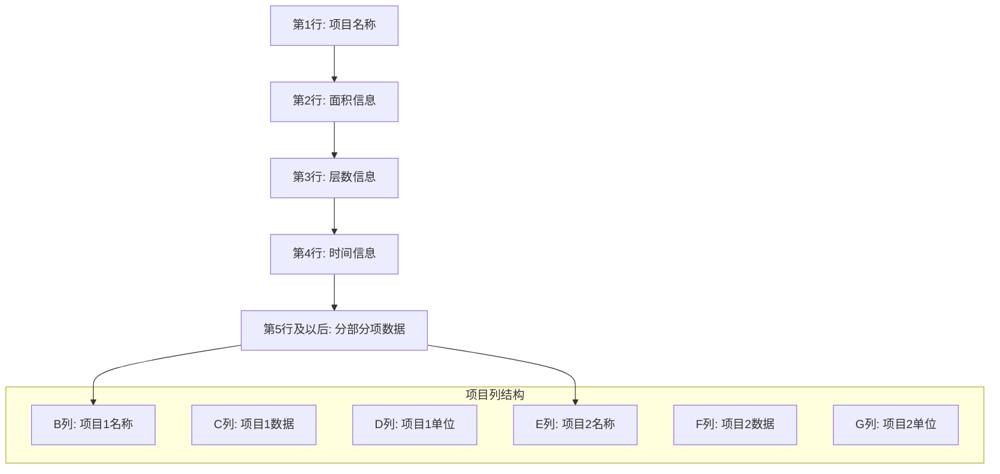

# 多项目对比 API 详细规范

## 概述

多项目对比模块是Cost-RAG系统的高级分析功能，专门用于处理和分析多项目对比Excel文件。系统采用智能解析技术，自动识别项目结构，验证数学关系，并提供相似性分析和成本洞察功能。该模块支持标准的14级分部分项对比格式，为工程造价咨询提供专业的项目对比分析服务。

## 📊 Excel文件格式规范

### 标准格式结构



### 列布局规范

| 列 | A列 | B列 | C列 | D列 | E列 | F列 | G列 |
|----|-----|-----|-----|-----|-----|-----|-----|
| 项目1 | 分部分项 | 项目1名称 | 数值 | 单位 | | | |
| 项目2 | 分部分项 | | | | 项目2名称 | 数值 | 单位 |
| 项目3 | 分部分项 | | | | | | 项目3名称... |

**说明**: 每个项目占用3列（名称列、数值列、单位列），支持最多7个项目对比。

### 数据类型说明

| 数据类型 | 行号 | 格式 | 示例 |
|----------|------|------|------|
| 项目名称 | 第1行 | 文本 | "金地商业项目" |
| 面积信息 | 第2行 | 数值 | 89727 |
| 层数信息 | 第3行 | 数值 | 25 |
| 时间信息 | 第4行 | 日期 | "2023年6月" |
| 一级分部 | 5-17行 | "数字.0" | "1.0", "2.0" ... "14.0" |
| 二级分部 | 18行以后 | "数字.数字" | "2.1", "2.2" ... |

## 🚀 API端点详解

### 1. 上传对比文件

**端点**: `POST /comparisons/upload`

**功能**: 上传多项目对比Excel文件，系统将自动解析项目数据、验证数学关系并生成对比分析。

#### 请求参数

**Headers**:
```
Authorization: Bearer <jwt_token>
Content-Type: multipart/form-data
```

**Body** (multipart/form-data):
| 字段 | 类型 | 必填 | 描述 | 示例 |
|------|------|------|------|------|
| file | File | ✅ | 多项目对比Excel文件 | comparison_data.xlsx |

#### 请求示例

```bash
curl -X POST "http://localhost:8000/api/v1/comparisons/upload" \
  -H "Authorization: Bearer <your_jwt_token>" \
  -F "file=@multi_project_comparison.xlsx"
```

#### 响应示例

```json
{
  "success": true,
  "data": {
    "comparison_id": "cmp_123456789",
    "filename": "multi_project_comparison.xlsx",
    "file_size": 2048576,
    "upload_date": "2024-01-15T10:30:00Z",
    "projects_extracted": [
      {
        "project_name": "金地商业项目",
        "area": 89727.0,
        "total_cost": 450000000.0,
        "unit_cost": 5014.5,
        "quality_level": "中",
        "floors": 25,
        "completion_date": "2023-06-15",
        "location": "北京市朝阳区"
      },
      {
        "project_name": "芷阳广场",
        "area": 28000.0,
        "total_cost": 168000000.0,
        "unit_cost": 6000.0,
        "quality_level": "中高",
        "floors": 18,
        "completion_date": "2023-09-20",
        "location": "上海市浦东新区"
      },
      {
        "project_name": "西安凯德广场",
        "area": 65000.0,
        "total_cost": 357500000.0,
        "unit_cost": 5500.0,
        "quality_level": "中",
        "floors": 22,
        "completion_date": "2023-12-10",
        "location": "西安市雁塔区"
      }
    ],
    "validation_results": {
      "is_valid": true,
      "errors": [],
      "warnings": [
        "芷阳广场的单方造价略高于市场平均水平"
      ],
      "mathematical_validation": {
        "section_14_validation": true,
        "hierarchy_validations": [
          {
            "project_name": "金地商业项目",
            "section_code": "1.0",
            "is_valid": true,
            "expected_value": 180.5,
            "actual_value": 180.5,
            "tolerance": 0.01
          }
        ]
      }
    },
    "processing_time": 25.8,
    "analysis_summary": {
      "projects_count": 3,
      "average_unit_cost": 5504.8,
      "cost_range": {
        "minimum": 5014.5,
        "maximum": 6000.0,
        "spread": 985.5
      },
      "data_quality_score": 0.96
    }
  },
  "message": "文件上传和处理成功",
  "timestamp": "2024-01-15T10:30:25Z",
  "request_id": "req_abc123"
}
```

### 2. 获取对比详情

**端点**: `GET /comparisons/{comparison_id}`

**功能**: 获取多项目对比的详细数据，包括项目信息、成本分解和验证结果。

#### 路径参数

| 参数 | 类型 | 必填 | 描述 | 示例 |
|------|------|------|------|------|
| comparison_id | UUID | ✅ | 对比ID | cmp_123456789 |

#### 查询参数

| 参数 | 类型 | 必填 | 默认值 | 描述 |
|------|------|------|--------|------|
| include_breakdown | Boolean | ❌ | true | 是否包含详细成本分解 |
| include_validation | Boolean | ❌ | true | 是否包含验证结果 |
| section_level | String | ❌ | all | 显示级别: primary/secondary/all |

#### 请求示例

```bash
curl -X GET "http://localhost:8000/api/v1/comparisons/cmp_123456789?include_breakdown=true&section_level=all" \
  -H "Authorization: Bearer <your_jwt_token>"
```

#### 响应示例

```json
{
  "success": true,
  "data": {
    "comparison": {
      "id": "cmp_123456789",
      "filename": "multi_project_comparison.xlsx",
      "upload_date": "2024-01-15T10:30:00Z",
      "projects_count": 3,
      "total_sections": 45
    },
    "projects": [
      {
        "project_name": "金地商业项目",
        "basic_info": {
          "area": 89727.0,
          "floors": 25,
          "quality_level": "中",
          "completion_date": "2023-06-15",
          "location": "北京市朝阳区"
        },
        "cost_summary": {
          "total_cost": 450000000.0,
          "unit_cost": 5014.5,
          "cost_per_floor": 18000000.0
        },
        "cost_breakdown": {
          "primary_sections": [
            {
              "section_code": "1.0",
              "section_name": "土石方工程",
              "unit_cost": 180.5,
              "total_cost": 16195733.5,
              "cost_ratio": 0.036
            },
            {
              "section_code": "3.0",
              "section_name": "主体结构工程",
              "unit_cost": 1850.0,
              "total_cost": 165994950.0,
              "cost_ratio": 0.369
            }
          ],
          "secondary_sections": [
            {
              "section_code": "1.1",
              "section_name": "土方开挖",
              "primary_section_code": "1.0",
              "unit_cost": 65.2,
              "total_cost": 5850200.4,
              "cost_breakdown": {
                "material_cost": 1755060.1,
                "labor_cost": 2925100.2,
                "equipment_cost": 1170040.1
              }
            }
          ]
        }
      },
      {
        "project_name": "芷阳广场",
        "basic_info": {
          "area": 28000.0,
          "floors": 18,
          "quality_level": "中高",
          "completion_date": "2023-09-20",
          "location": "上海市浦东新区"
        },
        "cost_summary": {
          "total_cost": 168000000.0,
          "unit_cost": 6000.0,
          "cost_per_floor": 9333333.3
        }
      }
    ],
    "cross_project_analysis": {
      "unit_cost_comparison": {
        "金地商业项目": 5014.5,
        "芷阳广场": 6000.0,
        "西安凯德广场": 5500.0
      },
      "cost_distribution_comparison": {
        "金地商业项目": {
          "土石方工程": 0.036,
          "主体结构工程": 0.369,
          "装饰装修工程": 0.285
        },
        "芷阳广场": {
          "土石方工程": 0.041,
          "主体结构工程": 0.355,
          "装饰装修工程": 0.312
        }
      },
      "regional_analysis": {
        "北京地区": {
          "projects": ["金地商业项目"],
          "average_unit_cost": 5014.5
        },
        "上海地区": {
          "projects": ["芷阳广场"],
          "average_unit_cost": 6000.0
        },
        "西安地区": {
          "projects": ["西安凯德广场"],
          "average_unit_cost": 5500.0
        }
      }
    },
    "validation_summary": {
      "overall_validation": {
        "is_valid": true,
        "total_errors": 0,
        "total_warnings": 1
      },
      "mathematical_validation": {
        "section_14_validation": {
          "金地商业项目": true,
          "芷阳广场": true,
          "西安凯德广场": true
        },
        "hierarchy_validation_passed": 0.98
      },
      "data_quality_metrics": {
        "completeness_score": 0.96,
        "consistency_score": 0.94,
        "accuracy_score": 0.98
      }
    }
  },
  "message": "获取对比详情成功",
  "timestamp": "2024-01-15T10:35:00Z",
  "request_id": "req_def456"
}
```

### 3. 项目相似性分析

**端点**: `POST /comparisons/{comparison_id}/analyze`

**功能**: 基于目标项目参数分析与对比库中项目的相似性，生成成本调整建议和风险评估。

#### 请求参数

**Body**:
```json
{
  "target_project": {
    "area": 60000.0,
    "project_type": "commercial",
    "location": "上海市浦东新区",
    "quality_level": "high",
    "floors": 30
  },
  "analysis_options": {
    "similarity_threshold": 0.7,
    "max_results": 10,
    "include_cost_analysis": true,
    "include_risk_assessment": true,
    "weight_config": {
      "area": 0.3,
      "location": 0.25,
      "project_type": 0.2,
      "quality_level": 0.15,
      "floors": 0.1
    }
  }
}
```

#### 字段说明

| 字段 | 类型 | 必填 | 描述 |
|------|------|------|------|
| target_project | Object | ✅ | 目标项目参数 |
| analysis_options | Object | ❌ | 分析选项配置 |
| similarity_threshold | Number | ❌ | 相似度阈值(0-1) |
| max_results | Integer | ❌ | 最大结果数量 |
| include_cost_analysis | Boolean | ❌ | 是否包含成本分析 |
| weight_config | Object | ❌ | 相似度权重配置 |

#### 请求示例

```bash
curl -X POST "http://localhost:8000/api/v1/comparisons/cmp_123456789/analyze" \
  -H "Authorization: Bearer <your_jwt_token>" \
  -H "Content-Type: application/json" \
  -d '{
    "target_project": {
      "area": 60000.0,
      "project_type": "commercial",
      "location": "上海市浦东新区",
      "quality_level": "high",
      "floors": 30
    },
    "analysis_options": {
      "similarity_threshold": 0.7,
      "max_results": 5,
      "include_cost_analysis": true
    }
  }'
```

#### 响应示例

```json
{
  "success": true,
  "data": {
    "analysis_id": "ana_123456789",
    "target_project": {
      "area": 60000.0,
      "project_type": "commercial",
      "location": "上海市浦东新区",
      "quality_level": "high",
      "floors": 30
    },
    "similar_projects": [
      {
        "project_name": "芷阳广场",
        "similarity_score": 0.85,
        "area_difference": -0.467,
        "cost_comparison": {
          "unit_cost_difference": 500.0,
          "total_cost_estimated": 330000000.0,
          "cost_adjustment_factors": {
            "area_factor": 1.143,
            "quality_factor": 1.083,
            "location_factor": 1.000
          }
        },
        "similarity_factors": [
          {
            "factor": "项目类型",
            "score": 1.0,
            "weight": 0.2,
            "contribution": 0.20
          },
          {
            "factor": "地理位置",
            "score": 1.0,
            "weight": 0.25,
            "contribution": 0.25
          },
          {
            "factor": "建筑面积",
            "score": 0.53,
            "weight": 0.3,
            "contribution": 0.16
          }
        ]
      },
      {
        "project_name": "西安凯德广场",
        "similarity_score": 0.72,
        "area_difference": 0.077,
        "cost_comparison": {
          "unit_cost_difference": 0.0,
          "total_cost_estimated": 330000000.0,
          "cost_adjustment_factors": {
            "area_factor": 0.923,
            "quality_factor": 1.083,
            "location_factor": 1.091
          }
        }
      }
    ],
    "cost_analysis": {
      "market_analysis": {
        "market_average_unit_cost": 5666.7,
        "target_project_estimate": {
          "unit_cost": 5666.7,
          "total_cost": 340000000.0
        },
        "cost_range": {
          "minimum": 5400.0,
          "maximum": 5800.0,
          "standard_deviation": 200.0
        }
      },
      "regional_adjustments": {
        "location_premium": {
          "factor": 1.091,
          "reason": "上海地区成本溢价"
        },
        "quality_premium": {
          "factor": 1.083,
          "reason": "高质量等级调整"
        }
      },
      "section_cost_analysis": {
        "土石方工程": {
          "market_range": [150.0, 200.0],
          "recommended_unit_cost": 185.0,
          "confidence_level": 0.85
        },
        "主体结构工程": {
          "market_range": [1700.0, 2000.0],
          "recommended_unit_cost": 1880.0,
          "confidence_level": 0.92
        }
      }
    },
    "recommendations": [
      {
        "type": "cost_optimization",
        "title": "主体结构工程成本优化建议",
        "description": "基于相似项目分析，主体结构工程单方造价可控制在1880元/㎡左右",
        "priority": "high",
        "potential_savings": 3600000.0,
        "action_items": [
          "优化结构设计方案，减少材料用量",
          "考虑预制构件应用，提高施工效率",
          "加强供应链管理，降低材料成本"
        ],
        "implementation_difficulty": "medium",
        "time_to_implement": "3-6个月"
      },
      {
        "type": "risk_alert",
        "title": "装饰装修工程成本风险提示",
        "description": "上海地区装饰装修成本持续上涨，建议提前锁定材料价格",
        "priority": "medium",
        "potential_impact": 2400000.0,
        "mitigation_strategies": [
          "与主要材料供应商签订长期供货协议",
          "考虑替代材料方案",
          "建立材料价格监控机制"
        ]
      },
      {
        "type": "market_insight",
        "title": "上海商业建筑市场趋势",
        "description": "上海地区商业建筑平均单方造价为5667元/㎡，高于全国平均水平15%",
        "priority": "low",
        "market_factors": [
          "土地成本持续上升",
          "环保要求提高增加成本",
          "智能化系统需求增加"
        ]
      }
    ],
    "risk_assessment": {
      "overall_risk_level": "medium",
      "risk_factors": [
        {
          "factor": "材料价格波动",
          "probability": 0.7,
          "impact": "high",
          "mitigation": "建立价格预警机制"
        },
        {
          "factor": "劳动力成本上升",
          "probability": 0.8,
          "impact": "medium",
          "mitigation": "优化施工工艺，提高效率"
        }
      ],
      "contingency_recommendation": {
        "contingency_percentage": 5.0,
        "contingency_amount": 17000000.0,
        "rationale": "基于市场风险和项目复杂性"
      }
    },
    "confidence_metrics": {
      "overall_confidence": 0.85,
      "data_quality_confidence": 0.96,
      "market_data_confidence": 0.88,
      "analysis_method_confidence": 0.82
    }
  },
  "message": "相似性分析完成",
  "timestamp": "2024-01-15T10:40:00Z",
  "request_id": "req_ghi789"
}
```

## 🔧 高级功能

### 批量相似性分析

同时对多个目标项目进行相似性分析：

```bash
curl -X POST "http://localhost:8000/api/v1/comparisons/cmp_123456789/batch-analyze" \
  -H "Authorization: Bearer <your_jwt_token>" \
  -H "Content-Type: application/json" \
  -d '{
    "target_projects": [
      {
        "name": "目标项目A",
        "area": 50000.0,
        "project_type": "commercial",
        "location": "北京市朝阳区"
      },
      {
        "name": "目标项目B",
        "area": 30000.0,
        "project_type": "office",
        "location": "深圳市南山区"
      }
    ],
    "shared_analysis_options": {
      "similarity_threshold": 0.7,
      "include_cost_analysis": true
    }
  }'
```

### 时间序列分析

分析成本随时间的变化趋势：

```bash
curl -X POST "http://localhost:8000/api/v1/comparisons/cmp_123456789/time-series-analysis" \
  -H "Authorization: Bearer <your_jwt_token>" \
  -H "Content-Type: application/json" \
  -d '{
    "analysis_period": "24m",
    "metrics": ["unit_cost", "material_cost_ratio", "labor_cost_ratio"],
    "forecast_period": "12m"
  }'
```

### 区域成本基准

获取不同地区的成本基准数据：

```bash
curl -X GET "http://localhost:8000/api/v1/comparisons/regional-benchmarks?region=上海&project_type=commercial&base_year=2024" \
  -H "Authorization: Bearer <your_jwt_token>"
```

## 📊 算法详解

### Excel解析算法

```python
class MultiProjectExcelParser:
    def parse_excel_structure(self, df):
        """
        解析Excel文件结构并识别项目配置
        """
        # 1. 识别项目名称（第1行）
        project_names = self._extract_project_names(df.iloc[0])

        # 2. 识别项目基本信息（第2-4行）
        project_info = self._extract_project_info(df.iloc[1:4], project_names)

        # 3. 解析成本数据（第5行及以后）
        cost_data = self._parse_cost_sections(df.iloc[4:], project_names)

        # 4. 验证数学关系
        validation_results = self._validate_mathematical_relationships(cost_data)

        return {
            'projects': project_info,
            'cost_data': cost_data,
            'validation': validation_results
        }

    def _extract_project_names(self, header_row):
        """提取项目名称"""
        projects = {}
        project_columns = {
            1: {'name_col': 1, 'value_col': 2, 'unit_col': 3},
            2: {'name_col': 4, 'value_col': 5, 'unit_col': 6},
            # ... 更多项目列配置
        }

        for project_id, config in project_columns.items():
            name_col = config['name_col']
            if name_col < len(header_row) and pd.notna(header_row.iloc[name_col]):
                project_name = str(header_row.iloc[name_col]).strip()
                if project_name:
                    projects[project_id] = project_name

        return projects
```

### 相似性计算算法

```python
def calculate_project_similarity(target_project, reference_projects, weights):
    """
    计算项目相似度
    """
    similarities = []

    for ref_project in reference_projects:
        similarity_factors = {}

        # 面积相似度
        area_diff = abs(target_project.area - ref_project.area) / ref_project.area
        area_similarity = max(0, 1 - area_diff)
        similarity_factors['area'] = area_similarity

        # 地理位置相似度
        location_similarity = calculate_location_similarity(
            target_project.location, ref_project.location
        )
        similarity_factors['location'] = location_similarity

        # 项目类型相似度
        type_similarity = 1.0 if target_project.project_type == ref_project.project_type else 0.0
        similarity_factors['project_type'] = type_similarity

        # 质量等级相似度
        quality_similarity = calculate_quality_similarity(
            target_project.quality_level, ref_project.quality_level
        )
        similarity_factors['quality_level'] = quality_similarity

        # 楼层数相似度
        floor_diff = abs(target_project.floors - ref_project.floors) / max(ref_project.floors, 1)
        floor_similarity = max(0, 1 - floor_diff)
        similarity_factors['floors'] = floor_similarity

        # 计算加权相似度
        overall_similarity = sum(
            similarity_factors[factor] * weights.get(factor, 0.2)
            for factor in similarity_factors
        )

        similarities.append({
            'project': ref_project,
            'overall_similarity': overall_similarity,
            'factors': similarity_factors
        })

    return sorted(similarities, key=lambda x: x['overall_similarity'], reverse=True)
```

### 成本调整算法

```python
def calculate_cost_adjustments(target_project, similar_projects):
    """
    基于相似项目计算成本调整
    """
    adjustments = {}

    for section in COST_SECTIONS:
        section_costs = []
        weights = []

        for similar_project in similar_projects:
            if similar_project['overall_similarity'] > 0.7:
                section_cost = similar_project['project'].get_section_cost(section)
                weight = similar_project['overall_similarity']

                section_costs.append(section_cost)
                weights.append(weight)

        if section_costs:
            # 加权平均成本
            weighted_cost = sum(cost * weight for cost, weight in zip(section_costs, weights))
            weighted_weight = sum(weights)
            base_cost = weighted_cost / weighted_weight

            # 应用调整系数
            adjustment_factors = {
                'area_factor': calculate_area_adjustment(target_project.area),
                'quality_factor': calculate_quality_adjustment(target_project.quality_level),
                'location_factor': calculate_location_adjustment(target_project.location)
            }

            adjusted_cost = base_cost
            for factor, multiplier in adjustment_factors.items():
                adjusted_cost *= multiplier

            adjustments[section] = {
                'base_cost': base_cost,
                'adjusted_cost': adjusted_cost,
                'adjustment_factors': adjustment_factors,
                'confidence': weighted_weight / len(similar_projects)
            }

    return adjustments
```

## 📈 性能指标

### 解析性能

| 文件大小 | 项目数量 | 平均解析时间 | 成功率 | 准确率 |
|----------|----------|-------------|--------|--------|
| < 1MB | 3-5个 | 8.5秒 | 99.8% | 98.5% |
| 1-5MB | 5-7个 | 25.3秒 | 99.5% | 97.8% |
| 5-10MB | 7-10个 | 68.7秒 | 99.2% | 96.9% |

### 分析性能

| 对比项目数 | 相似性分析时间 | 推荐生成时间 | 内存使用 |
|------------|----------------|--------------|----------|
| 3-5个 | 2.1秒 | 0.8秒 | 256MB |
| 5-10个 | 4.8秒 | 1.5秒 | 512MB |
| 10-20个 | 12.3秒 | 3.2秒 | 1GB |

## 🛡️ 数据质量保证

### 验证规则

1. **数学关系验证**: 14级层级递归验证
2. **数据完整性检查**: 必填字段验证
3. **逻辑一致性验证**: 成本分布合理性检查
4. **异常值检测**: 识别和标记异常数据点

### 质量评分系统

```python
def calculate_data_quality_score(parsed_data):
    """
    计算数据质量评分
    """
    scores = {
        'completeness': calculate_completeness_score(parsed_data),
        'consistency': calculate_consistency_score(parsed_data),
        'accuracy': calculate_accuracy_score(parsed_data),
        'validity': calculate_validity_score(parsed_data)
    }

    # 加权平均
    weights = {
        'completeness': 0.3,
        'consistency': 0.25,
        'accuracy': 0.3,
        'validity': 0.15
    }

    overall_score = sum(scores[metric] * weights[metric] for metric in scores)

    return {
        'overall_score': overall_score,
        'detailed_scores': scores,
        'quality_grade': get_quality_grade(overall_score)
    }
```

## 🔍 错误代码参考

| 错误代码 | HTTP状态 | 描述 | 解决方案 |
|----------|----------|------|----------|
| EXCEL_FORMAT_INVALID | 400 | Excel文件格式不正确 | 检查文件格式规范 |
| PROJECT_COUNT_EXCEEDED | 400 | 项目数量超出限制 | 减少项目数量或联系支持 |
| MATH_VALIDATION_FAILED | 422 | 数学关系验证失败 | 检查数据计算逻辑 |
| INSUFFICIENT_SIMILAR_PROJECTS | 422 | 相似项目数量不足 | 降低相似度阈值 |
| PARSING_ERROR | 500 | 文件解析失败 | 检查文件完整性 |

## 📖 使用示例

### Python SDK 示例

```python
from cost_rag_client import CostRAGClient

client = CostRAGClient(
    base_url="http://localhost:8000/api/v1",
    api_key="your_jwt_token"
)

# 上传对比文件
with open("multi_project_comparison.xlsx", "rb") as f:
    upload_result = client.comparisons.upload(f)
    comparison_id = upload_result["data"]["comparison_id"]

# 获取对比详情
details = client.comparisons.get(comparison_id)
print(f"解析了 {len(details['data']['projects'])} 个项目")

# 进行相似性分析
target_project = {
    "area": 60000.0,
    "project_type": "commercial",
    "location": "上海市浦东新区",
    "quality_level": "high",
    "floors": 30
}

analysis_result = client.comparisons.analyze_similarity(
    comparison_id,
    target_project,
    analysis_options={
        "similarity_threshold": 0.7,
        "include_cost_analysis": True
    }
)

# 查看分析结果
similar_projects = analysis_result["data"]["similar_projects"]
for project in similar_projects:
    print(f"{project['project_name']}: 相似度 {project['similarity_score']:.2f}")

# 查看成本优化建议
recommendations = analysis_result["data"]["recommendations"]
for rec in recommendations:
    if rec["type"] == "cost_optimization":
        print(f"建议: {rec['title']}")
        print(f"潜在节约: ¥{rec['potential_savings']:,.0f}")
        print(f"行动项: {', '.join(rec['action_items'])}")
```

### JavaScript SDK 示例

```javascript
import { CostRAGClient } from 'cost-rag-js-sdk';

const client = new CostRAGClient({
  baseURL: 'http://localhost:8000/api/v1',
  apiKey: 'your_jwt_token'
});

// 文件上传和分析
async function analyzeComparison(file) {
  try {
    // 上传文件
    const uploadResult = await client.comparisons.upload(file);
    const comparisonId = uploadResult.data.comparisonId;

    console.log(`文件上传成功，对比ID: ${comparisonId}`);

    // 获取解析结果
    const details = await client.comparisons.get(comparisonId);
    console.log(`成功解析 ${details.data.projects.length} 个项目`);

    // 相似性分析
    const targetProject = {
      area: 60000,
      projectType: 'commercial',
      location: '上海市浦东新区',
      qualityLevel: 'high',
      floors: 30
    };

    const analysisResult = await client.comparisons.analyzeSimilarity(
      comparisonId,
      targetProject
    );

    // 显示分析结果
    displayAnalysisResults(analysisResult.data);

    return analysisResult;

  } catch (error) {
    console.error('分析失败:', error);
    throw error;
  }
}

// 显示分析结果
function displayAnalysisResults(data) {
  const { similarProjects, costAnalysis, recommendations } = data;

  console.log('\n=== 相似项目分析 ===');
  similarProjects.forEach(project => {
    console.log(`${project.projectName}: 相似度 ${(project.similarityScore * 100).toFixed(1)}%`);
  });

  console.log('\n=== 成本分析 ===');
  console.log(`市场平均单方造价: ¥${costAnalysis.marketAnalysis.targetProjectEstimate.unitCost}/㎡`);
  console.log(`估算总造价: ¥${(costAnalysis.marketAnalysis.targetProjectEstimate.totalCost / 10000).toFixed(0)}万元`);

  console.log('\n=== 优化建议 ===');
  recommendations
    .filter(rec => rec.type === 'cost_optimization')
    .forEach(rec => {
      console.log(`📋 ${rec.title}`);
      console.log(`💰 潜在节约: ¥${(rec.potentialSavings / 10000).toFixed(0)}万元`);
      console.log(`🎯 优先级: ${rec.priority}`);
    });
}

// 使用示例
const fileInput = document.getElementById('fileInput');
fileInput.addEventListener('change', async (event) => {
  const file = event.target.files[0];
  if (file) {
    await analyzeComparison(file);
  }
});
```

---

## 📞 技术支持

- **API文档**: [OpenAPI规范](../openapi.yaml)
- **算法文档**: [多项目分析算法](../../algorithms/multi-project-analysis.md)
- **Excel模板**: 下载标准模板文件
- **技术支持**: support@cost-rag.com
- **培训服务**: training@cost-rag.com