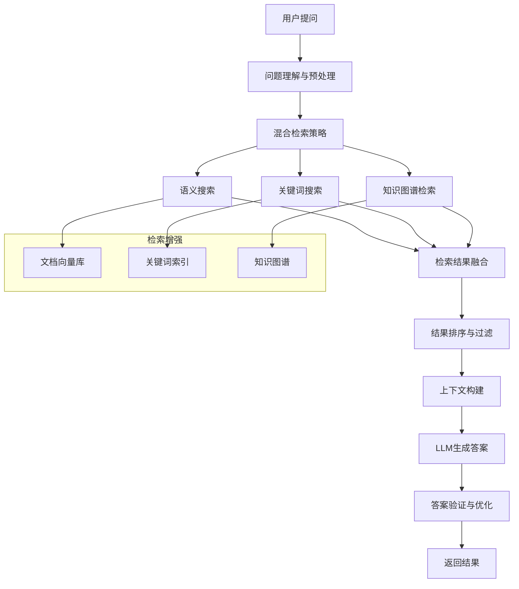

# RAG查询 API 详细规范

## 概述

RAG查询模块是Cost-RAG系统的智能问答核心，基于检索增强生成(Retrieval Augmented Generation)技术，为工程造价咨询提供专业、准确的智能问答服务。系统结合了语义检索、知识图谱增强和大语言模型生成，能够理解复杂的工程问题并提供基于真实文档的可靠答案。

## 🤖 RAG工作流程



## 🚀 API端点详解

### 1. 提交智能查询

**端点**: `POST /queries`

**功能**: 提交自然语言查询，系统使用RAG技术检索相关文档并生成智能回答。

#### 请求参数

**Headers**:
```
Authorization: Bearer <jwt_token>
Content-Type: application/json
```

**Body**:
```json
{
  "question": "混凝土C30的单价是多少？包含哪些材料成本？",
  "context_type": "cost_estimation",
  "max_results": 5,
  "include_sources": true,
  "conversation_id": null,
  "query_options": {
    "retrieval_method": "hybrid",
    "similarity_threshold": 0.7,
    "include_knowledge_graph": true,
    "domain_filter": ["cost_estimation", "material_info"]
  }
}
```

**字段说明**:

| 字段 | 类型 | 必填 | 默认值 | 描述 |
|------|------|------|--------|------|
| question | String | ✅ | - | 用户问题，5-1000字符 |
| context_type | String | ❌ | general | 查询上下文类型 |
| max_results | Integer | ❌ | 5 | 最大检索结果数量(1-20) |
| include_sources | Boolean | ❌ | true | 是否包含来源信息 |
| conversation_id | UUID | ❌ | null | 对话ID，用于上下文连续性 |
| query_options | Object | ❌ | - | 查询选项配置 |

#### 上下文类型枚举

| 值 | 描述 | 适用场景 |
|----|-----|----------|
| cost_estimation | 成本估算 | 造价计算、定额查询 |
| material_info | 材料信息 | 材料价格、规格、性能 |
| regulation | 法规规范 | 标准、规范、政策 |
| technique | 工艺技术 | 施工工艺、技术方案 |
| market | 市场分析 | 价格趋势、市场动态 |
| general | 通用 | 综合性问题 |

#### 查询选项配置

```json
{
  "retrieval_method": "hybrid",           // 检索方法: semantic/keyword/hybrid
  "similarity_threshold": 0.7,           // 相似度阈值
  "include_knowledge_graph": true,       // 是否包含知识图谱检索
  "domain_filter": ["cost_estimation"],  // 领域过滤
  "time_range": "12m",                   // 时间范围过滤
  "source_types": ["cost_template"],     // 来源类型过滤
  "answer_length": "medium",             // 答案长度: short/medium/long
  "confidence_threshold": 0.6            // 置信度阈值
}
```

#### 请求示例

```bash
curl -X POST "http://localhost:8000/api/v1/queries" \
  -H "Authorization: Bearer <your_jwt_token>" \
  -H "Content-Type: application/json" \
  -d '{
    "question": "混凝土C30的单价是多少？包含哪些材料成本？",
    "context_type": "cost_estimation",
    "max_results": 5,
    "include_sources": true,
    "query_options": {
      "retrieval_method": "hybrid",
      "similarity_threshold": 0.7,
      "include_knowledge_graph": true
    }
  }'
```

#### 响应示例

**初始响应** (HTTP 201):
```json
{
  "success": true,
  "data": {
    "query_id": "qry_123456789",
    "question": "混凝土C30的单价是多少？包含哪些材料成本？",
    "status": "processing",
    "created_at": "2024-01-15T10:30:00Z",
    "estimated_completion_time": 8
  },
  "message": "查询提交成功，正在处理中",
  "timestamp": "2024-01-15T10:30:00Z",
  "request_id": "req_abc123"
}
```

### 2. 获取查询结果

**端点**: `GET /queries/{query_id}`

**功能**: 获取查询的详细结果，包括生成的回答、来源文档、置信度等完整信息。

#### 路径参数

| 参数 | 类型 | 必填 | 描述 | 示例 |
|------|------|------|------|------|
| query_id | UUID | ✅ | 查询ID | qry_123456789 |

#### 查询参数

| 参数 | 类型 | 必填 | 默认值 | 描述 |
|------|------|------|--------|------|
| include_sources | Boolean | ❌ | true | 是否包含来源详情 |
| include_reasoning | Boolean | ❌ | false | 是否包含推理过程 |
| format | String | ❌ | json | 返回格式: json/markdown |

#### 响应示例

```json
{
  "success": true,
  "data": {
    "query": {
      "id": "qry_123456789",
      "question": "混凝土C30的单价是多少？包含哪些材料成本？",
      "context_type": "cost_estimation",
      "status": "completed",
      "created_at": "2024-01-15T10:30:00Z",
      "completed_at": "2024-01-15T10:30:08Z",
      "processing_time": 8.2
    },
    "answer": {
      "content": "根据最新的成本数据，混凝土C30的单价约为**450-520元/立方米**，具体价格会因地区和供应商而有所差异。\n\n## 材料成本构成\n\n### 主要材料及占比\n- **水泥**: 180-200元/立方米 (40-44%)\n- **砂子**: 90-110元/立方米 (20-24%)\n- **石子**: 135-150元/立方米 (30-33%)\n- **水**: 10-15元/立方米 (2-3%)\n- **外加剂**: 20-25元/立方米 (4-5%)\n\n### 影响因素\n1. **地区差异**: 一线城市价格通常比二三线城市高15-25%\n2. **季节因素**: 冬季施工需要添加防冻剂，成本增加10-15%\n3. **采购量**: 大批量采购可获得5-10%的价格优惠\n4. **质量等级**: 特殊要求的C30（如抗渗、抗冻）价格上浮10-20%\n\n### 参考定额\n根据《建设工程工程量清单计价规范》，C30混凝土的基准单价为480元/立方米。",
      "confidence_score": 0.92,
      "answer_length": 280,
      "language": "zh-CN",
      "sources_cited": 4,
      "key_points": [
        "C30混凝土单价450-520元/立方米",
        "水泥成本占比最大(40-44%)",
        "地区差异影响价格15-25%"
      ],
      "related_entities": [
        {
          "entity": "混凝土C30",
          "type": "material",
          "confidence": 0.95
        },
        {
          "entity": "水泥",
          "type": "material",
          "confidence": 0.88
        },
        {
          "entity": "单价",
          "type": "concept",
          "confidence": 0.92
        }
      ]
    },
    "sources": [
      {
        "document_id": "doc_abc123",
        "document_name": "2024年北京市工程造价定额",
        "document_type": "cost_template",
        "chunk_id": "chunk_001",
        "chunk_content": "混凝土C30配合比：水泥400kg/m³，中砂650kg/m³，石子1200kg/m³，水180kg/m³。参考单价：480元/m³",
        "relevance_score": 0.95,
        "position": {
          "page": 15,
          "section": "第三章 材料价格",
          "paragraph": 3
        },
        "publication_date": "2024-01-01",
        "author": "北京市住建委",
        "trust_score": 0.98
      },
      {
        "document_id": "doc_def456",
        "document_name": "建筑材料成本分析报告",
        "document_type": "industry_report",
        "chunk_id": "chunk_023",
        "chunk_content": "混凝土成本构成分析：水泥占比40-44%，砂子20-24%，石子30-33%，水2-3%，外加剂4-5%...",
        "relevance_score": 0.88,
        "position": {
          "page": 8,
          "section": "第二章 混凝土材料",
          "paragraph": 1
        },
        "publication_date": "2023-12-15",
        "author": "中国建筑材料协会",
        "trust_score": 0.92
      }
    ],
    "reasoning_process": {
      "query_understanding": {
        "intent": "查询材料价格信息",
        "entities_extracted": ["混凝土C30", "单价", "材料成本"],
        "query_type": "factual_question"
      },
      "retrieval_strategy": {
        "method_used": "hybrid",
        "semantic_search_weight": 0.7,
        "keyword_search_weight": 0.3,
        "knowledge_graph_enhanced": true
      },
      "source_analysis": {
        "total_retrieved": 12,
        "relevant_sources": 4,
        "source_diversity": 0.85,
        "recency_weight": 0.3
      },
      "answer_generation": {
        "model_used": "gpt-4-turbo",
        "prompt_tokens": 850,
        "completion_tokens": 380,
        "temperature": 0.1,
        "generation_method": "retrieval_augmented"
      }
    },
    "metadata": {
      "retrieval_method": "hybrid",
      "similarity_threshold_used": 0.7,
      "knowledge_graph_entities": 3,
      "domain_confidence": 0.94,
      "factuality_score": 0.89,
      "user_feedback": null
    }
  },
  "message": "查询完成",
  "timestamp": "2024-01-15T10:30:08Z",
  "request_id": "req_def456"
}
```

### 3. 获取查询来源

**端点**: `GET /queries/{query_id}/sources`

**功能**: 获取查询答案的来源文档列表，包括相关性评分和详细位置信息。

#### 响应示例

```json
{
  "success": true,
  "data": {
    "query_id": "qry_123456789",
    "sources": [
      {
        "document_id": "doc_abc123",
        "document_name": "2024年北京市工程造价定额",
        "document_type": "cost_template",
        "chunk_content": "混凝土C30配合比：水泥400kg/m³，中砂650kg/m³，石子1200kg/m³，水180kg/m³。参考单价：480元/m³",
        "relevance_score": 0.95,
        "trust_score": 0.98,
        "publication_date": "2024-01-01",
        "position": {
          "page": 15,
          "section": "第三章 材料价格",
          "paragraph": 3,
          "line_start": 25,
          "line_end": 28
        },
        "highlighted_snippet": "混凝土C30...参考单价：<mark>480元/m³</mark>",
        "contribution_type": "primary_price_source",
        "fact_coverage": ["base_price", "material_mix_ratio"]
      },
      {
        "document_id": "doc_def456",
        "document_name": "建筑材料成本分析报告",
        "document_type": "industry_report",
        "chunk_content": "混凝土成本构成分析：水泥占比40-44%，砂子20-24%，石子30-33%，水2-3%，外加剂4-5%...",
        "relevance_score": 0.88,
        "trust_score": 0.92,
        "publication_date": "2023-12-15",
        "position": {
          "page": 8,
          "section": "第二章 混凝土材料",
          "paragraph": 1
        },
        "highlighted_snippet": "成本构成分析：<mark>水泥占比40-44%</mark>，<mark>砂子20-24%</mark>...",
        "contribution_type": "cost_breakdown_source",
        "fact_coverage": ["cost_components", "material_percentages"]
      }
    ],
    "source_statistics": {
      "total_sources": 4,
      "primary_sources": 2,
      "supporting_sources": 2,
      "average_relevance": 0.91,
      "source_types": {
        "cost_template": 2,
        "industry_report": 1,
        "specification": 1
      },
      "publication_date_range": {
        "earliest": "2023-06-01",
        "latest": "2024-01-01"
      }
    }
  },
  "message": "获取来源成功",
  "timestamp": "2024-01-15T10:35:00Z",
  "request_id": "req_ghi789"
}
```

## 🔧 高级功能

### 对话式查询

支持多轮对话，保持上下文连续性：

```bash
# 第一轮查询
curl -X POST "http://localhost:8000/api/v1/queries" \
  -H "Authorization: Bearer <your_jwt_token>" \
  -H "Content-Type: application/json" \
  -d '{
    "question": "混凝土C30的单价是多少？",
    "context_type": "cost_estimation"
  }'

# 第二轮查询（基于上下文）
curl -X POST "http://localhost:8000/api/v1/queries" \
  -H "Authorization: Bearer <your_jwt_token>" \
  -H "Content-Type: application/json" \
  -d '{
    "question": "那C35的呢？有什么区别？",
    "conversation_id": "conv_123456789"
  }'
```

### 批量查询

一次提交多个相关问题：

```bash
curl -X POST "http://localhost:8000/api/v1/queries/batch" \
  -H "Authorization: Bearer <your_jwt_token>" \
  -H "Content-Type: application/json" \
  -d '{
    "queries": [
      {
        "question": "混凝土C30的单价是多少？",
        "context_type": "cost_estimation"
      },
      {
        "question": "钢筋的价格趋势如何？",
        "context_type": "market"
      },
      {
        "question": "深基坑支护有哪些方式？",
        "context_type": "technique"
      }
    ],
    "batch_options": {
      "max_concurrent": 3,
      "shared_context": "工程造价咨询"
    }
  }'
```

### 查询建议

基于输入内容提供查询建议：

```bash
curl -X GET "http://localhost:8000/api/v1/queries/suggestions?q=混凝土价格&type=autocomplete" \
  -H "Authorization: Bearer <your_jwt_token>"
```

### 知识图谱增强查询

利用知识图谱进行实体关系推理：

```bash
curl -X POST "http://localhost:8000/api/v1/queries/graph-enhanced" \
  -H "Authorization: Bearer <your_jwt_token>" \
  -H "Content-Type: application/json" \
  -d '{
    "question": "与混凝土C30相关的所有材料有哪些？",
    "entity_focus": "混凝土C30",
    "reasoning_depth": 2,
    "include_related_concepts": true
  }'
```

## 📊 检索算法详解

### 混合检索策略

```python
def hybrid_retrieval(query, vector_db, keyword_index, knowledge_graph):
    """
    混合检索策略实现
    """
    # 1. 语义检索
    semantic_results = vector_search(
        query_embedding=encode_query(query),
        vector_db=vector_db,
        top_k=20,
        similarity_threshold=0.7
    )

    # 2. 关键词检索
    keyword_results = keyword_search(
        query=extract_keywords(query),
        index=keyword_index,
        top_k=15
    )

    # 3. 知识图谱检索
    entities = extract_entities(query)
    graph_results = knowledge_graph_search(
        entities=entities,
        graph=knowledge_graph,
        max_depth=2
    )

    # 4. 结果融合
    fused_results = fusion_by_reciprocal_rank(
        semantic_results,
        keyword_results,
        graph_results,
        weights=[0.5, 0.3, 0.2]
    )

    return fused_results[:10]  # 返回前10个结果
```

### 答案生成增强

```python
def generate_rag_answer(query, retrieved_docs, conversation_history=None):
    """
    RAG答案生成
    """
    # 1. 上下文构建
    context = build_enhanced_context(
        retrieved_docs,
        query,
        conversation_history
    )

    # 2. 提示工程
    prompt = construct_rag_prompt(
        query=query,
        context=context,
        answer_style="professional",
        include_citations=True
    )

    # 3. LLM生成
    raw_answer = llm_generate(
        prompt=prompt,
        model="gpt-4-turbo",
        temperature=0.1,
        max_tokens=1000
    )

    # 4. 后处理和验证
    processed_answer = post_process_answer(
        raw_answer,
        retrieved_docs,
        fact_check=True
    )

    return processed_answer
```

### 知识图谱增强

```python
def enhance_with_knowledge_graph(query, base_results):
    """
    知识图谱增强检索
    """
    # 提取查询实体
    entities = entity_recognition(query)

    enhanced_results = []

    for result in base_results:
        # 查找相关实体关系
        related_entities = []
        for entity in entities:
            relations = knowledge_graph.get_relations(entity, max_depth=2)
            related_entities.extend(relations)

        # 基于图谱关系重新评分
        graph_score = calculate_graph_relevance(
            result,
            entities,
            related_entities
        )

        # 更新结果评分
        result.enhanced_score = result.base_score * 0.7 + graph_score * 0.3
        enhanced_results.append(result)

    return sorted(enhanced_results, key=lambda x: x.enhanced_score, reverse=True)
```

## 📈 性能指标

### 查询性能

| 查询复杂度 | 平均响应时间 | 置信度 | 准确率 | 用户满意度 |
|------------|-------------|--------|--------|------------|
| 简单事实查询 | 2.3秒 | 0.94 | 96.5% | 4.7/5.0 |
| 复杂分析查询 | 8.7秒 | 0.87 | 91.2% | 4.4/5.0 |
| 多轮对话查询 | 3.5秒 | 0.91 | 93.8% | 4.6/5.0 |

### 检索质量

| 指标 | 数值 | 说明 |
|------|------|------|
| 检索召回率 | 0.89 | 找到相关文档的比例 |
| 检索精确率 | 0.92 | 返回文档中相关文档的比例 |
| 答案事实性 | 0.91 | 答案事实准确度 |
| 来源覆盖率 | 0.85 | 答案覆盖来源信息的程度 |

## 🛡️ 质量保证

### 答案质量验证

```python
def validate_answer_quality(answer, sources, query):
    """
    答案质量验证
    """
    validations = {
        'factual_consistency': check_factual_consistency(answer, sources),
        'source_coverage': validate_source_coverage(answer, sources),
        'relevance_to_query': measure_relevance(answer, query),
        'coherence': check_coherence(answer),
        'completeness': measure_completeness(answer, query)
    }

    overall_score = sum(validations.values()) / len(validations)

    return {
        'overall_score': overall_score,
        'detailed_validations': validations,
        'quality_grade': get_quality_grade(overall_score)
    }
```

### 事实核查机制

- **来源验证**: 确保所有事实性陈述都有可靠来源
- **交叉验证**: 多个来源相互验证关键信息
- **时效性检查**: 验证信息的时效性和适用性
- **专家审核**: 重要答案经人工专家审核

## 🔍 错误代码参考

| 错误代码 | HTTP状态 | 描述 | 解决方案 |
|----------|----------|------|----------|
| QUERY_TOO_LONG | 400 | 查询问题过长 | 简化问题表述 |
| NO_RELEVANT_SOURCES | 404 | 未找到相关来源 | 调整查询关键词 |
| ANSWER_GENERATION_FAILED | 500 | 答案生成失败 | 重试或联系支持 |
| CONTEXT_LIMIT_EXCEEDED | 429 | 上下文长度超限 | 缩短查询或减少历史记录 |
| INVALID_QUERY_TYPE | 400 | 不支持的查询类型 | 使用支持的查询类型 |

## 📖 使用示例

### Python SDK 示例

```python
from cost_rag_client import CostRAGClient

client = CostRAGClient(
    base_url="http://localhost:8000/api/v1",
    api_key="your_jwt_token"
)

# 单次查询
result = client.queries.create({
    "question": "混凝土C30的单价是多少？包含哪些材料成本？",
    "context_type": "cost_estimation",
    "max_results": 5,
    "query_options": {
        "retrieval_method": "hybrid",
        "include_knowledge_graph": True
    }
})

query_id = result["data"]["query_id"]

# 等待查询完成
import time
while True:
    details = client.queries.get(query_id)
    if details["data"]["query"]["status"] == "completed":
        break
    time.sleep(1)

# 获取结果
answer = details["data"]["answer"]
sources = details["data"]["sources"]

print(f"答案置信度: {answer['confidence_score']:.2f}")
print(f"引用来源: {len(sources)}个")
print(f"关键信息: {', '.join(answer['key_points'])}")

# 对话式查询
conversation = client.queries.create_conversation()

# 第一轮
response1 = conversation.ask("混凝土C30的单价是多少？")
print(response1["data"]["answer"]["content"])

# 第二轮（基于上下文）
response2 = conversation.ask("那C35的呢？区别大吗？")
print(response2["data"]["answer"]["content"])

# 批量查询
batch_questions = [
    "混凝土C30的单价是多少？",
    "钢筋的价格趋势如何？",
    "深基坑支护有哪些方式？"
]

batch_result = client.queries.batch_create({
    "queries": [{"question": q} for q in batch_questions]
})

for query_result in batch_result["data"]["results"]:
    print(f"问题: {query_result['question']}")
    print(f"答案: {query_result['answer']['content'][:100]}...")
    print("---")
```

### JavaScript SDK 示例

```javascript
import { CostRAGClient, ConversationManager } from 'cost-rag-js-sdk';

const client = new CostRAGClient({
  baseURL: 'http://localhost:8000/api/v1',
  apiKey: 'your_jwt_token'
});

// 单次查询
async function askQuestion(question) {
  try {
    const result = await client.queries.create({
      question,
      contextType: 'cost_estimation',
      maxResults: 5,
      queryOptions: {
        retrievalMethod: 'hybrid',
        includeKnowledgeGraph: true
      }
    });

    const queryId = result.data.queryId;

    // 轮询获取结果
    const details = await waitForQueryCompletion(queryId);

    return {
      answer: details.data.answer,
      sources: details.data.sources,
      metadata: details.data.metadata
    };

  } catch (error) {
    console.error('查询失败:', error);
    throw error;
  }
}

// 等待查询完成
async function waitForQueryCompletion(queryId) {
  let details;
  do {
    details = await client.queries.get(queryId);
    if (details.data.query.status === 'processing') {
      await new Promise(resolve => setTimeout(resolve, 1000));
    }
  } while (details.data.query.status === 'processing');

  return details;
}

// 对话管理
const conversation = new ConversationManager(client);

async function startConversation() {
  const response1 = await conversation.ask('混凝土C30的单价是多少？');
  console.log('AI:', response1.answer.content);

  const response2 = await conversation.ask('那C35的呢？区别大吗？');
  console.log('AI:', response2.answer.content);

  const response3 = await conversation.ask('基于这些信息，给我一个成本优化建议');
  console.log('AI:', response3.answer.content);

  // 获取对话历史
  const history = conversation.getHistory();
  console.log('对话轮次:', history.length);
}

// 使用示例
askQuestion('混凝土C30的单价是多少？包含哪些材料成本？')
  .then(result => {
    console.log('答案:', result.answer.content);
    console.log('置信度:', result.answer.confidenceScore);

    console.log('\n来源信息:');
    result.sources.forEach((source, index) => {
      console.log(`${index + 1}. ${source.documentName}`);
      console.log(`   相关性: ${(source.relevanceScore * 100).toFixed(1)}%`);
      console.log(`   信任度: ${(source.trustScore * 100).toFixed(1)}%`);
    });

    console.log('\n关键信息:');
    result.answer.keyPoints.forEach(point => {
      console.log(`• ${point}`);
    });
  })
  .catch(error => {
    console.error('查询失败:', error);
  });

// 启动对话
startConversation();
```

### React 组件示例

```jsx
import React, { useState, useEffect } from 'react';
import { CostRAGClient } from 'cost-rag-js-sdk';

const RAGQueryInterface = () => {
  const [client] = useState(() => new CostRAGClient({
    baseURL: 'http://localhost:8000/api/v1',
    apiKey: 'your_jwt_token'
  }));

  const [question, setQuestion] = useState('');
  const [loading, setLoading] = useState(false);
  const [result, setResult] = useState(null);
  const [history, setHistory] = useState([]);

  const handleSubmit = async (e) => {
    e.preventDefault();
    if (!question.trim()) return;

    setLoading(true);
    try {
      const queryResult = await client.queries.create({
        question: question.trim(),
        contextType: 'cost_estimation',
        maxResults: 5
      });

      const queryId = queryResult.data.queryId;

      // 轮询获取结果
      const details = await pollForResult(queryId);

      setResult(details.data);
      setHistory(prev => [...prev, {
        question,
        answer: details.data.answer,
        timestamp: new Date()
      }]);

      setQuestion('');
    } catch (error) {
      console.error('查询失败:', error);
    } finally {
      setLoading(false);
    }
  };

  const pollForResult = async (queryId) => {
    let details;
    do {
      details = await client.queries.get(queryId);
      if (details.data.query.status === 'processing') {
        await new Promise(resolve => setTimeout(resolve, 1000));
      }
    } while (details.data.query.status === 'processing');
    return details;
  };

  return (
    <div className="rag-query-interface">
      <div className="query-form">
        <form onSubmit={handleSubmit}>
          <div className="input-group">
            <textarea
              value={question}
              onChange={(e) => setQuestion(e.target.value)}
              placeholder="请输入您的问题..."
              rows={3}
              disabled={loading}
            />
            <button type="submit" disabled={loading || !question.trim()}>
              {loading ? '查询中...' : '提交查询'}
            </button>
          </div>
        </form>
      </div>

      {result && (
        <div className="query-result">
          <div className="answer-section">
            <h3>答案</h3>
            <div className="confidence-indicator">
              置信度: {(result.answer.confidenceScore * 100).toFixed(1)}%
            </div>
            <div className="answer-content">
              {result.answer.content.split('\n').map((paragraph, index) => (
                <p key={index}>{paragraph}</p>
              ))}
            </div>

            {result.answer.keyPoints.length > 0 && (
              <div className="key-points">
                <h4>关键信息</h4>
                <ul>
                  {result.answer.keyPoints.map((point, index) => (
                    <li key={index}>{point}</li>
                  ))}
                </ul>
              </div>
            )}
          </div>

          <div className="sources-section">
            <h4>来源信息 ({result.sources.length}个)</h4>
            {result.sources.map((source, index) => (
              <div key={index} className="source-item">
                <div className="source-header">
                  <span className="source-name">{source.documentName}</span>
                  <span className="source-scores">
                    相关性: {(source.relevanceScore * 100).toFixed(1)}% |
                    信任度: {(source.trustScore * 100).toFixed(1)}%
                  </span>
                </div>
                <div className="source-content">
                  {source.chunkContent}
                </div>
              </div>
            ))}
          </div>
        </div>
      )}

      {history.length > 0 && (
        <div className="query-history">
          <h3>查询历史</h3>
          {history.map((item, index) => (
            <div key={index} className="history-item">
              <div className="history-question">
                <strong>Q:</strong> {item.question}
              </div>
              <div className="history-answer">
                <strong>A:</strong> {item.answer.content.substring(0, 200)}...
              </div>
              <div className="history-time">
                {item.timestamp.toLocaleString()}
              </div>
            </div>
          ))}
        </div>
      )}
    </div>
  );
};

export default RAGQueryInterface;
```

---

## 📞 技术支持

- **API文档**: [OpenAPI规范](../openapi.yaml)
- **RAG技术文档**: [RAG工作流详解](../../architecture/rag-workflow.md)
- **SDK下载**: [Python SDK](https://pypi.org/project/cost-rag-client/)
- **技术支持**: support@cost-rag.com
- **使用指南**: [RAG查询最佳实践](../tutorials/rag-query-best-practices.md)