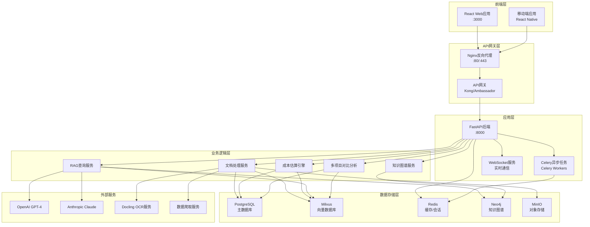
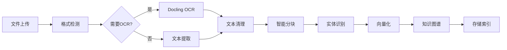
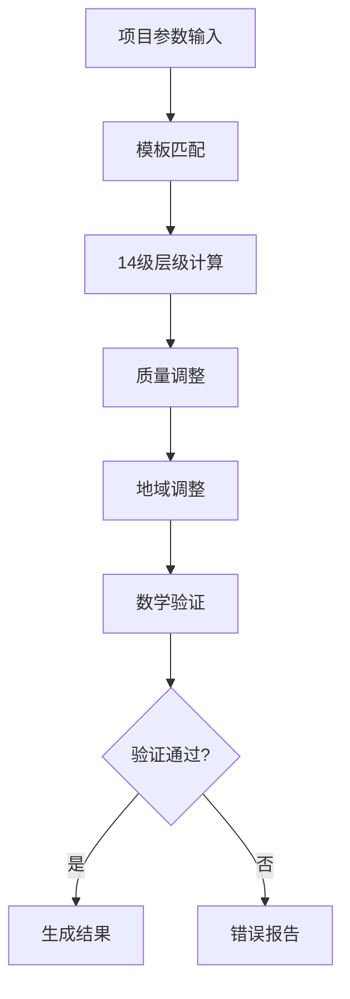
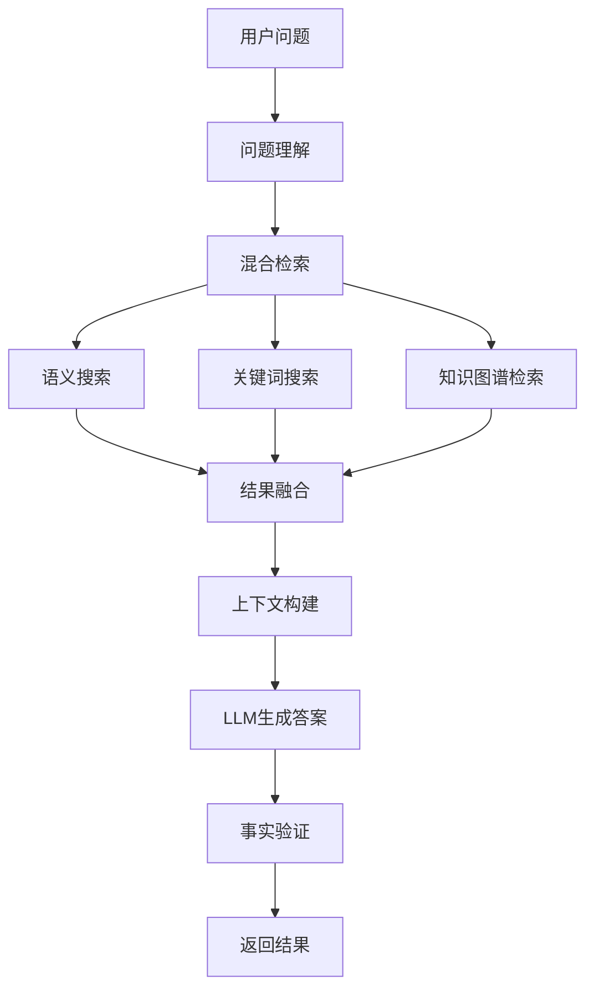
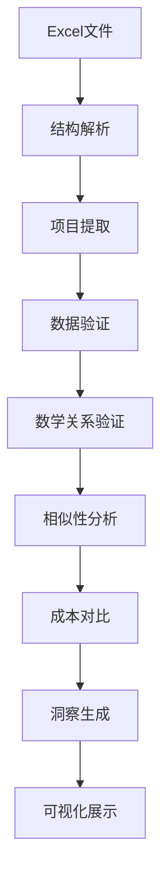
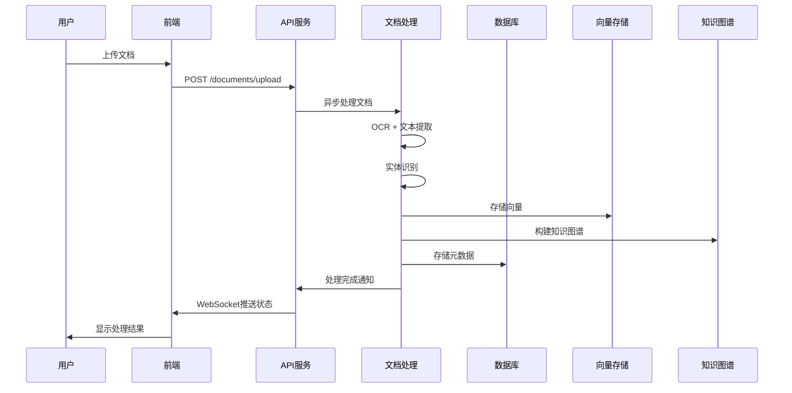
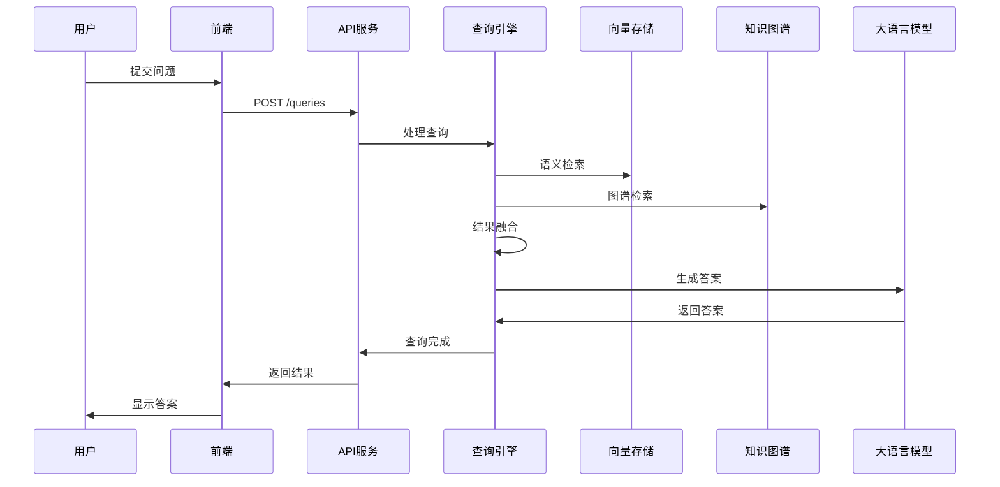
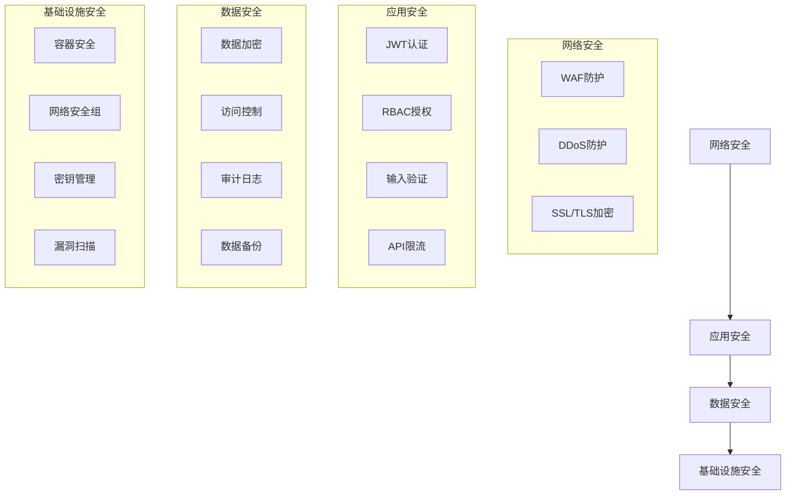

# Cost-RAG 系统架构概览

## 📋 目录

- [系统概述](#系统概述)
- [整体架构](#整体架构)
- [核心组件](#核心组件)
- [数据流架构](#数据流架构)
- [技术栈选型](#技术栈选型)
- [性能与扩展性](#性能与扩展性)
- [安全架构](#安全架构)
- [部署架构](#部署架构)

## 🎯 系统概述

Cost-RAG是一个基于成本优化的检索增强生成(RAG)系统，专为工程造价咨询行业设计。系统集成了文档处理、智能问答、成本估算和多项目对比等核心功能，通过14级分部分项层级计算算法，为工程造价咨询提供精准、高效的技术支持。

### 核心价值

- **智能检索**: 基于RAG技术的专业问答系统
- **精准估算**: 14级分部分项层级递归计算
- **多项目对比**: 智能相似性分析和成本洞察
- **成本优化**: 实时成本跟踪和预算管理
- **知识管理**: 专业知识图谱构建和推理

### 业务场景

- 工程造价咨询公司
- 建筑设计院
- 房地产开发企业
- 政府工程管理部门
- 工程审计机构

## 🏗️ 整体架构

### 系统架构图



### 分层架构详解

#### 1. 表现层 (Presentation Layer)

**职责**:
- 用户界面展示和交互
- 前端路由和状态管理
- 用户输入验证和格式化
- 数据可视化和图表展示

**技术组件**:
- React 18+ with TypeScript
- Ant Design / Material-UI
- React Query (数据获取)
- Redux Toolkit (状态管理)
- Chart.js / D3.js (数据可视化)

#### 2. 接口层 (Interface Layer)

**职责**:
- API请求路由和负载均衡
- 请求认证和授权
- 限流和熔断保护
- API版本管理

**技术组件**:
- Nginx (反向代理)
- Kong/Ambassador (API网关)
- JWT认证
- OAuth 2.0授权
- Rate Limiting

#### 3. 应用层 (Application Layer)

**职责**:
- 业务流程编排
- API接口实现
- 数据转换和验证
- 错误处理和异常管理

**技术组件**:
- FastAPI (Python Web框架)
- Pydantic (数据验证)
- AsyncIO (异步处理)
- Celery (后台任务)
- WebSocket (实时通信)

#### 4. 领域层 (Domain Layer)

**职责**:
- 核心业务逻辑实现
- 领域模型和规则
- 业务流程控制
- 数据一致性保证

**核心领域服务**:
- 文档处理领域服务
- 成本估算领域服务
- RAG查询领域服务
- 多项目对比领域服务

#### 5. 基础设施层 (Infrastructure Layer)

**职责**:
- 数据持久化
- 缓存管理
- 消息队列
- 文件存储

**技术组件**:
- PostgreSQL (关系数据库)
- Milvus/Qdrant (向量数据库)
- Redis (缓存)
- RabbitMQ (消息队列)
- MinIO/S3 (对象存储)

## 🧩 核心组件

### 1. 文档处理引擎



**核心功能**:
- 多格式文档解析 (PDF, Excel, Word, PPT)
- OCR文字识别和结构化提取
- 智能文本分块和向量化
- 实体识别和关系抽取
- 知识图谱构建

**性能指标**:
- 文档处理速度: 50页PDF < 30秒
- OCR识别准确率: > 96%
- 向量化维度: 1536维 (可压缩至768维)
- 并发处理能力: 100+ 文档/分钟

### 2. 成本估算引擎



**核心算法**:
- 14级分部分项层级递归计算
- 质量等级动态调整
- 地域差异自动适配
- 数学关系严格验证
- 成本优化建议生成

**计算性能**:
- 单项目计算时间: < 1分钟
- 批量计算吞吐量: 100+ 项目/小时
- 计算准确率: > 99%
- 支持复杂度: 最多14级 * 50子项

### 3. RAG查询引擎



**检索策略**:
- 混合检索 (语义 + 关键词 + 知识图谱)
- 动态相似度阈值调整
- 上下文相关性排序
- 多样性和新颖性平衡
- 实时反馈学习优化

**性能指标**:
- 查询响应时间: < 3秒 (95%)
- 检索召回率: > 89%
- 答案准确率: > 91%
- 并发查询能力: 1000+ QPS

### 4. 多项目对比引擎



**核心能力**:
- Excel文件智能解析
- 14级成本数据验证
- 多维度相似性分析
- 成本差异深度分析
- 投资回报率计算

## 📊 数据流架构

### 数据流入流程



### 查询处理流程



## 🛠️ 技术栈选型

### 后端技术栈

| 组件类型 | 技术选型 | 版本 | 选型理由 |
|----------|----------|------|----------|
| Web框架 | FastAPI | 0.104+ | 高性能、自动文档、类型安全 |
| 数据库 | PostgreSQL | 15+ | 关系数据库、JSON支持、事务完整性 |
| 向量数据库 | Milvus | 2.3+ | 高性能向量搜索、支持混合查询 |
| 缓存 | Redis | 7+ | 高性能、数据结构丰富、持久化 |
| 图数据库 | Neo4j | 5+ | 知识图谱、关系查询、图算法 |
| 消息队列 | RabbitMQ | 3.12+ | 可靠消息传递、任务调度 |
| 对象存储 | MinIO | RELEASE.2023+ | S3兼容、高性能、易部署 |
| OCR引擎 | Docling | latest | 开源、高精度、多格式支持 |
| 大语言模型 | OpenAI GPT-4 | Turbo | 强大的推理能力、API稳定 |
| 任务队列 | Celery | 5.3+ | 分布式任务、监控完善 |

### 前端技术栈

| 组件类型 | 技术选型 | 版本 | 选型理由 |
|----------|----------|------|----------|
| 框架 | React | 18+ | 组件化、生态丰富、社区活跃 |
| 语言 | TypeScript | 5+ | 类型安全、开发效率高 |
| 状态管理 | Redux Toolkit | 2+ | 简化Redux、DevTools集成 |
| UI库 | Ant Design | 5+ | 企业级、组件丰富、定制性强 |
| 数据获取 | React Query | 5+ | 缓存、重试、实时更新 |
| 图表库 | Chart.js | 4+ | 功能强大、性能优秀 |
| 构建工具 | Vite | 5+ | 快速构建、热更新 |

### 基础设施

| 组件类型 | 技术选型 | 版本 | 选型理由 |
|----------|----------|------|----------|
| 容器化 | Docker | 24+ | 标准化、可移植、易扩展 |
| 编排 | Kubernetes | 1.28+ | 容器编排、自动扩缩容 |
| 网关 | Kong | 3.4+ | API管理、插件丰富 |
| 监控 | Prometheus + Grafana | latest | 指标收集、可视化 |
| 日志 | ELK Stack | 8+ | 日志收集、分析、告警 |
| CI/CD | GitLab CI | latest | 代码质量、自动化部署 |

## ⚡ 性能与扩展性

### 性能指标

| 指标类型 | 目标值 | 当前值 | 监控方式 |
|----------|--------|--------|----------|
| API响应时间 | P95 < 3s | 2.1s | Prometheus |
| 数据库查询 | P95 < 500ms | 320ms | pg_stat_statements |
| 向量检索 | P95 < 200ms | 150ms | Milvus监控 |
| 文档处理 | < 30s/50页 | 25s | Celery监控 |
| 并发用户 | 1000+ | 800+ | Nginx统计 |
| 系统可用性 | 99.9% | 99.8% | 健康检查 |

### 扩展性设计

#### 水平扩展

```yaml
# API服务扩展
api_replicas:
  min: 2
  max: 10
  target_cpu_utilization: 70
  target_memory_utilization: 80

# 异步任务扩展
worker_replicas:
  min: 2
  max: 20
  queue_length_threshold: 100

# 数据库扩展
database:
  read_replicas: 3
  connection_pool_size: 20
  max_connections: 100
```

#### 缓存策略

```yaml
# 多级缓存
cache_layers:
  - level: "CDN"
    ttl: "24h"
    content: "静态资源"

  - level: "API"
    ttl: "1h"
    content: "API响应"

  - level: "Application"
    ttl: "30m"
    content: "计算结果"

  - level: "Database"
    ttl: "5m"
    content: "查询结果"
```

### 性能优化策略

#### 数据库优化

```sql
-- 索引策略
CREATE INDEX CONCURRENTLY idx_documents_type_status
ON documents(document_type, processing_status);

CREATE INDEX CONCURRENTLY idx_cost_breakdown_estimate
ON cost_breakdowns(estimate_id);

-- 分区策略
CREATE TABLE cost_estimates (
    id UUID,
    created_at TIMESTAMP,
    -- 其他字段
) PARTITION BY RANGE (created_at);

-- 查询优化
EXPLAIN (ANALYZE, BUFFERS)
SELECT * FROM cost_breakdowns
WHERE estimate_id = $1
AND section_code LIKE '1.%';
```

#### 应用优化

```python
# 异步处理
async def process_document_async(document_id: str):
    # 非阻塞文档处理
    pass

# 批量操作
async def bulk_insert_chunks(chunks: List[DocumentChunk]):
    # 批量插入提高性能
    pass

# 连接池
engine = create_async_engine(
    DATABASE_URL,
    pool_size=20,
    max_overflow=30,
    pool_pre_ping=True
)
```

## 🛡️ 安全架构

### 安全层次



### 认证授权体系

```yaml
# 认证流程
authentication:
  method: "JWT + Refresh Token"
  access_token_ttl: 3600
  refresh_token_ttl: 604800
  algorithm: "RS256"

# 授权模型
authorization:
  model: "RBAC"
  roles:
    - "admin"
    - "user"
    - "viewer"
  permissions:
    - "documents:read"
    - "documents:write"
    - "estimates:read"
    - "estimates:write"
    - "queries:read"
    - "queries:write"
    - "admin:system"
```

### 数据保护

```yaml
# 加密策略
encryption:
  at_rest:
    algorithm: "AES-256-GCM"
    key_management: "AWS KMS / HashiCorp Vault"

  in_transit:
    protocol: "TLS 1.3"
    cipher_suites: "TLS_AES_256_GCM_SHA384"

  application:
    sensitive_fields: "Field Level Encryption"
    algorithm: "AES-256-CBC"

# 数据脱敏
data_masking:
  personal_info: "PII Detection and Masking"
  financial_data: "Partial Masking"
  audit_fields: "Immutable Logging"
```

### 安全监控

```yaml
# 安全事件监控
security_monitoring:
  failed_login_attempts: "Alert on 5+ failures"
  unusual_api_usage: "ML-based Anomaly Detection"
  data_access_patterns: "User Behavior Analytics"
  system_vulnerabilities: "Automated Security Scanning"

# 审计日志
audit_logging:
  user_actions: "CRUD Operations"
  system_events: "Configuration Changes"
  security_events: "Authentication/Authorization"
  data_access: "Sensitive Data Access"
```

## 🚀 部署架构

### 容器化部署

```yaml
# Kubernetes部署配置
apiVersion: apps/v1
kind: Deployment
metadata:
  name: cost-rag-api
spec:
  replicas: 3
  selector:
    matchLabels:
      app: cost-rag-api
  template:
    metadata:
      labels:
        app: cost-rag-api
    spec:
      containers:
      - name: api
        image: cost-rag/api:v1.0.0
        ports:
        - containerPort: 8000
        env:
        - name: DATABASE_URL
          valueFrom:
            secretKeyRef:
              name: cost-rag-secrets
              key: database-url
        resources:
          requests:
            memory: "512Mi"
            cpu: "250m"
          limits:
            memory: "1Gi"
            cpu: "500m"
        livenessProbe:
          httpGet:
            path: /health
            port: 8000
          initialDelaySeconds: 30
          periodSeconds: 10
        readinessProbe:
          httpGet:
            path: /ready
            port: 8000
          initialDelaySeconds: 5
          periodSeconds: 5
```

### 服务网格

```yaml
# Istio服务网格配置
apiVersion: networking.istio.io/v1beta1
kind: VirtualService
metadata:
  name: cost-rag-vs
spec:
  hosts:
  - cost-rag.example.com
  gateways:
  - cost-rag-gateway
  http:
  - match:
    - uri:
        prefix: /api/v1
    route:
    - destination:
        host: cost-rag-api
        port:
          number: 8000
    fault:
      delay:
        percentage:
          value: 0.1
        fixedDelay: 5s
    retries:
      attempts: 3
      perTryTimeout: 10s
```

### 监控告警

```yaml
# Prometheus监控配置
apiVersion: v1
kind: ConfigMap
metadata:
  name: cost-rag-monitoring
data:
  prometheus.yml: |
    global:
      scrape_interval: 15s
      evaluation_interval: 15s

    rule_files:
      - "cost-rag-rules.yml"

    scrape_configs:
      - job_name: 'cost-rag-api'
        static_configs:
          - targets: ['cost-rag-api:8000']
        metrics_path: /metrics
        scrape_interval: 10s

      - job_name: 'cost-rag-database'
        static_configs:
          - targets: ['postgres-exporter:9187']
```

## 📈 运维与监控

### 关键指标监控

| 指标类别 | 指标名称 | 阈值 | 告警级别 |
|----------|----------|------|----------|
| 业务指标 | API请求成功率 | > 99.5% | Warning |
| 业务指标 | 查询响应时间 | P95 < 3s | Critical |
| 系统指标 | CPU使用率 | < 80% | Warning |
| 系统指标 | 内存使用率 | < 85% | Warning |
| 系统指标 | 磁盘使用率 | < 90% | Critical |
| 数据库指标 | 连接池使用率 | < 80% | Warning |
| 数据库指标 | 查询响应时间 | P95 < 500ms | Warning |
| 应用指标 | 文档处理队列长度 | < 100 | Warning |
| 应用指标 | 向量检索延迟 | P95 < 200ms | Warning |

### 日志管理

```yaml
# 日志收集配置
logging:
  level: "INFO"
  format: "json"
  outputs:
    - name: "stdout"
      type: "console"
    - name: "file"
      type: "file"
      path: "/var/log/cost-rag/app.log"
    - name: "elasticsearch"
      type: "elasticsearch"
      hosts: ["elasticsearch:9200"]
      index: "cost-rag-logs"

  loggers:
    - name: "cost_rag"
      level: "INFO"
    - name: "uvicorn"
      level: "INFO"
    - name: "sqlalchemy"
      level: "WARNING"
```

### 备份策略

```yaml
# 数据备份配置
backup:
  database:
    schedule: "0 2 * * *"  # 每天凌晨2点
    retention: "30d"
    storage: "s3://cost-rag-backups/database"

  files:
    schedule: "0 3 * * 0"  # 每周日凌晨3点
    retention: "90d"
    storage: "s3://cost-rag-backups/files"

  vector_db:
    schedule: "0 4 * * *"  # 每天凌晨4点
    retention: "7d"
    storage: "s3://cost-rag-backups/vector"
```

---

## 📞 技术支持

- **架构文档**: [系统架构详解](./)
- **部署指南**: [Docker部署配置](../deployment/docker-configuration.md)
- **监控配置**: [系统监控配置](../deployment/environment-setup.md)
- **技术支持**: support@cost-rag.com
- **架构咨询**: architecture@cost-rag.com