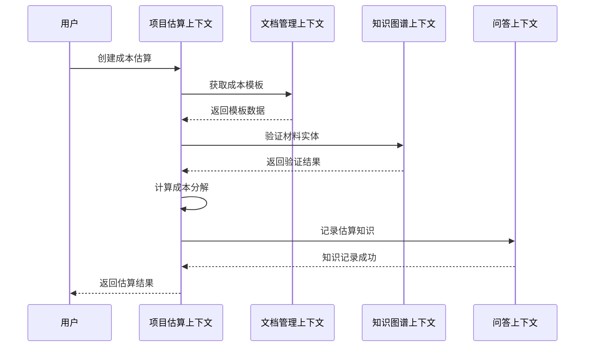
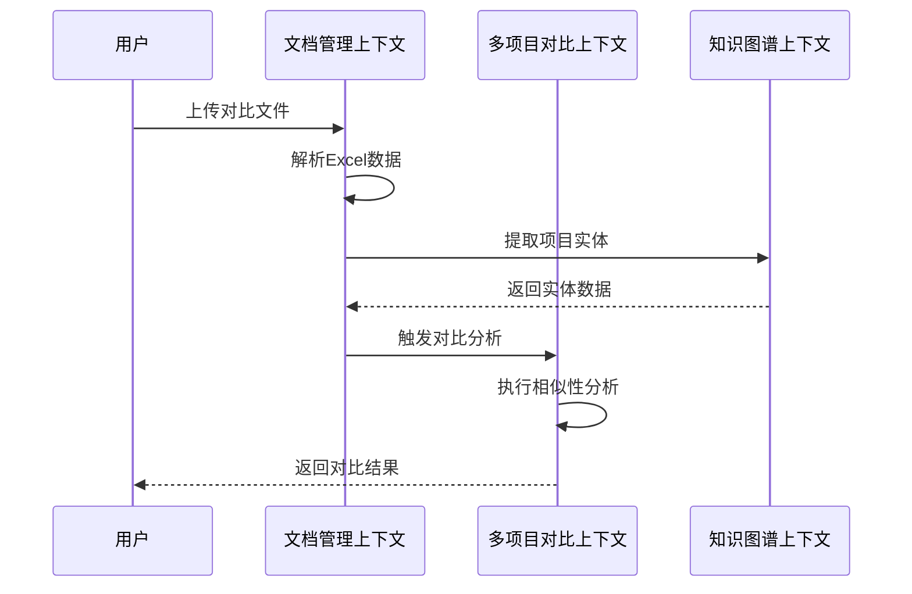
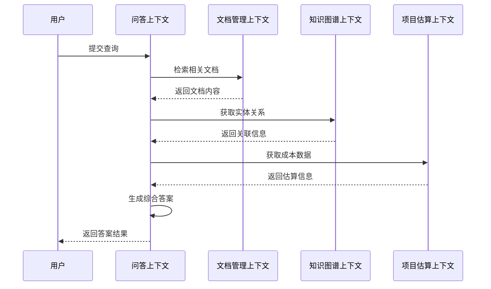

# Cost-RAG 限界上下文映射

## 📋 目录

- [限界上下文概述](#限界上下文概述)
- [核心业务上下文](#核心业务上下文)
- [支持业务上下文](#支持业务上下文)
- [通用支撑上下文](#通用支撑上下文)
- [上下文关系图](#上下文关系图)
- [上下文集成策略](#上下文集成策略)
- [跨上下文协作](#跨上下文协作)

## 🎯 限界上下文概述

限界上下文(Bounded Context)是DDD中的核心概念，它定义了一个清晰的边界，在这个边界内，特定的领域模型是统一和一致的。Cost-RAG系统通过识别和定义合适的限界上下文，将复杂的工程造价咨询业务分解为可管理的、自治的模块。

### 上下文划分原则

1. **业务职责单一**: 每个上下文负责一个明确的业务职责
2. **数据一致性**: 上下文内部保持强一致性
3. **团队自主性**: 每个上下文可以由独立的团队开发和维护
4. **技术栈独立性**: 上下文可以选择最适合的技术栈
5. **部署独立性**: 上下文可以独立部署和扩展

### 上下文分类

- **核心业务上下文**: 直接支持核心业务流程
- **支持业务上下文**: 为核心业务提供支撑功能
- **通用支撑上下文**: 横切关注点的通用功能

## 🏗️ 核心业务上下文

### 1. 项目估算上下文 (Project Estimation Context)

**业务职责**:
- 工程项目成本估算
- 14级分部分项层级计算
- 成本模板管理
- 估算结果验证

**核心模型**:
```python
# 聚合根
class CostEstimate:
    def __init__(self, project: Project, template: CostTemplate):
        self.id = str(uuid.uuid4())
        self.project = project
        self.template = template
        self.status = EstimateStatus.DRAFT
        self.created_at = datetime.now()
        self.events = []

    # 领域服务
    def calculate(self, quality_level: QualityLevel) -> CostBreakdown:
        calculator = HierarchicalCostCalculator()
        breakdown = calculator.calculate(
            self.project.area,
            self.template,
            quality_level
        )

        # 验证数学关系
        validator = CostBreakdownValidator()
        validation_result = validator.validate(breakdown)

        if not validation_result.is_valid:
            raise ValidationError(validation_result.errors)

        self.breakdown = breakdown
        self.status = EstimateStatus.COMPLETED

        # 记录领域事件
        self.events.append(EstimateCalculated(
            self.id,
            breakdown.total_cost,
            breakdown.unit_cost
        ))

        return breakdown

# 实体
class Project:
    def __init__(self, name: str, type: ProjectType, area: float):
        self.id = str(uuid.uuid4())
        self.name = name
        self.type = type
        self.area = Area(area)
        self.quality_level = QualityLevel.MEDIUM
        self.location = ""
        self.created_at = datetime.now()

# 值对象
class Money:
    def __init__(self, amount: float, currency: str = "CNY"):
        if amount < 0:
            raise ValueError("金额不能为负数")
        self._amount = round(amount, 2)
        self._currency = currency

    @property
    def amount(self) -> float:
        return self._amount

    def add(self, other: 'Money') -> 'Money':
        if self.currency != other.currency:
            raise ValueError("货币单位不一致")
        return Money(self.amount + other.amount, self.currency)
```

**技术架构**:
```
┌─────────────────────────────────────┐
│           项目估算上下文                │
├─────────────────────────────────────┤
│  FastAPI + SQLAlchemy + PostgreSQL   │
│  • 14级层级计算引擎                 │
│  • 成本模板管理                     │
│  • 估算验证服务                     │
│  • 成本分析报告                     │
└─────────────────────────────────────┘
```

### 2. 文档管理上下文 (Document Management Context)

**业务职责**:
- 文档上传和处理
- 多格式文档解析
- OCR文字识别
- 文档分块和向量化

**核心模型**:
```python
# 聚合根
class Document:
    def __init__(self, filename: str, file_type: DocumentType):
        self.id = str(uuid.uuid4())
        self.filename = filename
        self.file_type = file_type
        self.status = ProcessingStatus.UPLOADED
        self.file_size = 0
        self.created_at = datetime.now()
        self.chunks = []
        self.entities = []
        self.events = []

    # 领域服务
    async def process(self, file_data: bytes) -> ProcessingResult:
        # 文件类型检测
        file_detector = FileTypeDetector()
        detected_type = file_detector.detect(file_data, self.filename)

        # OCR或文本提取
        if detected_type.requires_ocr:
            processor = DoclingOCRProcessor()
        else:
            processor = TextExtractorProcessor()

        extraction_result = await processor.process(file_data)

        # 智能分块
        chunker = IntelligentChunker()
        chunks = chunker.chunk(extraction_result.text)

        # 实体识别
        entity_extractor = CostEntityExtractor()
        entities = entity_extractor.extract(extraction_result.text)

        # 保存结果
        self.chunks = chunks
        self.entities = entities
        self.file_size = len(file_data)
        self.status = ProcessingStatus.COMPLETED

        # 记录事件
        self.events.extend([
            DocumentProcessed(self.id, len(chunks), len(entities)),
            EntitiesExtracted(self.id, entities)
        ])

        return ProcessingResult(chunks, entities)

# 实体
class DocumentChunk:
    def __init__(self, content: str, index: int):
        self.id = str(uuid.uuid4())
        self.content = content
        self.index = index
        self.token_count = len(content.split())
        self.embedding_vector = None
        self.metadata = {}

# 值对象
class FileType:
    def __init__(self, extension: str, mime_type: str, requires_ocr: bool):
        self.extension = extension
        self.mime_type = mime_type
        self.requires_ocr = requires_ocr

    @classmethod
    def from_filename(cls, filename: str) -> 'FileType':
        extension = Path(filename).suffix.lower()
        mime_type, requires_ocr = cls._get_type_info(extension)
        return cls(extension, mime_type, requires_ocr)
```

**技术架构**:
```
┌─────────────────────────────────────┐
│           文档管理上下文                │
├─────────────────────────────────────┤
│  FastAPI + Celery + MinIO + Milvus   │
│  • Docling OCR集成                   │
│  • 异步文档处理                     │
│  • 智能分块算法                     │
│  • 向量化存储                       │
└─────────────────────────────────────┘
```

### 3. 智能问答上下文 (Intelligent Q&A Context)

**业务职责**:
- RAG查询处理
- 混合检索策略
- 答案生成和验证
- 对话管理

**核心模型**:
```python
# 聚合根
class Conversation:
    def __init__(self, user_id: str, title: str = None):
        self.id = str(uuid.uuid4())
        self.user_id = user_id
        self.title = title or f"对话_{datetime.now().strftime('%Y%m%d_%H%M%S')}"
        self.messages = []
        self.created_at = datetime.now()
        self.updated_at = datetime.now()

    # 领域服务
    async def ask_question(self, question: str, context_type: str = "general") -> Answer:
        # 构建查询上下文
        query_context = QueryContext(
            conversation_history=self.messages[-5:],  # 最近5轮对话
            context_type=context_type,
            user_preferences=self.get_user_preferences()
        )

        # 创建查询
        query = Query.create(question, query_context)

        # 混合检索
        retriever = HybridRetriever()
        retrieval_result = await retriever.retrieve(query)

        # 生成答案
        answer_generator = RAGAnswerGenerator()
        answer = await answer_generator.generate(query, retrieval_result)

        # 保存对话记录
        message = ConversationMessage.create(
            role="user",
            content=question,
            timestamp=datetime.now()
        )
        self.messages.append(message)

        assistant_message = ConversationMessage.create(
            role="assistant",
            content=answer.content,
            timestamp=datetime.now(),
            sources=retrieval_result.sources
        )
        self.messages.append(assistant_message)

        self.updated_at = datetime.now()

        return answer

# 实体
class Query:
    def __init__(self, question: str, context: QueryContext):
        self.id = str(uuid.uuid4())
        self.question = question
        self.context = context
        self.status = QueryStatus.PROCESSING
        self.created_at = datetime.now()
        self.retrieval_result = None
        self.answer = None

# 值对象
class QueryContext:
    def __init__(self,
                 conversation_history: List[ConversationMessage] = None,
                 context_type: str = "general",
                 user_preferences: Dict = None):
        self.conversation_history = conversation_history or []
        self.context_type = context_type
        self.user_preferences = user_preferences or {}
```

**技术架构**:
```
┌─────────────────────────────────────┐
│           智能问答上下文                │
├─────────────────────────────────────┤
│  FastAPI + OpenAI + Redis + Neo4j   │
│  • 混合检索引擎                     │
│  • LLM集成服务                      │
│  • 对话状态管理                     │
│  • 答案质量验证                     │
└─────────────────────────────────────┘
```

## 🔧 支持业务上下文

### 4. 多项目对比上下文 (Multi-Project Comparison Context)

**业务职责**:
- Excel数据解析
- 项目相似性分析
- 成本对比分析
- 市场基准研究

**核心模型**:
```python
# 聚合根
class ProjectComparison:
    def __init__(self, filename: str):
        self.id = str(uuid.uuid4())
        self.filename = filename
        self.projects = []
        self.validation_results = ValidationResults()
        self.created_at = datetime.now()

    # 领域服务
    async def parse_excel(self, file_data: bytes) -> ComparisonResult:
        # Excel结构解析
        excel_parser = MultiProjectExcelParser()
        parse_result = excel_parser.parse(file_data)

        # 提取项目数据
        project_extractor = ProjectDataExtractor()
        projects = await project_extractor.extract(parse_result)

        # 验证数学关系
        validator = MathRelationshipValidator()
        validation_result = validator.validate(projects)

        # 保存结果
        self.projects = projects
        self.validation_results = validation_result

        return ComparisonResult(projects, validation_result)

# 实体
class Project:
    def __init__(self, name: str, comparison_data: Dict):
        self.name = name
        self.area = Area(comparison_data.get('area', 0))
        self.total_cost = Money(comparison_data.get('total_cost', 0))
        self.unit_cost = Money(comparison_data.get('unit_cost', 0))
        self.cost_breakdown = CostBreakdown.from_dict(comparison_data)
        self.quality_level = QualityLevel.from_string(comparison_data.get('quality_level', 'medium'))

# 值对象
class SimilarityScore:
    def __init__(self, score: float, factors: Dict[str, float]):
        self.score = max(0, min(1, score))
        self.factors = factors

    def is_similar(self, threshold: float = 0.7) -> bool:
        return self.score >= threshold
```

### 5. 知识图谱上下文 (Knowledge Graph Context)

**业务职责**:
- 实体识别和抽取
- 关系构建和验证
- 图谱推理和查询
- 知识更新和维护

**核心模型**:
```python
# 聚合根
class KnowledgeGraph:
    def __init__(self):
        self.id = str(uuid.uuid4())
        self.entities = {}
        self.relationships = {}
        self.inference_rules = []
        self.created_at = datetime.now()

    # 领域服务
    async def extract_and_build(self, documents: List[Document]):
        # 实体抽取
        entity_extractor = CostEntityExtractor()
        entity_relations = []

        for document in documents:
            for chunk in document.chunks:
                entities = await entity_extractor.extract(chunk.content)
                relations = await self._extract_relations(entities, chunk)
                entity_relations.extend(relations)

        # 构建图谱
        await self._build_graph(entity_relations)

        # 图谱推理
        await self._run_inference()

# 实体
class KnowledgeEntity:
    def __init__(self, name: str, entity_type: EntityType, properties: Dict):
        self.id = str(uuid.uuid4())
        self.name = name
        self.type = entity_type
        self.properties = properties
        self.confidence = 1.0
        self.created_at = datetime.now()

# 值对象
class EntityRelation:
    def __init__(self, source: str, target: str, relation_type: RelationType, confidence: float = 1.0):
        self.id = str(uuid.uuid4())
        self.source_id = source
        self.target_id = target
        self.type = relation_type
        self.confidence = confidence
        self.created_at = datetime.now()
```

## 🌐 通用支撑上下文

### 6. 用户管理上下文 (User Management Context)

**业务职责**:
- 用户认证和授权
- 权限管理
- 组织管理
- 用户偏好设置

**核心模型**:
```python
# 聚合根
class User:
    def __init__(self, username: str, email: str, full_name: str):
        self.id = str(uuid.uuid4())
        self.username = username
        self.email = email
        self.full_name = full_name
        self.role = Role.USER
        self.organization = None
        self.preferences = UserPreferences()
        self.created_at = datetime.now()

# 实体
class Role:
    def __init__(self, name: str, permissions: List[str]):
        self.id = str(uuid.uuid4())
        self.name = name
        self.permissions = permissions

# 值对象
class UserPreferences:
    def __init__(self):
        self.language = "zh-CN"
        self.timezone = "Asia/Shanghai"
        self.notification_settings = NotificationSettings()
        self.ui_preferences = UIPreferences()
```

### 7. 系统管理上下文 (System Management Context)

**业务职责**:
- 系统配置管理
- 审计日志
- 监控和告警
- 系统维护

**核心模型**:
```python
# 聚合根
class SystemConfiguration:
    def __init__(self):
        self.id = str(uuid.uuid4())
        self.version = "1.0.0"
        self.settings = {}
        self.features = {}
        self.created_at = datetime.now()
        self.updated_at = datetime.now()

# 实体
class AuditLog:
    def __init__(self, user_id: str, action: str, resource: str, changes: Dict):
        self.id = str(uuid.uuid4())
        self.user_id = user_id
        self.action = action
        self.resource = resource
        self.changes = changes
        self.timestamp = datetime.now()

# 值对象
class FeatureFlag:
    def __init__(self, name: str, enabled: bool, description: str = ""):
        self.name = name
        self.enabled = enabled
        self.description = description
```

## 🗺️ 上下文关系图

```mermaid
graph TB
    subgraph "核心业务层"
        PE[项目估算上下文]
        DM[文档管理上下文]
        QA[问答上下文]
    end

    subgraph "支持业务层"
        PC[多项目对比上下文]
        KG[知识图谱上下文]
    end

    subgraph "通用支撑层"
        UM[用户管理上下文]
        SM[系统管理上下文]
    end

    %% 核心业务关系
    PE <|-- DM : "Published Language<br/>成本模板文档"
    PE <|-- QA : "Published Language<br/>知识问答内容"
    DM <|-- QA : "Published Language<br/>问答内容来源"

    PE <|-- PC : "Open Host Service<br/>基准数据"
    DM <|-- PC : "Conformist<br/>对比项目文档"
    QA <|-- KG : "Partnership<br/>实体关系增强"
    PC <|-- KG : "Partnership<br/>项目特征关联"

    DM <|-- KG : "Partnership<br/>实体抽取"
    QA <|-- KG : "Partnership<br/>图谱推理增强"
    PC <|-- KG : "Partnership<br/>相似度计算"

    %% 通用支撑关系
    PE <|-- UM : "Customer/Supplier<br/>用户权限管理"
    DM <|-- UM : "Customer/Supplier<br/>文档访问权限"
    QA <|-- UM : "Customer/Supplier<br/>查询权限控制"
    PC <|-- UM : "Customer/Supplier<br/>对比报告权限"
    KG <|-- UM : "Customer/Supplier<br/>知识访问权限"

    PE <|-- SM : "Customer/Supplier<br/>系统配置"
    DM <|-- SM : "Customer/Supplier<br/>系统监控"
    QA <|-- SM : "Customer/Supplier<br/>系统监控"
    PC <|-- SM : "Customer/Supplier<br/>系统配置"
    KG <|-- SM : "Customer/Supplier<br/>系统维护"
```

## 🔄 上下文集成策略

### 1. 反腐化层 (Anti-Corruption Layer)

#### 项目估算上下文 → 文档管理上下文
```python
class DocumentServiceAdapter:
    def __init__(self, document_client: DocumentManagementClient):
        self.document_client = document_client

    async def get_cost_templates(self, filters: TemplateFilters) -> List[CostTemplate]:
        # 调用文档上下文的API
        documents = await self.document_client.search_documents(
            SearchQuery(
                document_type="cost_template",
                filters=filters.to_dict()
            )
        )

        # 转换为成本模板领域对象
        templates = []
        for doc in documents:
            if doc.processing_status == ProcessingStatus.COMPLETED:
                template = CostTemplate.from_document(doc)
                templates.append(template)

        return templates
```

#### 文档管理上下文 → 问答上下文
```python
class KnowledgeRetrievalAdapter:
    def __init__(self, document_client: DocumentManagementClient):
        self.document_client = document_client

    async def retrieve_knowledge(self, query: str, context_type: str) -> RetrievalResult:
        # 调用文档上下文的检索API
        search_result = await self.document_client.search_content(
            SearchQuery(
                query=query,
                context_filter={"context_type": context_type},
                max_results=10,
                retrieval_method="hybrid"
            )
        )

        # 转换为检索结果领域对象
        sources = []
        for item in search_result.items:
            source = Source.from_search_item(item)
            sources.append(source)

        return RetrievalResult(sources)
```

### 2. 领域事件驱动集成

#### 事件发布模式
```python
# 项目估算上下文发布事件
class CostEstimateAggregate:
    def complete_estimation(self):
        # 完成估算逻辑
        # ...

        # 发布领域事件
        event = EstimateCompleted(
            estimate_id=self.id,
            project_name=self.project.name,
            total_cost=self.breakdown.total_cost
        )
        DomainEventPublisher.publish(event)

# 其他上下文订阅事件
class AnalyticsEventHandler:
    @event_handler(EstimateCompleted)
    async def handle_estimate_completed(self, event: EstimateCompleted):
        # 更新分析数据
        await self.update_estimation_analytics(event)
```

### 3. 共享内核 (Shared Kernel)

#### 通用值对象
```python
# 共享值对象
class Money:
    def __init__(self, amount: float, currency: str = "CNY"):
        self._amount = round(amount, 2)
        self._currency = currency

class Area:
    def __init__(self, square_meters: float):
        self._square_meters = round(square_meters, 2)

class QualityLevel(Enum):
    LOW = "low"
    MEDIUM = "medium"
    HIGH = "high"
```

#### 通用领域服务
```python
# 共享领域服务
class ValidationService:
    def validate_email(self, email: str) -> bool:
        pattern = r'^[a-zA-Z0-9._%+-]+@[a-zA-Z0-9.-]+\.[a-zA-Z]{2,}$'
        return re.match(pattern, email) is not None

class NotificationService:
    async def send_notification(self, user_id: str, message: str):
        # 通用通知逻辑
        pass
```

## 🔗 跨上下文协作

### 1. 项目估算流程协作



### 2. 文档处理流程协作



### 3. 智能问答流程协作



## 📚 上下文技术栈

### 技术选型对比

| 上下文 | 主要技术 | 数据库 | 缓存 | 部署方式 |
|--------|----------|--------|------|----------|
| 项目估算 | FastAPI | PostgreSQL | Redis | 独立容器 |
| 文档管理 | FastAPI + Celery | PostgreSQL | MinIO + Milvus | 独立容器 |
| 智能问答 | FastAPI | Neo4j | Redis | 独立容器 |
| 多项目对比 | FastAPI | PostgreSQL | Redis | 独立容器 |
| 知识图谱 | FastAPI | Neo4j | Redis | 独立容器 |
| 用户管理 | FastAPI | PostgreSQL | Redis | 独立容器 |
| 系统管理 | FastAPI | PostgreSQL | Redis | 独立容器 |

### 部署架构

```yaml
# Kubernetes部署配置
apiVersion: v1
kind: Namespace
metadata:
  name: cost-rag
---
# 项目估算上下文
apiVersion: apps/v1
kind: Deployment
metadata:
  name: project-estimation
  namespace: cost-rag
spec:
  replicas: 3
  template:
    metadata:
      labels:
        app: project-estimation
        context: estimation
    spec:
      containers:
      - name: api
        image: cost-rag/estimation-service:v1.0
        ports:
        - containerPort: 8000
        env:
        - name: DATABASE_URL
          valueFrom:
            secretKeyRef:
              name: estimation-db-secret
              key: url
---
# 文档管理上下文
apiVersion: apps/v1
kind: Deployment
metadata:
  name: document-management
  namespace: cost-rag
spec:
  replicas: 2
  template:
    metadata:
      labels:
        app: document-management
        context: document
    spec:
      containers:
      - name: api
        image: cost-rag/document-service:v1.0
        ports:
        - containerPort: 8001
      - name: worker
        image: cost-rag/document-worker:v1.0
        env:
        - name: CELERY_BROKER_URL
          value: "redis://redis:6379/0"
---
# 智能问答上下文
apiVersion: apps/v1
kind: Deployment
metadata:
  name: intelligent-qa
  namespace: cost-rag
spec:
  replicas: 3
  template:
    metadata:
      labels:
        app: intelligent-qa
        context: qa
    spec:
      containers:
      - name: api
        image: cost-rag/qa-service:v1.0
        ports:
        - containerPort: 8002
        env:
        - name: OPENAI_API_KEY
          valueFrom:
            secretKeyRef:
              name: openai-secret
              key: api-key
```

## 📊 上下文监控指标

### 业务指标

| 上下文 | 关键指标 | 目标值 | 监控方式 |
|--------|----------|--------|----------|
| 项目估算 | 估算成功率 | > 99.5% | 业务监控 |
| 项目估算 | 计算准确度 | > 99% | 业务监控 |
| 文档管理 | 处理成功率 | > 99% | 业务监控 |
| 文档管理 | OCR准确率 | > 96% | 业务监控 |
| 智能问答 | 查询响应时间 | P95 < 3s | 性能监控 |
| 智能问答 | 答案准确率 | > 91% | 业务监控 |
| 多项目对比 | 解析成功率 | > 98% | 业务监控 |
| 知识图谱 | 实体识别准确率 | > 90% | 业务监控 |

### 技术指标

| 上下文 | 技术指标 | 目标值 | 监控方式 |
|--------|----------|--------|----------|
| 项目估算 | API响应时间 | P95 < 500ms | APM监控 |
| 项目估算 | 数据库查询时间 | P95 < 100ms | 数据库监控 |
| 文档管理 | 文档处理时间 | < 30s/50页 | 任务监控 |
| 文档管理 | 向量检索延迟 | P95 < 200ms | 向量库监控 |
| 智能问答 | LLM调用延迟 | P95 < 5s | API监控 |
| 智能问答 | 缓存命中率 | > 80% | 缓存监控 |
| 多项目对比 | Excel解析时间 | < 10s | 性能监控 |
| 知识图谱 | 图谱查询时间 | P95 < 100ms | 图谱监控 |

## 🔗 集成测试策略

### 上下文集成测试

```python
class ContextIntegrationTest:
    def test_estimation_document_integration(self):
        # 测试项目估算上下文与文档管理上下文的集成
        project = Project.create("测试项目", ProjectType.COMMERCIAL, Area(10000.0))

        # 模拟文档上下文返回模板
        mock_document_service = MockDocumentService()
        mock_document_service.get_cost_templates.return_value = [
            CostTemplate("标准模板", "北京", 2024)
        ]

        # 测试估算创建
        estimation_service = CostEstimationService(mock_document_service)
        estimate = estimation_service.create_estimate(project)

        # 验证结果
        assert estimate.template.name == "标准模板"
        assert estimate.breakdown.total_cost.amount > 0

    def test_qa_multi_context_integration(self):
        # 测试问答上下文与多个上下文的集成
        query = Query("混凝土C30的单价是多少？", QueryContext())

        # 模拟各上下文返回数据
        mock_retrieval = MockRetrievalService()
        mock_retrieval.retrieve.return_value = RetrievalResult([
            Source.from_document("成本定额.pdf"),
            Source.from_knowledge_graph("混凝土", "材料")
        ])

        # 测试答案生成
        qa_service = QAService(mock_retrieval)
        answer = qa_service.process_query(query)

        # 验证答案质量
        assert answer.confidence > 0.8
        assert len(answer.sources) >= 1
```

### 端到端测试

```python
class EndToEndTest:
    def test_complete_estimation_workflow(self):
        # 完整的估算工作流测试
        with TestClient(app) as client:
            # 1. 上传文档
            response = client.post("/documents/upload", files={"file": test_pdf})
            document_id = response.json()["data"]["document_id"]

            # 2. 创建估算
            estimate_data = {
                "project_name": "测试项目",
                "project_type": "commercial",
                "area": 50000.0
            }
            response = client.post("/estimates", json=estimate_data)
            estimate_id = response.json()["data"]["estimate_id"]

            # 3. 等待处理完成
            estimate = self._wait_for_completion(client, estimate_id)

            # 4. 验证结果
            assert estimate["status"] == "completed"
            assert estimate["breakdown"]["total_cost"] > 0

            # 5. 测试查询
            response = client.post("/queries", json={
                "question": "这个项目的总造价是多少？"
            })
            query_id = response.json()["data"]["query_id"]

            answer = self._wait_for_answer(client, query_id)
            assert str(estimate["breakdown"]["total_cost"]) in answer["answer"]["content"]
```

---

## 📞 技术支持

- **领域设计文档**: [实体与值对象](./entities-value-objects.md)
- **仓储模式**: [仓储接口设计](./repository-patterns.md)
- **领域服务**: [领域服务设计](./domain-services.md)
- **限界上下文**: [限界上下文映射](./)
- **技术支持**: support@cost-rag.com
- **架构咨询**: architecture@cost-rag.com