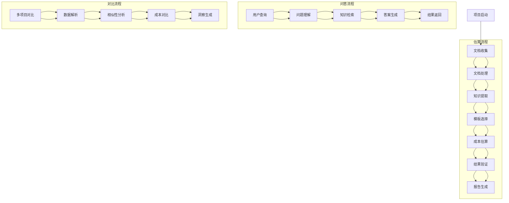
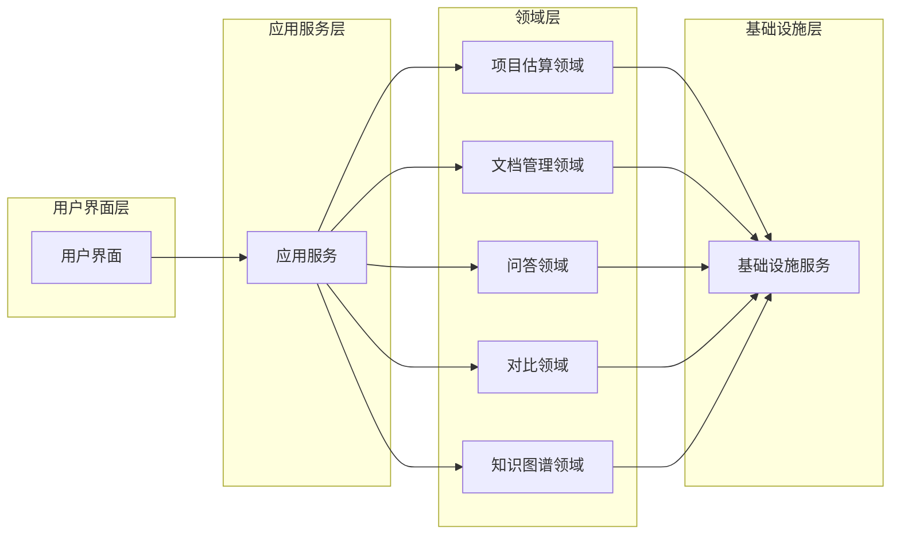
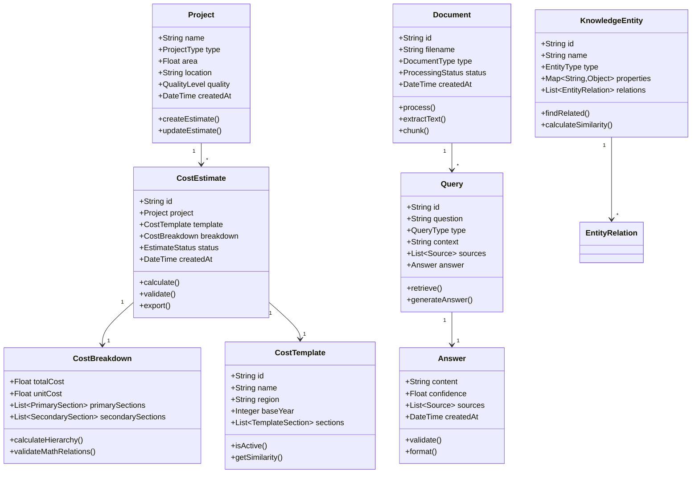

# Cost-RAG 领域分析

## 📋 目录

- [领域分析概述](#领域分析概述)
- [核心领域识别](#核心领域识别)
- [业务流程分析](#业务流程分析)
- [领域边界定义](#领域边界定义)
- [领域模型概念](#领域模型概念)
- [限界上下文映射](#限界上下文映射)
- [领域事件设计](#领域事件设计)

## 🎯 领域分析概述

Cost-RAG系统的核心业务是工程造价咨询，涉及复杂的成本计算、文档管理、智能问答和多项目对比。通过领域驱动设计(DDD)方法，我们将复杂的业务逻辑分解为清晰的、可管理的领域模型，确保系统的可维护性和可扩展性。

### 分析方法

1. **事件风暴**: 识别领域中的关键事件和参与者
2. **领域建模**: 建立核心概念和关系
3. **边界划分**: 定义清晰的领域边界
4. **上下文映射**: 确定上下文间的关系
5. **战略设计**: 制定领域架构决策

### 业务目标

- **精准估算**: 提供准确的工程造价估算
- **智能问答**: 基于RAG技术的专业问答服务
- **知识管理**: 构建和管理工程造价知识库
- **成本优化**: 通过数据分析实现成本优化
- **风险控制**: 识别和评估工程成本风险

## 🏗️ 核心领域识别

通过业务分析和领域专家访谈，我们识别出以下几个核心领域：

### 1. 工程项目估算领域 (Project Estimation Domain)

**核心概念**:
- 项目 (Project)
- 成本估算 (CostEstimate)
- 成本分解 (CostBreakdown)
- 成本模板 (CostTemplate)
- 分部分项 (CostSection)

**核心职责**:
- 14级分部分项层级计算
- 成本模板管理
- 估算结果验证
- 成本优化建议

### 2. 文档管理领域 (Document Management Domain)

**核心概念**:
- 文档 (Document)
- 文档版本 (DocumentVersion)
- 文档分块 (DocumentChunk)
- 实体 (Entity)
- 关系 (Relationship)

**核心职责**:
- 文档解析和处理
- OCR文字识别
- 文本分块和向量化
- 知识图谱构建

### 3. 智能问答领域 (Intelligent Q&A Domain)

**核心概念**:
- 查询 (Query)
- 回答 (Answer)
- 上下文 (Context)
- 对话 (Conversation)
- 知识检索 (KnowledgeRetrieval)

**核心职责**:
- RAG查询处理
- 答案生成和验证
- 对话管理
- 知识检索优化

### 4. 多项目对比领域 (Multi-Project Comparison Domain)

**核心概念**:
- 项目对比 (ProjectComparison)
- 相似性分析 (SimilarityAnalysis)
- 成本洞察 (CostInsight)
- 市场基准 (MarketBenchmark)

**核心职责**:
- Excel数据解析
- 项目相似性计算
- 成本差异分析
- 市场对比研究

### 5. 知识图谱领域 (Knowledge Graph Domain)

**核心概念**:
- 知识实体 (KnowledgeEntity)
- 实体关系 (EntityRelation)
- 图谱节点 (GraphNode)
- 推理规则 (InferenceRule)

**核心职责**:
- 实体识别和抽取
- 关系构建和验证
- 图谱推理和查询
- 知识更新和维护

## 📊 业务流程分析

### 核心业务流程图



### 关键业务事件

| 事件名称 | 触发条件 | 影响范围 | 业务价值 |
|----------|----------|----------|----------|
| ProjectCreated | 新项目创建 | 估算领域 | 启动成本估算流程 |
| DocumentUploaded | 文档上传完成 | 文档领域 | 增加知识库内容 |
| CostCalculated | 成本计算完成 | 估算领域 | 提供估算结果 |
| QuerySubmitted | 用户提交查询 | 问答领域 | 提供智能回答 |
| ComparisonCompleted | 对比分析完成 | 对比领域 | 提供对比洞察 |

## 🎨 领域边界定义

### 领域边界图



### 领域间协作关系

| 源领域 | 目标领域 | 协作方式 | 接口定义 |
|--------|----------|----------|----------|
| 文档管理 | 项目估算 | 提供成本数据 | CostDataService |
| 文档管理 | 问答领域 | 提供知识内容 | KnowledgeRetrievalService |
| 知识图谱 | 问答领域 | 提供实体关系 | GraphQueryService |
| 项目估算 | 对比领域 | 提供估算数据 | EstimateDataService |
| 多项目对比 | 项目估算 | 提供基准数据 | BenchmarkDataService |

## 🧩 领域模型概念

### 核心领域概念图



### 值对象 (Value Objects)

#### 1. Money (金额)
```python
class Money:
    def __init__(self, amount: float, currency: str = "CNY"):
        if amount < 0:
            raise ValueError("金额不能为负数")
        self._amount = round(amount, 2)
        self._currency = currency

    @property
    def amount(self) -> float:
        return self._amount

    @property
    def currency(self) -> str:
        return self._currency

    def add(self, other: 'Money') -> 'Money':
        if self.currency != other.currency:
            raise ValueError("货币单位不一致")
        return Money(self.amount + other.amount, self.currency)

    def multiply(self, multiplier: float) -> 'Money':
        return Money(self.amount * multiplier, self.currency)
```

#### 2. Area (面积)
```python
class Area:
    def __init__(self, square_meters: float):
        if square_meters <= 0:
            raise ValueError("面积必须大于0")
        self._square_meters = round(square_meters, 2)

    @property
    def square_meters(self) -> float:
        return self._square_meters

    def to_square_feet(self) -> float:
        return self._square_meters * 10.764
```

#### 3. QualityLevel (质量等级)
```python
class QualityLevel(Enum):
    LOW = "low"
    MEDIUM = "medium"
    HIGH = "high"

    def adjustment_factor(self) -> float:
        factors = {
            QualityLevel.LOW: 0.85,
            QualityLevel.MEDIUM: 1.00,
            QualityLevel.HIGH: 1.20
        }
        return factors[self]
```

## 🗺️ 限界上下文映射

### 上下文关系图

```mermaid
graph TB
    subgraph "Core Context"
        A[项目估算上下文<br/>Project Estimation Context]
        B[文档管理上下文<br/>Document Management Context]
    end

    subgraph "Supporting Contexts"
        C[智能问答上下文<br/>Intelligent Q&A Context]
        D[多项目对比上下文<br/>Multi-Project Comparison Context]
        E[知识图谱上下文<br/>Knowledge Graph Context]
    end

    subgraph "Generic Contexts"
        F[用户管理上下文<br/>User Management Context]
        G[系统管理上下文<br/>System Management Context]
    end

    A -.-> B : Customer/Supplier
    A -.-> C : Published Language
    A -.-> D : Open Host Service
    A -.-> E : Partnership

    B -.-> C : Published Language
    B -.-> E : Partnership
    B -.-> D : Conformist

    C -.-> E : Partnership
    D -.-> E : Partnership

    A -.-> F : Customer/Supplier
    B -.-> F : Customer/Supplier
    C -.-> F : Customer/Supplier
    D -.-> F : Customer/Supplier

    A -.-> G : Customer/Supplier
    B -.-> G : Customer/Supplier
```

### 上下文详细定义

#### 1. 项目估算上下文 (Project Estimation Context)

**职责**:
- 工程项目成本估算
- 成本模板管理
- 估算结果验证
- 成本分析报告

**核心模型**:
- Project (项目)
- CostEstimate (成本估算)
- CostBreakdown (成本分解)
- CostTemplate (成本模板)

**接口**:
```python
class CostEstimationService:
    def create_estimate(self, project_data: ProjectData) -> CostEstimate
    def get_estimate(self, estimate_id: str) -> CostEstimate
    def update_estimate(self, estimate_id: str, updates: EstimateUpdates) -> CostEstimate
    def export_estimate(self, estimate_id: str, format: str) -> bytes
```

#### 2. 文档管理上下文 (Document Management Context)

**职责**:
- 文档上传和处理
- 文本提取和分块
- OCR识别
- 文档元数据管理

**核心模型**:
- Document (文档)
- DocumentChunk (文档分块)
- ProcessingJob (处理任务)
- ExtractionResult (提取结果)

**接口**:
```python
class DocumentService:
    def upload_document(self, file: UploadFile) -> Document
    def process_document(self, document_id: str) -> ProcessingJob
    def get_document(self, document_id: str) -> Document
    def search_documents(self, query: SearchQuery) -> List[Document]
```

#### 3. 智能问答上下文 (Intelligent Q&A Context)

**职责**:
- RAG查询处理
- 答案生成
- 对话管理
- 知识检索

**核心模型**:
- Query (查询)
- Answer (答案)
- Conversation (对话)
- RetrievalResult (检索结果)

**接口**:
```python
class QueryService:
    def submit_query(self, question: str, context: QueryContext) -> Query
    def get_answer(self, query_id: str) -> Answer
    def continue_conversation(self, conversation_id: str, question: str) -> Answer
```

## 📋 领域事件设计

### 核心领域事件

#### 1. 项目估算事件

```python
# 项目创建事件
class ProjectCreated(DomainEvent):
    def __init__(self, project_id: str, project_name: str, project_type: str):
        self.project_id = project_id
        self.project_name = project_name
        self.project_type = project_type
        self.occurred_at = datetime.now()

# 成本估算完成事件
class EstimateCalculated(DomainEvent):
    def __init__(self, estimate_id: str, total_cost: Money, unit_cost: Money):
        self.estimate_id = estimate_id
        self.total_cost = total_cost
        self.unit_cost = unit_cost
        self.occurred_at = datetime.now()

# 估算验证失败事件
class EstimateValidationFailed(DomainEvent):
    def __init__(self, estimate_id: str, errors: List[str]):
        self.estimate_id = estimate_id
        self.errors = errors
        self.occurred_at = datetime.now()
```

#### 2. 文档管理事件

```python
# 文档上传事件
class DocumentUploaded(DomainEvent):
    def __init__(self, document_id: str, filename: str, file_type: str):
        self.document_id = document_id
        self.filename = filename
        self.file_type = file_type
        self.occurred_at = datetime.now()

# 文档处理完成事件
class DocumentProcessed(DomainEvent):
    def __init__(self, document_id: str, chunks_count: int, entities_count: int):
        self.document_id = document_id
        self.chunks_count = chunks_count
        self.entities_count = entities_count
        self.occurred_at = datetime.now()

# 实体提取事件
class EntityExtracted(DomainEvent):
    def __init__(self, document_id: str, entities: List[ExtractedEntity]):
        self.document_id = document_id
        self.entities = entities
        self.occurred_at = datetime.now()
```

#### 3. 智能问答事件

```python
# 查询提交事件
class QuerySubmitted(DomainEvent):
    def __init__(self, query_id: str, question: str, context_type: str):
        self.query_id = query_id
        self.question = question
        self.context_type = context_type
        self.occurred_at = datetime.now()

# 答案生成事件
class AnswerGenerated(DomainEvent):
    def __init__(self, query_id: str, answer: str, confidence: float):
        self.query_id = query_id
        self.answer = answer
        self.confidence = confidence
        self.occurred_at = datetime.now()

# 查询反馈事件
class QueryFeedbackReceived(DomainEvent):
    def __init__(self, query_id: str, rating: int, feedback: str):
        self.query_id = query_id
        self.rating = rating
        self.feedback = feedback
        self.occurred_at = datetime.now()
```

### 事件处理模式

#### 事件发布器
```python
class DomainEventPublisher:
    def __init__(self):
        self._handlers = defaultdict(list)

    def subscribe(self, event_type: Type[DomainEvent], handler: Callable):
        self._handlers[event_type].append(handler)

    def publish(self, event: DomainEvent):
        event_type = type(event)
        for handler in self._handlers[event_type]:
            # 异步执行处理器
            asyncio.create_task(handler(event))
```

#### 事件处理器
```python
class EstimateEventHandler:
    def __init__(self, email_service: EmailService, notification_service: NotificationService):
        self.email_service = email_service
        self.notification_service = notification_service

    @event_handler(EstimateCalculated)
    async def handle_estimate_calculated(self, event: EstimateCalculated):
        # 发送邮件通知
        await self.email_service.send_completion_notification(event.estimate_id)

        # 更新项目状态
        await self.notification_service.update_project_status(event.estimate_id, "completed")
```

## 🔗 聚合根设计

### 1. 项目估算聚合根

```python
class CostEstimateAggregate:
    def __init__(self, project: Project):
        self._project = project
        self._estimate = None
        self._breakdown = None
        self._events = []

    def create_estimate(self, template: CostTemplate, quality_level: QualityLevel) -> CostEstimate:
        if self._estimate:
            raise ValueError("估算已存在")

        self._estimate = CostEstimate.create(self._project, template)
        self._breakdown = CostBreakdownCalculator.calculate(
            self._project.area, template, quality_level
        )

        # 验证数学关系
        validation_result = self._breakdown.validate()
        if not validation_result.is_valid:
            raise ValidationError(validation_result.errors)

        # 记录领域事件
        self._events.append(EstimateCalculated(
            self._estimate.id,
            self._breakdown.total_cost,
            self._breakdown.unit_cost
        ))

        return self._estimate

    def get_events(self) -> List[DomainEvent]:
        return self._events.copy()

    def clear_events(self):
        self._events.clear()
```

### 2. 文档聚合根

```python
class DocumentAggregate:
    def __init__(self):
        self._document = None
        self._chunks = []
        self._entities = []
        self._events = []

    def process_upload(self, file_data: bytes, filename: str, document_type: str) -> Document:
        self._document = Document.create(filename, document_type)

        # 异步处理文档
        processing_result = DocumentProcessor.process(file_data)

        self._chunks = processing_result.chunks
        self._entities = processing_result.entities

        # 记录事件
        self._events.append(DocumentUploaded(self._document.id, filename, document_type))
        self._events.append(DocumentProcessed(
            self._document.id,
            len(self._chunks),
            len(self._entities)
        ))

        return self._document
```

## 📚 战略设计原则

### 1. 领域驱动设计原则

- **战略设计优先**: 从业务战略出发设计领域模型
- **限界上下文**: 明确的领域边界和职责划分
- **通用语言**: 技术术语与业务术语保持一致
- **领域建模**: 建立反映业务本质的领域模型

### 2. 架构设计原则

- **高内聚低耦合**: 领域内部高内聚，领域之间低耦合
- **依赖倒置**: 高层模块不依赖低层模块
- **接口隔离**: 客户端不应该依赖它不需要的接口
- **单一职责**: 一个类只应该有一个改变的理由

### 3. 数据设计原则

- **聚合根一致性**: 通过聚合根保证数据一致性
- **最终一致性**: 跨聚合根操作使用最终一致性
- **事件溯源**: 记录领域事件用于状态重建
- **读写分离**: CQRS模式分离读写操作

---

## 📞 技术支持

- **领域设计文档**: [实体与值对象](./entities-value-objects.md)
- **仓储模式**: [仓储接口设计](./repository-patterns.md)
- **领域服务**: [领域服务设计](./domain-services.md)
- **边界上下文**: [限界上下文映射](./bounded-contexts.md)
- **技术支持**: support@cost-rag.com